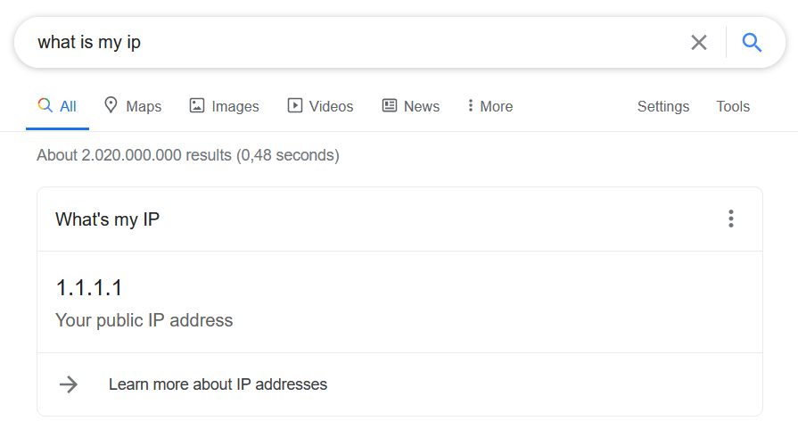

There may come a time when you need to know the public IP address of your router, you know that one assigned by your ISP. Not too difficult to find, when you know where and how to look. This can be particularly handy when quickly verifying if your VPN is working, setting up ddns, ... Most of the time this need just suddenly creeps up on you. So having a quick and easy way to grab you public IP could be an amazing time saver. The easiest way to check your router's public IP is to go to your favourite search engine, type in `what is my IP` and press enter.



> Yes that's obviously not my real public IP, I'm not surfing the internet from behind Cloudflare's public DNS resolver. 😜

This also works in duckduckgo and as you can see from the returned search results there are a plethora of other sites out there that can do exactly the same thing. Just by the act of simply visiting the site, your router has made a request, and thus revealed your public IP address. Some of these sites even go farther and show the name of your ISP, your city and even maps. But to be honest all this is kinda boring and I understand that this is not really blowing you away yet, but bear with me. Let's take it up a notch and drop down into our terminal for some something slightly more interesting.

There are a couple of RESTfull web services out that that can return your public API simply by making an HTTP request. Those work in the same way as those websites returned by my google search query. This is pretty neat because now we can leverage `curl` and have it make an HTTP request to get our public IP. For example, a few services I often use are [ipify](https://www.ipify.org/) and [icanhazip](https://icanhazip.com/), as an added bonus both services are also open-source which means you can have a look at the source code [https://github.com/major/icanhaz](https://github.com/rdegges/ipify-api), [https://github.com/rdegges/ipify-api](https://github.com/rdegges/ipify-api). Let's dive into ipify and see how we can use it to resolve a public IP address:

```sh
$ curl https://api.ipify.org
```

This will make an HTTP request to the API and return your public IPv4 address as plain text. If you want to resolve your IPv6 address you can use the following command:

```sh
$ curl https://api6.ipify.org
```

The way this work is pretty neat and when you have a look at it's DNS record you will see that it only has an `AAAA` record configured. Which means that if you don't have an IPv6 address it won't be able to resolve and you will see something like `curl: (7) Couldn't connect to server`. There are a few more things you can play around with, like have the API return JSON, all these are neatly explained in their docs.

Next up let's look into plain old DNS to resolve our public IP. For this, we need to have access to a little tool called `dig`. Typing `which dig` should let you know if it is already installed and available on your PATH. If not then it shouldn't be too difficult to install, in ubuntu it's part of the dnsutils tools so running `sudo apt install dnsutils` will get you going in no time. The dig command is primarily used to query DNS servers and is a useful tool for network troubleshooting. It is popular due to its flexibility, simplicity, and crystal clear output. Let me quickly run through the basics of `dig`, this, by all means, is not an extensive guide on how DNS and dig works, but just enough get you going through the next section. Let's start out with something simple and let's just query for google.com

```sh
$ dig google.com

; <<>> DiG 9.16.1-Ubuntu <<>> google.com
;; global options: +cmd
;; Got answer:
;; ->>HEADER<<- opcode: QUERY, status: NOERROR, id: 15031
;; flags: qr rd ad; QUERY: 1, ANSWER: 1, AUTHORITY: 0, ADDITIONAL: 0

;; QUESTION SECTION:
;google.com.                    IN      A

;; ANSWER SECTION:
google.com.             0       IN      A       216.58.208.110

;; Query time: 0 msec
;; SERVER: 172.29.80.1#53(172.29.80.1)
;; WHEN: Fri Nov 20 09:47:02 CET 2020
;; MSG SIZE  rcvd: 54
```

Let me quickly walk you through this output. This first section tells us a little bit about the version used and the global options that are set (in this case, +cmd).

```sh
; <<>> DiG 9.16.1-Ubuntu <<>> google.com
;; global options: +cmd
```

The next section, dig tells us some technical details about the answer received from the DNS server. We can also turn this section off by adding `+nocomments` to the command, but this will also turn off many of the section headers, so be aware of that.

```sh
;; Got answer:
;; ->>HEADER<<- opcode: QUERY, status: NOERROR, id: 15031
;; flags: qr rd ad; QUERY: 1, ANSWER: 1, AUTHORITY: 0, ADDITIONAL: 0
```

The next 2 sections are the `QUESTION` and `ANSWER` section. In the QUESTION section dig just echos our original question right back at us. The `ANWSER` section is actually the one we are most interested in, it shows the IP address of the requested domain and the type of DNS record (an A record in this case).

```sh
;; QUESTION SECTION:
;google.com.                    IN      A

;; ANSWER SECTION:
google.com.             0       IN      A       216.58.208.110
```

The final section of the default output contains statistics about the query and can be toggled with the +nostats option.

```sh
;; Query time: 0 msec
;; SERVER: 172.29.80.1#53(172.29.80.1)
;; WHEN: Fri Nov 20 09:47:02 CET 2020
;; MSG SIZE  rcvd: 54
```

That's a lot of information to go through to find an IP address, which is quite cumbersome to every time go hunting for an IP address in a big blob of text. Luckily `dig has another trick up its sleeve and allows adding `+short` to the command to only display the IP address (A record) of the domain name:

```sh
$ dig +short google.com

216.58.208.110
```

There are just a few more things left we need to know to resolve our public IP over DNS. First, it's possible to use a custom name server by using the @ symbol followed by a hostname or IP address of the name server (eg `@8.8.8.8). It's also possible to ask for a different record type by adding A, AAAA, CNAME, TXT to the dig command. Alright with that quick introduction out of the way, let's drop down to the good stuff and have a look at how we can resolve our public IP using Cloudflare's DNS resolvers for IPv4 and IPV6:

```sh
$ dig txt ch +short whoami.cloudflare @1.1.1.1
$ dig txt ch +short whoami.cloudflare @2606:4700:4700::1111
```

Let me quickly explain how this one works from left to right. First, we need to craft a request for a TXT record, then we need to make sure we are using the CH (chaos) class. The DNS system has different classes of which we mostly use IN for Internet, but in this case, we need to use the CH. The CH class has its use in the [Chaosnet](http://en.wikipedia.org/wiki/Chaosnet), which is a network implementation that didn’t make it, unlike the current Ethernet + TCP/IP combo. If you want to read up on your knowledge of the Chaosnet protocol [this pdf is your friend](http://dspace.mit.edu/bitstream/handle/1721.1/6353/AIM-628.pdf?sequence=2). Nowadays the CH class is mostly just misused for fun purposes, case in point resolving a public IP over Cloudflare's nameservers. We use `+short` to make sure dig just returns the IP address. The query we use in this example is `whomai.cloudflare` which will point back to your public IP. And the last part is the IP addresses of the Cloudflare name servers eg `@1.1.1.1` for IPv4 and `@2606:4700:4700::1111` for IPv6.

There are a few more name servers that implement the same functionality to resolve your public IP like `opendns` and `google`:

```sh
$ dig -4 txt in +short o-o.myaddr.l.google.com @ns1.google.com
$ dig -6 txt in +short o-o.myaddr.l.google.com @ns1.google.com

$ dig -4 +short myip.opendns.com @resolver1.opendns.com
$ dig -6 +short myip.opendns.com @resolver1.opendns.com
```

To make this easily accessible from your terminal it's possible to define an alias `publicip` to save a couple of keystrokes:

```sh
alias publicip='dig +short myip.opendns.com @resolver1.opendns.com -4'
```

By now we have seen a couple of ways to resolve a public IP address, all the way from google, to using dig and leveraging DNS name servers. With all this knowledge at hand, it would be nice to write some code. So let's play around with some C# 9 and create a dotnet CLI program that can resolve a public IP over DNS. We'll need at least the dotnet 5.0.100 SDK because we will be leveraging some newer language features. When this is installed it's possible to create a new CLI project with `dotnet new console -o public-ip`, which creates anew C# project in a `public-ip`directory. To be able to easily resolve DNS records in dotnet we will need a third-party package called [DnsClient](https://www.nuget.org/packages/DnsClient), which can easily be installed with `dotnet add package DnsClient`. The dotnet scaffolding tool (`dotnet new`) that we just ran created a `Program.cs` file, let's wipe it clean because we are going to use [top level statements](https://docs.microsoft.com/en-us/dotnet/csharp/language-reference/proposals/csharp-9.0/top-level-statements). Paste in the following in the `Program.cs` file:

```csharp
using System;
using System.Collections.Generic;
using System.Linq;
using System.Net;
using System.Threading.Tasks;
using DnsClient;

var client = new LookupClient();

var ipv4 = await PublicIP("ipv4");
var ipv6 = await PublicIP("ipv6");

if (!string.IsNullOrEmpty(ipv4)) Console.WriteLine($"Public IPv4: {ipv4}");
if (!string.IsNullOrEmpty(ipv6)) Console.WriteLine($"Public IPv6: {ipv6}");

Task<string> PublicIP(string type = "ipv4")
{
    var query = "whoami.cloudflare";
    var queryType = QueryType.TXT;
    var queryClass = QueryClass.CH;
    var servers = type == "ipv4" ?
        new List<IPAddress> { IPAddress.Parse("1.1.1.1"), IPAddress.Parse("1.0.0.1"), } :
        new List<IPAddress> { IPAddress.Parse("2606:4700:4700::1111"), IPAddress.Parse("2606:4700:4700::1001"), };

    return QueryDns(query, queryType, queryClass, servers);
}

async Task<string> QueryDns(string query, QueryType queryType, QueryClass queryClass, List<IPAddress> servers)
{
    try
    {
        var options = new DnsQueryAndServerOptions(servers.ToArray())
        {
            UseCache = false,
        };

        var question = new DnsQuestion(query, queryType, queryClass);
        var response = await client.QueryAsync(question, options);
        var ip = response.Answers.TxtRecords().FirstOrDefault()?.Text.FirstOrDefault();
        return ip;
    }
    catch
    {
        return null;
    }
}
```

This uses Cloudflare's name servers as we did before to resolve your public IP, simply running `dotnet run` will execute the code and print your public IPv4 and IPv6 address if available.

## Summary

In this post, I provided a few tips and tricks to quickly help you grab your public IP address. All these tricks revolve around a common principle that if you talk out to service on the internet you expose your IP address. It also shows that you can get really creative with these things, query google, use HTTP, plain DNS, or write your own custom implementation in your favourite language.
