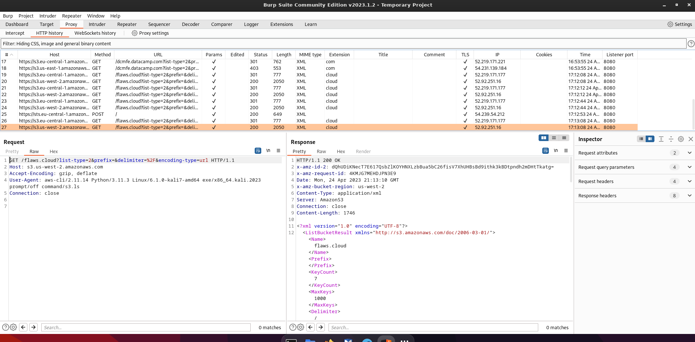

HTTP Proxies such as Burp Suite or [mitmproxy](https://mitmproxy.org/) often get associated with web application security, pentesting or security research in general. But they can be handy tools during development, testing or when exploring APIs. I actually find myself using Burp a lot more for learning or reverse engineering a particular API. In this post, I want to show you how you can leverage Burp to take a look 'under the hood' and learn how the AWS CLI makes HTTP requests. But before we can get started, we must ensure we have the right tools installed. On a Mac with homebrew ready to go, this is relatively straightforward:

```sh
brew install awscli burp-suite
```

As usual, things are a bit more complicated on Linux, depending on what flavour you are currently typing on. The following links should help you get started:

- https://docs.aws.amazon.com/cli/latest/userguide/getting-started-install.html
- https://portswigger.net/burp/releases/community/latest

You can check if everything is installed correctly by running the following commands and verify you get roughly the same output:

```sh
$ aws --version

aws-cli/2.11.14 Python/3.11.3 Linux/6.1.0-kali7-amd64 exe/x86_64.kali.2023 prompt/off

$ burpsuite --version

Picked up _JAVA_OPTIONS: -Dawt.useSystemAAFontSettings=on -Dswing.aatext=true
2023.1.2-18945 Burp Suite Community Edition
```

Once Burp is up and running, it will have started a proxy on `http://localhost:8080`, and with the AWS CLI [configured correctly](https://docs.aws.amazon.com/cli/latest/userguide/cli-configure-files.html), we can now add some environment variables to ensure traffic gets send to Burp Suite.

```sh
export HTTP_PROXY=http://localhost:8080
export HTTPS_PROXY=http://localhost:8080
```

And that should be; let's try it and see if we can see requests to AWS coming into Burp.

```sh
$ aws sts get-caller-identity

SSL validation failed for https://sts.us-east-1.amazonaws.com/ [SSL: CERTIFICATE_VERIFY_FAILED] certificate verify failed: self signed certificate in certificate chain (_ssl.c:992)
```
And we get an SSL error! This is because for Burp Suite to be able to proxy HTTPS traffic, it needs to sign its own certificates. And CA it uses to create those certificates isn't trusted by default on your system. To fix this we need to download the CA from Burp and tell the AWS CLI that this CA can be trusted, pinky promise!

```sh
curl http://127.0.0.1:8080/cert --output ./certificate.cer
openssl x509 -inform der -in ./certificate.cer -out ./certificate.pem
export AWS_CA_BUNDLE="$(pwd)/certificate.pem"
```

And that's it, all traffic from the AWS CLI now flows through Burp:



Putting it all together, we can write this up in just a few lines:

```sh
export HTTP_PROXY=http://localhost:8080
export HTTPS_PROXY=http://localhost:8080
export AWS_CA_BUNDLE=/dev/shm/cert.pem
curl -s http://127.0.0.1:8080/cert | openssl x509 -inform der -out "$AWS_CA_BUNDLE"
```

## Conclusion

What I like about this approach is that you can reuse the same principle to debug many other CLI tools as well. In the end, many CLI tools for popular services are just making HTTP requests back and forth. Quickly inspecting what's going on over the wire could be a valuable asset. Even more interesting is that many SDKs implement the same principle. If you are writing something in Node, Python, or any other language, the same trick will allow you to gain some valuable insights. As I showed earlier, the steps are a simple set `*_PROXY` environment variables to point to your HTTP proxy. And make the CLI or SDK trust the self-signed CA certificate. This last one will be different depending on the tool or language.
